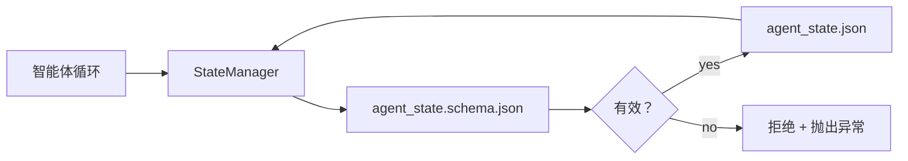

# 代码库记忆与持久状态

> 聊天历史是易失的。代码库是持久的。工作台把智能体状态存进版本化文件，让下一次会话、下一个智能体和下一位审阅者都从同一个事实源读取。

**类型：** 构建
**语言：** Python（标准库 + `jsonschema` 可选）
**前置要求：** 第 14 阶段 · 第 32 节（最小工作台）
**用时：** 约 60 分钟

## 学习目标

- 定义哪些内容属于代码库记忆，哪些内容属于聊天历史。
- 为 `agent_state.json` 和 `task_board.json` 编写 JSON Schema。
- 构建一个能够加载、验证、变更并以原子方式持久化状态的状态管理器。
- 使用模式在错误写入破坏工作台之前拒绝它们。

## 问题所在

智能体结束了一次会话。聊天关闭。下一次会话打开后询问从哪里开始。模型说“让我检查一下文件”，读到过时的笔记，又把已经完成的工作重做一遍。更糟的是，因为没人告诉它某个文件已经完成，它重新改写了那个文件。

工作台的修复方案是代码库记忆：状态以 JSON 文件的形式存在于代码库中，在模式约束下写入，以原子方式持久化，并且便于代码审阅中的 diff。聊天是临时的信息流；代码库才是事实记录。

## 核心概念



### 哪些内容属于代码库记忆

| 属于 | 不属于 |
|---------|-----------------|
| 活动任务 ID | 原始聊天记录 |
| 本次会话改动过的文件 | 词元级推理轨迹 |
| 智能体作出的假设 | “用户看起来很沮丧” |
| 未解决的阻塞项 | 抽样得到的补全结果 |
| 下一步行动 | 厂商特定的模型 ID |

判断标准是持久性：三个月后在 CI 重跑时，这项内容还有用吗？有用就放进代码库；没用就放进遥测。

### 以模式为先的状态

JSON Schema 就是契约。没有它，每个智能体都会发明新字段，每位审阅者都要学习一种新形状，每个 CI 脚本都要为旧版本编写特殊处理。有了它，错误写入就会被拒绝。

模式覆盖：

- 必需键。
- 允许的 `status` 值。
- 禁止的值（例如数组不能为 `null`）。
- 模式约束（任务 ID 匹配 `T-\d{3,}`）。
- 用于迁移的版本字段。

### 原子写入

状态写入必须经得起部分失败：写入临时文件、执行 fsync，再将它重命名覆盖目标。状态文件是事实源；一个写了一半的文件比没有文件更糟。

### 迁移

模式变化时，随着模式版本提升，在模式旁边发布一个迁移脚本。状态文件携带 `schema_version` 字段；如果管理器无法迁移某个版本的文件，就拒绝加载它。

```figure
wb-state-persist
```

## 动手构建

`code/main.py` 实现：

- `agent_state.schema.json` 和 `task_board.schema.json`。
- 一个只使用标准库的验证器（JSON Schema 的子集：required、type、enum、pattern、items）。
- 带有临时文件写入和重命名原子写入的 `StateManager.load`、`StateManager.update`、`StateManager.commit`。
- 一个变更状态、持久化、重新加载并证明往返过程的演示。

运行：

```text
python3 code/main.py
```

脚本会写入 `workdir/agent_state.json` 和 `workdir/task_board.json`，跨两个回合变更它们，并在每一步打印经过验证的状态。

## 现实中的生产模式

四个模式能让本节的最小实现变成一个多智能体单体代码库也能承受的系统。

**临时文件加重命名不是可选项。** 2026 年 3 月的一份 Hive 项目错误报告清楚记录了这种失败模式：`state.json` 通过 `write_text()` 写入，异常被捕获并静默处理。部分写入让会话在没有任何信号的情况下依据损坏的状态恢复。修复始终是：在目标所在的同一目录中使用 `tempfile.mkstemp`，写入，执行 `fsync`，再使用 `os.replace`（在 POSIX 和 Windows 上都是原子重命名）。本节的 `atomic_write` 正是这样做的。

**每次非幂等工具调用都使用幂等键。** 如果智能体在调用工具之后、检查点记录结果之前崩溃，恢复过程会重试工具调用。读取是安全的；发送邮件、插入数据库、上传文件则很危险。模式是：在执行前把每次工具调用 ID 记录到 `pending_calls.jsonl`。重试时检查该 ID；如果已经存在，就跳过调用并使用缓存结果。Anthropic 和 LangChain 都在 2026 年的指导中强调了这一点；LangGraph 的检查点保存待处理写入，也是出于同样原因。

**把大型产物与状态分开。** 不要把 CSV、长篇记录或生成文件存进 `agent_state.json`。把产物保存为单独的文件（或上传到对象存储），状态中只保留路径。检查点保持小而快速；产物可以独立增长。

**用事件溯源记录审计，用快照支持恢复。** 每次变更都追加到事件日志（`state.events.jsonl`）；定期生成 `state.json` 快照。恢复时读取快照，然后重放快照时间戳之后的事件。这会消耗更多磁盘，但能逐字重放智能体决策——调试长时程运行时必不可少。Postgres 内部使用的 WAL 也是同一种形状。

**要么迁移模式，要么拒绝加载。** `schema_version` 整数就是契约。当管理器加载未知版本的文件时，它拒绝读取。随着模式版本提升，在旁边发布迁移脚本；`tools/migrate_state.py` 会在每次启动时幂等运行。

## 实际使用

在生产环境中：

- **LangGraph 检查点。** 思路相同，存储不同。检查点会把图状态持久化到 SQLite、Postgres 或自定义后端。本节讲授的模式，就是检查点失效、需要手动读取状态时所使用的东西。
- **Letta 记忆块。** 带有结构化模式的持久块（第 14 阶段 · 第 08 节）。同样的纪律，作用域改为长时程人格。
- **OpenAI Agents SDK 会话存储。** 可插拔后端，具备模式意识。本节的状态文件就是本地文件后端。

## 交付

`outputs/skill-state-schema.md` 会生成项目专用的 JSON Schema 对（状态 + 任务板）、一个接入原子写入的 Python `StateManager`，以及迁移脚手架，让下一次模式升级不会破坏工作台。

## 练习

1. 增加一个 `last_human_touch` 时间戳。在人类编辑后的五秒内，拒绝任何智能体写入。
2. 扩展验证器以支持 `oneOf`，让任务可以是构建任务或审阅任务，并分别具有不同的必需字段。
3. 增加 `schema_version` 字段，并编写从 v1 到 v2 的迁移（将 `blockers` 重命名为 `risks`）。
4. 把存储后端从本地文件改为 SQLite，同时保持 `StateManager` API 不变。
5. 让两个智能体以 50 ms 的写入竞态操作同一个状态文件。会发生什么，原子重命名如何拯救你？

## 关键术语

| 术语 | 人们常说 | 实际含义 |
|------|----------------|------------------------|
| Repo memory（代码库记忆） | “笔记文件” | 在代码库跟踪文件中、按模式存储的状态 |
| Schema-first（以模式为先） | “验证输入” | 先定义契约再写入，并拒绝漂移 |
| Atomic write（原子写入） | “直接重命名” | 写临时文件、fsync、重命名，使部分失败不能破坏状态 |
| Migration（迁移） | “模式升级” | 把 vN 状态转换为 v(N+1) 状态的脚本 |
| System of record（事实记录） | “事实源” | 工作台视为权威的产物 |

## 延伸阅读

- [JSON Schema specification](https://json-schema.org/specification.html)
- [LangGraph checkpointers](https://langchain-ai.github.io/langgraph/concepts/persistence/)
- [Letta memory blocks](https://docs.letta.com/concepts/memory)
- [Fast.io，AI Agent State Checkpointing: A Practical Guide](https://fast.io/resources/ai-agent-state-checkpointing/)——带幂等性的以模式为先检查点
- [Fast.io，AI Agent Workflow State Persistence: Best Practices 2026](https://fast.io/resources/ai-agent-workflow-state-persistence/)——并发控制、TTL、事件溯源
- [Hive Issue #6263 — non-atomic state.json writes silently ignored](https://github.com/aden-hive/hive/issues/6263)——真实项目中的失败模式
- [eunomia，Checkpoint/Restore Systems: Evolution, Techniques, Applications](https://eunomia.dev/blog/2025/05/11/checkpointrestore-systems-evolution-techniques-and-applications-in-ai-agents/)——将操作系统历史中的 CR 原语应用于智能体
- [Indium，7 State Persistence Strategies for Long-Running AI Agents in 2026](https://www.indium.tech/blog/7-state-persistence-strategies-ai-agents-2026/)
- [Microsoft Agent Framework，Compaction](https://learn.microsoft.com/en-us/agent-framework/agents/conversations/compaction)——厂商检查点管理器
- 第 14 阶段 · 第 08 节——记忆块与睡眠时间计算
- 第 14 阶段 · 第 32 节——本节形式化的三文件最小工作台
- 第 14 阶段 · 第 40 节——从同一模式读取的交接数据包
