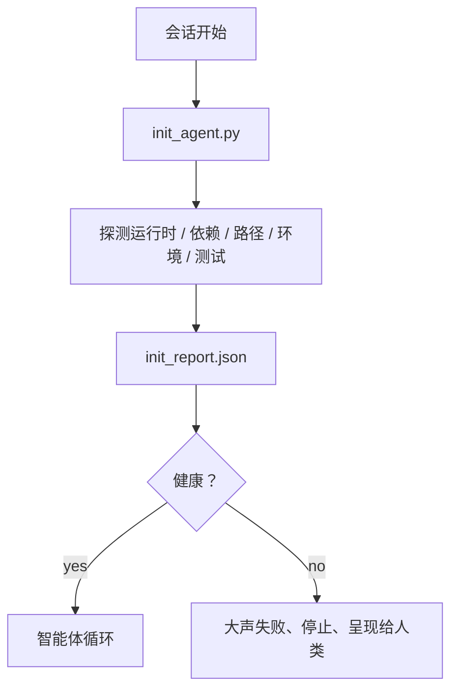

# 智能体初始化脚本

> 每个冷启动的会话都要缴纳一次税。智能体读取同样的文件、重试同样的探测、重新发现同样的路径。初始化脚本把这笔税支付一次，然后把答案写入状态。

**类型：** 构建
**语言：** Python（标准库）
**前置要求：** 第 14 阶段 · 第 32 节（最小工作台）、第 14 阶段 · 第 34 节（代码库记忆）
**用时：** 约 45 分钟

## 学习目标

- 识别那些智能体不应在每个会话中反复做的工作。
- 构建一个探测运行时、依赖和代码库健康状况的确定性初始化脚本。
- 持久化探测结果，让智能体读取它，而不是重新运行检查。
- 初始化失败时大声、快速地失败，并提供唯一的查找位置。

## 问题所在

打开一个会话。智能体猜 Python 版本，猜测试命令，反复列出代码库根目录五次来寻找入口，尝试导入一个未安装的包，询问用户配置文件在哪里。等它真正开始编辑时，一万个词元已经花在本应由一个脚本完成的设置工作上。

解决方案是一个初始化脚本：在智能体做任何其他事情之前运行，并写出智能体在启动时读取的 `init_report.json`。

## 核心概念



### 初始化脚本探测什么

| 探测 | 为什么重要 |
|-------|----------------|
| 运行时版本 | 错误的 Python 或 Node 版本会造成悄无声息的错误版本问题 |
| 依赖是否可用 | 之后才发现缺少包，代价是现在捕获它的十倍 |
| 测试命令 | 智能体必须知道如何验证；找不到命令就意味着工作台损坏 |
| 代码库路径 | 硬编码路径会漂移；一次解析后固定下来 |
| 环境变量 | 缺少 `OPENAI_API_KEY` 是一个失败面，不是运行时谜团 |
| 状态 + 任务板新鲜度 | 崩溃会话留下的过时状态是一个陷阱 |
| 最近一次已知良好提交 | 为会话末尾的交接 diff 提供锚点 |

### 大声失败、快速失败、在一个地方失败

探测失败意味着停止，并把问题呈现给人类。不要说“智能体会自己解决”。初始化的全部意义，就是在工作台损坏时拒绝启动。

### 幂等

连续运行两次。第二次运行除了更新时间戳应该是空操作。幂等性让你可以把脚本接入 CI、hooks 或任务前的斜杠命令。

### 初始化与启动规则

规则（第 14 阶段 · 第 33 节）描述行动前必须满足什么。初始化是建立这些规则可检查条件的脚本。没有初始化的规则会变成“要小心”；没有规则的初始化则变成经过润色的失败。

```figure
wb-init-probes
```

## 动手构建

`code/main.py` 实现 `init_agent.py`：

- 五个探测：Python 版本，通过 `importlib.util.find_spec` 检查列出的依赖，测试命令是否可解析，必需的环境变量，以及状态文件新鲜度。
- 每个探测返回 `(name, status, detail)`。
- 脚本用完整探测集合写入 `init_report.json`；任何阻断级别的探测失败时以非零状态退出。

运行：

```text
python3 code/main.py
```

脚本会打印探测表、写入 `init_report.json`，在顺利路径上以零状态退出；否则列出失败的探测并以非零状态退出。

## 现实中的生产模式

三个模式把有用的初始化脚本与形式主义区分开来。

**锚定最近一次已知良好提交。** 将当前提交与上一次成功合并时写入的 `LKG` 文件进行探测比较。如果 diff 超过预算（默认为 50 个文件），就拒绝启动，并要求人类批准新的基线。这正是 Cloudflare 的 AI Code Review 用来限定审阅智能体范围的方式：每次审阅会话都锚定同一个最近一次已知良好状态，永远不会让漂移跨会话累积。

**带 TTL 的锁文件。** 第一次探测成功后写入 `prereqs.lock`。之后的运行在 N 小时内（默认 24 小时）信任该锁，跳过昂贵的探测。初始化脚本先读取锁；如果锁仍新鲜且依赖清单哈希匹配，就短路退出。这与 Docker 用于分层缓存的模式相同：幂等探测 + 内容哈希 = 跳过。

**热路径中没有网络、没有 LLM、没有意外。** 初始化探测是确定性的基础设施。调用 LLM 来分类失败，或访问外部服务检查许可证的探测，都不是探测，而是工作流。如果探测在 dry run 中超过三秒，把它视为工作台异味：要么移出初始化，要么缓存结果。

## 实际使用

在生产环境中：

- **Claude Code hooks。** `pre-task` hook 调用初始化脚本；如果失败，就拒绝启动智能体。
- **GitHub Actions。** `setup-agent` 任务运行初始化脚本；智能体任务依赖它。
- **Docker entrypoint。** 智能体容器在执行智能体运行时之前运行初始化脚本；失败时日志会呈现出来。

初始化脚本可移植，因为它不调用任何特定框架。Bash、Make 或任务文件都可以包装它。

## 交付

`outputs/skill-init-script.md` 会访谈项目，将其设置工作分类为探测，并生成项目专用的 `init_agent.py` 以及在任何智能体步骤前运行它的 CI 工作流。

## 练习

1. 增加一个探测，将当前提交与最近一次已知良好提交比较；如果有超过 50 个文件发生变化，就拒绝启动。
2. 让脚本写入 `prereqs.lock`，并在锁文件超过七天时拒绝启动。
3. 增加 `--fix` 标志，自动安装缺少的开发依赖，但未经批准绝不修改运行时依赖。
4. 把探测从硬编码函数迁移到 YAML 注册表。说明其中的权衡。
5. 为每个探测增加时间预算。运行超过三秒的探测就是工作台异味。

## 关键术语

| 术语 | 人们常说 | 实际含义 |
|------|----------------|------------------------|
| Probe（探测） | “检查” | 返回 `(name, status, detail)` 的确定性函数 |
| Init report（初始化报告） | “设置输出” | 与状态放在一起、写有探测结果的 JSON |
| Idempotent（幂等） | “可以安全重跑” | 连续两次运行产生相同报告，时间戳除外 |
| Fail loud（大声失败） | “不要吞掉错误” | 停止并把问题呈现给人类；不静默回退 |
| Setup tax（设置税） | “引导成本” | 智能体每个会话花费在重新发现显而易见信息上的词元 |

## 延伸阅读

- [Anthropic，Effective harnesses for long-running agents](https://www.anthropic.com/engineering/effective-harnesses-for-long-running-agents)
- [GitHub Actions，composite actions for setup](https://docs.github.com/en/actions/sharing-automations/creating-actions/creating-a-composite-action)
- [microservices.io，GenAI dev platform: guardrails](https://microservices.io/post/architecture/2026/03/09/genai-development-platform-part-1-development-guardrails.html)——将提交前检查 + CI 检查作为初始化
- [Augment Code，How to Build Your AGENTS.md (2026)](https://www.augmentcode.com/guides/how-to-build-agents-md)——初始化预期
- [Codex Blog，Codex CLI Context Compaction](https://codex.danielvaughan.com/2026/03/31/codex-cli-context-compaction-architecture/)——会话开始作为具备压缩意识的初始化
- 第 14 阶段 · 第 33 节——这个脚本所启用的规则集
- 第 14 阶段 · 第 34 节——这个脚本所播种的状态文件
- 第 14 阶段 · 第 38 节——初始化脚本提供输入的验证门
- 第 14 阶段 · 第 40 节——消费初始化报告中最近一次已知良好状态的交接
