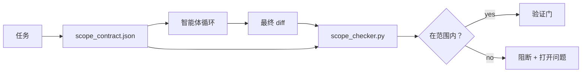

# 范围契约与任务边界

> 模型不知道工作在哪里结束。范围契约是一个按任务划分的文件，说明工作从哪里开始、在哪里结束，以及越界时如何回滚。契约把“留在范围内”从愿望变成检查项。

**类型：** 构建
**语言：** Python（标准库）
**前置要求：** 第 14 阶段 · 第 32 节（最小工作台）、第 14 阶段 · 第 33 节（作为约束的规则）
**用时：** 约 50 分钟

## 学习目标

- 编写一个智能体在任务开始时读取、验证器在任务结束时读取的范围契约。
- 指定允许的文件、禁止的文件、验收标准、回滚计划和审批边界。
- 实现范围检查器，将 diff 与契约比较并标出违规。
- 让范围蔓延变得可见、自动且可审阅。

## 问题所在

智能体会不断越界。任务是“修复登录 bug”。diff 却触及登录路由、邮件辅助工具、数据库驱动、README 和发布脚本。每一次触碰在当时都有合理理由。合在一起，它们已经是一个不同于原审阅变更的改动。

范围蔓延是智能体工作中监控最少的失败模式，因为智能体会真诚地叙述每一步。磁盘上的契约可以说明承诺了什么，再用检查把结果与承诺比较。

## 核心概念



### 范围契约包含什么

| 字段 | 用途 |
|-------|---------|
| `task_id` | 链接到任务板上的任务 |
| `goal` | 审阅者可以验证的一句话 |
| `allowed_files` | 智能体可以写入的 glob |
| `forbidden_files` | 智能体即使意外也不得触碰的 glob |
| `acceptance_criteria` | 证明完成的测试命令或断言行 |
| `rollback_plan` | 需要停止时操作员可以执行的一段说明 |
| `approvals_required` | 范围之外、需要人类明确签字的操作 |

没有 `forbidden_files` 的契约是不完整的。负空间是契约的一半。

### 使用 glob，而不是原始路径

真实代码库会移动文件。将契约固定在 glob（`app/**/*.py`、`tests/test_signup*.py`）上，这样跨会话的重构不会使契约失效。

### 回滚属于范围的一部分

列出如何回滚，会迫使契约作者思考可能出错的地方。无法从中回滚的契约，就不应该获得批准。

### 范围检查就是 diff 检查

智能体写出 diff。检查器读取 diff、允许的 glob、禁止的 glob，以及已经运行的所有验收命令。每项违规都会成为一个带标签的发现，验证门可以据此拒绝。

### 两种高度的范围：特征列表与任务契约

范围契约约束一个任务，但不约束项目。智能体可以完美地留在登录修复的契约内，却在下一回合决定项目还需要设置页面、深色模式开关和路由器重写。契约从未被要求判断哪些工作属于项目范围，只被要求判断哪些文件属于任务范围。

第二种高度需要自己的原语：智能体在会话开始时读取的 `feature_list.json`。它是机器可读、有顺序的项目待办列表。智能体准确选择一个状态为 `todo` 的特征，把它的 `id` 写入活动范围契约，并且在同一会话中禁止开始第二个特征。“一次一个特征”不再只是智能体可以自行解释后绕过的一行提示词，而是它从磁盘读取的值，也是门控检查强制执行的检查项。

```json
{
  "project": "knowledge-base",
  "active": "import-pdf",
  "features": [
    { "id": "import-pdf",   "status": "in_progress", "goal": "import a PDF into the library",        "done_when": "pytest tests/test_import.py && a sample PDF appears in the library view" },
    { "id": "full-text-search", "status": "todo",     "goal": "search document text and rank hits",   "done_when": "query returns ranked results with snippets" },
    { "id": "cite-answers", "status": "todo",         "goal": "answers carry source citations",        "done_when": "every answer renders at least one clickable citation" }
  ]
}
```

| 字段 | 用途 |
|-------|---------|
| `active` | 当前会话可以触碰的唯一特征；为空时选择一个并设置它 |
| `features[].id` | 范围契约的 `task_id` 所指向的稳定 slug |
| `features[].status` | `todo`、`in_progress`、`done`、`blocked`；同时只能有一个 `in_progress` |
| `features[].goal` | 审阅者可以验证的一句话 |
| `features[].done_when` | 将 `in_progress` 切换为 `done` 的验收行 |

两条规则让列表成为承重结构，而不是装饰。第一，“最多一个 `in_progress`”这一不变量本身就是启动检查（第 14 阶段 · 第 33 节）：如果列表显示两个，除非人类解决它，否则会话拒绝启动。第二，特征列表是文件而不是聊天消息，因为聊天会滚出上下文，而文件会跨会话、跨智能体持久存在。交接（第 14 阶段 · 第 40 节）会把已完成特征的状态写回 `done`，这样下一次会话打开的是准确的任务板，而不是重新推导还剩什么。

契约与列表通过最小权限原则组合起来，与下面描述的合并方式相同：任务契约的 `allowed_files` 必须位于活动特征所触及的范围之内，不能超出它。

```figure
wb-scope-bounce
```

## 动手构建

`code/main.py` 实现：

- `scope_contract.json` 模式（JSON Schema 子集，使用 glob 数组）。
- 一个 diff 解析器，将已触及文件列表和已运行命令列表转换为 `RunSummary`。
- 一个 `scope_check`，依据契约返回 `(violations, in_scope, off_scope)`。
- 两次演示运行：一次留在范围内，一次发生蔓延。检查器会用确切的文件和原因标出蔓延。

运行：

```text
python3 code/main.py
```

输出包括契约、两次运行、每次运行的判定，以及保存下来的 `scope_report.json`。

## 现实中的生产模式

一位运行“specsmaxxing”（在调用智能体前用 YAML 编写范围契约）的实践者报告称，三周内兔子洞率从 52% 降到 21%，而智能体没有改变。起作用的是契约，不是模型。三个模式让这项收益持续下来。

**使用违规预算，而不是二元失败。** `agent-guardrails`（Claude Code、Cursor、Windsurf、通过 MCP 使用的 Codex 所采用的开源合并门）为每个任务提供 `violationBudget`：预算内的轻微范围滑移会作为警告呈现；只有超过预算时合并门才会拒绝。与 `violationSeverity: "error" | "warning"` 配合使用。预算是一个能够真正发布的门，与一个被厌恶它的团队禁用的门之间的区别。

**按路径族设置不对称严重级别。** 对 `docs/**` 的范围外写入通常是 `warn`；对 `scripts/**`、`migrations/**`、`config/prod/**` 的范围外写入始终是 `block`。这种不对称必须放在契约中，而不是运行时中，因为它取决于项目，而且会随任务变化。

**把时间和网络预算放在文件预算旁边。** `time_budget_minutes` 字段限制墙上时钟时间；超过它后，运行时拒绝继续，除非重新获得批准。主机名上的 `network_egress` 允许列表会阻止智能体悄悄访问并非任务组成部分的外部 API。这些也是范围维度；文件 glob 是必要条件，但还不充分。

**多契约合并语义（最小权限）。** 当两个范围契约同时适用（例如项目级契约加任务级契约）时，合并规则是：对 `allowed_files` 取**交集**（两个契约都必须允许该路径），对 `forbidden_files` 取**并集**（任一个契约都可以禁止），`time_budget_minutes` 取限制更严格的值（最小值），`approvals_required` 累积。`network_egress` 为 `None` 表示不执行限制，为 `[]` 表示全部拒绝，为 `[...]` 表示允许列表；合并时，`None` 交由另一侧决定，两个列表取交集，全部拒绝保持全部拒绝。将这些规则写入契约模式，使合并可以机械执行且便于审阅。

## 实际使用

生产模式：

- **Claude Code 斜杠命令。** `/scope` 命令写入契约，并将它固定为会话上下文。子智能体行动前读取契约。
- **GitHub PR。** 将契约作为 PR 正文中的 JSON 文件，或作为纳入版本控制的产物提交。CI 针对合并 diff 运行范围检查器。
- **LangGraph interrupts。** 范围违规会触发中断；处理器询问人类是需要扩大契约，还是需要让智能体收手。

契约随任务一起移动。任务关闭后，契约归档到 `outputs/scope/closed/` 下。

## 交付

`outputs/skill-scope-contract.md` 会根据任务描述生成范围契约，并生成一个支持 glob、在每次智能体 diff 上于 CI 中运行的检查器。

## 练习

1. 增加 `network_egress` 字段，列出允许的外部主机。拒绝触及其他主机的运行。
2. 扩展检查器，对 `docs/**` 软失败，对 `scripts/**` 硬失败。说明这种不对称的理由。
3. 让契约使用静态规则集（不使用 LLM），根据 `goal` 字段推导 `allowed_files`。第一个边界情况会出什么问题？
4. 增加 `time_budget_minutes`，一旦墙上时钟超过预算就拒绝继续。
5. 对同一个 diff 运行两个契约。当两个契约同时适用时，正确的合并语义是什么？

## 关键术语

| 术语 | 人们常说 | 实际含义 |
|------|----------------|------------------------|
| Scope contract（范围契约） | “任务简述” | 按任务列出允许/禁止文件、验收和回滚的 JSON |
| Scope creep（范围蔓延） | “它还触及了……” | 同一任务中改动了契约之外的文件 |
| Rollback plan（回滚计划） | “我们可以回退” | 用于停止的操作员一段式运行手册 |
| Approval boundary（审批边界） | “需要签字” | 契约中列明、需要人类明确批准的操作 |
| Diff check（diff 检查） | “路径审计” | 将已触及文件与契约 glob 比较 |

## 延伸阅读

- [LangGraph human-in-the-loop interrupts](https://langchain-ai.github.io/langgraph/concepts/human_in_the_loop/)
- [OpenAI Agents SDK tool approval policies](https://platform.openai.com/docs/guides/agents-sdk)
- [logi-cmd/agent-guardrails — merge gates and scope validation](https://github.com/logi-cmd/agent-guardrails)——违规预算、严重级别层级
- [Dev|Journal，Preventing AI Agent Configuration Drift with Agent Contract Testing](https://earezki.com/ai-news/2026-05-05-i-built-a-tiny-ci-tool-to-keep-ai-agent-configs-from-drifting-in-my-repo/)——不依赖外部依赖的 `--strict` 模式
- [Agentic Coding Is Not a Trap (production logs)](https://dev.to/jtorchia/agentic-coding-is-not-a-trap-i-answered-the-viral-hn-post-with-my-own-production-logs-33d9)——specsmaxxing 数据：52% → 21%
- [OpenCode permission globs](https://opencode.ai/docs/agents/)——细粒度的逐权限范围
- [Knostic，AI Coding Agent Security: Threat Models and Protection Strategies](https://www.knostic.ai/blog/ai-coding-agent-security)——范围是最小权限的一部分
- [Augment Code，AI Spec Template](https://www.augmentcode.com/guides/ai-spec-template)——三层边界系统（必须/询问/绝不）
- 第 14 阶段 · 第 27 节——与范围锁配套的提示注入防御
- 第 14 阶段 · 第 33 节——为每个任务专门化这份契约的规则集
- 第 14 阶段 · 第 38 节——检查器将报告提交到的验证门
