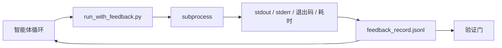

# 运行时反馈循环

> 看不到真实命令输出的智能体只是在猜。反馈运行器会把 stdout、stderr、退出码和耗时捕获为结构化记录，供下一轮读取。这样，智能体依据事实做出反应，而不是依据自己对事实的预测做出反应。

**类型：** 构建
**语言：** Python（标准库）
**前置要求：** 第 14 阶段 · 第 32 节（最小工作台）、第 14 阶段 · 第 35 节（初始化脚本）
**用时：** 约 50 分钟

## 学习目标

- 区分运行时反馈与可观测性遥测。
- 构建一个包装 shell 命令并持久化结构化记录的反馈运行器。
- 以确定性方式截断过大的输出，让循环保持在 token 预算内。
- 在缺少反馈时拒绝推进循环。

## 问题所在

智能体说“现在运行测试”。下一条消息说“所有测试都通过了”。现实是：测试根本没有运行。智能体想象出了输出，或者运行了命令却没有读取结果，或者读取了结果却静默截掉了失败所在的那一行。

反馈运行器会消除这道鸿沟。每条命令都经由运行器执行。每条记录都包含命令、捕获到的 stdout 和 stderr、退出码、墙钟耗时，以及一行智能体备注。智能体在下一轮读取这条记录。任务结束时，验证门读取这些记录。

## 核心概念



### 反馈记录中包含什么

| 字段 | 为什么重要 |
|-------|----------------|
| `command` | 精确的 argv，不会有 shell 展开带来的意外 |
| `stdout_tail` | 最后 N 行，确定性截断 |
| `stderr_tail` | 与 stdout 分开的最后 N 行 |
| `exit_code` | 不含歧义的成功信号 |
| `duration_ms` | 暴露缓慢探针和失控进程 |
| `started_at` | 用于重放的时间戳 |
| `agent_note` | 智能体在预期结果时写下的一行备注 |

### 截断必须是确定性的

50 MB 的日志会摧毁循环。运行器会截取头部和尾部，并用 `...truncated N lines...` 标记截断部分；这一过程是确定性的，因此同一份输出总会产生同一条记录。不进行采样：智能体需要看到的部分——最终错误和最终摘要——都在尾部。

### 反馈与遥测

遥测（第 14 阶段 · 第 23 节的 OTel GenAI 约定）供人工操作员跨时间审查运行情况。反馈供本次运行的下一轮读取。两者共享一些字段，但位于不同文件中，保留策略也不同。

### 没有反馈就拒绝推进

如果运行器在捕获退出码之前出错，记录会携带 `exit_code: null` 和 `error: <reason>`。智能体循环必须拒绝在退出码为 `null` 时声称成功。没有退出码，就没有进展。

```figure
wb-feedback-loop
```

## 动手构建

`code/main.py` 实现：

- `run_with_feedback(command, agent_note)`：包装 `subprocess.run`，捕获 stdout/stderr/退出码/耗时，以确定性方式截断，并追加到 `feedback_record.jsonl`。
- 一个把 JSONL 流式加载到 Python 列表中的小型加载器。
- 一个运行三条命令（成功、失败、缓慢），并打印每条命令最后一条记录的演示。

运行：

```text
python3 code/main.py
```

输出：三条反馈记录会追加到 `feedback_record.jsonl`，并内联打印每种命令的最后一条记录。多次运行时查看文件尾部，可以看到循环逐渐累积记录。

## 生产环境中的模式

下面三种模式可以把运行器加固到足以交付。

**写入时脱敏，而不是读取时脱敏。** 任何接触 stdout 或 stderr 的记录都可能泄露密钥。运行器会在追加 JSONL 之前执行脱敏步骤：删除匹配 `^Bearer `、`password=`、`api[_-]?key=`、`AKIA[0-9A-Z]{16}`（AWS）和 `xox[baprs]-`（Slack）的行。读取时才脱敏是一个容易踩的坑；磁盘上的文件才是攻击者能触及的东西。每季度根据生产运行时实际观察到的密钥格式审计一次脱敏模式。

**轮换策略，而不是单个文件。** 将每个 `feedback_record.jsonl` 文件限制为 1 MB；溢出时轮换为 `.1`、`.2`，删除 `.5`。智能体循环只读取当前文件，因此运行时开销有界。CI 工件存储完整的轮换文件集合。没有轮换时，每次加载器调用都会被不断膨胀的文件拖成瓶颈。

**为重试链使用父命令 ID。** 每条记录都获得 `command_id`；重试记录带有指向上一次尝试的 `parent_command_id`。审阅者的“失败尝试”列表（第 14 阶段 · 第 40 节）和验证门的审计都会沿着这条链追踪。没有这个链接，重试看起来像彼此独立的成功，审计也会隐藏失败历史。

## 实际使用

生产环境中的用法：

- **Claude Code Bash 工具。** 该工具已经捕获 stdout、stderr、退出码和耗时。本节的运行器是任何智能体产品都能使用的、与框架无关的等价物。
- **LangGraph 节点。** 用运行器包装任何 shell 节点，让记录持久化到图状态之外。
- **CI 日志。** 将 JSONL 管道传入 CI 工件存储；审阅者无需重新运行会话，就能重放任何命令。

运行器是一个薄包装层，即使框架迁移，它仍然能够存活，因为记录的形状由它负责拥有。

## 交付

`outputs/skill-feedback-runner.md` 会生成一个项目专用的 `run_with_feedback.py`，其中包含合适的截断预算、接入工作台的 JSONL 写入器，以及智能体在每轮读取的加载器。

## 练习

1. 为每条记录添加 `cwd` 字段，以便区分从不同目录运行的同一条命令。
2. 添加一个 `redaction` 步骤，删除匹配 `^Bearer ` 或 `password=` 的行。在 fixture 记录上测试它。
3. 将 `feedback_record.jsonl` 的总大小限制为 1 MB，通过轮换到 `.1`、`.2` 文件实现。为轮换策略辩护。
4. 添加 `parent_command_id`，让重试链可见：哪条命令产生了下一条命令所消费的输入。
5. 将 JSONL 管道传入一个突出显示最新非零退出码的小型 TUI。要让它在审阅中有用，TUI 必须显示哪八项关键功能？

## 关键术语

| 术语 | 人们常说 | 实际含义 |
|------|----------------|------------------------|
| Feedback record（反馈记录） | “运行日志” | 包含命令、输出、退出码和耗时的结构化 JSONL 条目 |
| Tail truncation（尾部截断） | “裁剪日志” | 确定性地捕获头部和尾部，使记录适合 token 预算 |
| Refuse-on-null（遇 null 拒绝） | “缺数据时阻塞” | `exit_code` 为 null 时循环不得推进 |
| Agent note（智能体备注） | “预期标签” | 智能体在读取结果前写下的一行预测 |
| Telemetry split（遥测分流） | “两个日志文件” | 反馈供下一轮读取，遥测供操作员使用 |

## 延伸阅读

- [OpenTelemetry GenAI 语义约定](https://opentelemetry.io/docs/specs/semconv/gen-ai/)
- [Anthropic，面向长时运行智能体的有效工作台](https://www.anthropic.com/engineering/effective-harnesses-for-long-running-agents)
- [Guardrails AI x MLflow——确定性安全、PII、质量验证器](https://guardrailsai.com/blog/guardrails-mlflow)——把脱敏模式作为回归测试
- [Aport.io，2026 年最佳 AI 智能体防护栏：前置行动授权比较](https://aport.io/blog/best-ai-agent-guardrails-2026-pre-action-authorization-compared/)——工具调用前后捕获
- [Andrii Furmanets，2026 年 AI 智能体：工具、记忆、评估、防护栏与可靠性的实践架构](https://andriifurmanets.com/blogs/ai-agents-2026-practical-architecture-tools-memory-evals-guardrails)——可观测性界面
- 第 14 阶段 · 第 23 节——遥测侧的 OTel GenAI 约定
- 第 14 阶段 · 第 24 节——智能体可观测性平台（Langfuse、Phoenix、Opik）
- 第 14 阶段 · 第 33 节——要求在声明完成前先获得反馈的规则
- 第 14 阶段 · 第 38 节——读取 JSONL 的验证门
