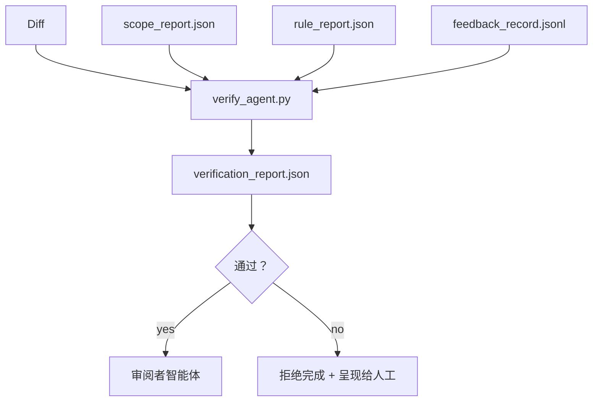

# 验证门

> 智能体不能自行宣布工作完成。验证门会读取范围契约、反馈日志、规则报告和 diff，并回答一个问题：这项任务真的完成了吗？如果验证门回答“否”，任务就没有完成，不管聊天里说了什么。

**类型：** 构建
**语言：** Python（标准库）
**前置要求：** 第 14 阶段 · 第 33 节（规则）、第 14 阶段 · 第 36 节（范围）、第 14 阶段 · 第 37 节（反馈）
**用时：** 约 55 分钟

## 学习目标

- 将验证门定义为作用于工作台工件的确定性函数。
- 将规则报告、范围报告、反馈记录和 diff 合并为单一结论。
- 输出一份 `verification_report.json`，让审阅者智能体和 CI 都能读取。
- 遇到任何阻塞级失败时，无一例外地拒绝推进任务。

## 问题所在

智能体太容易宣布成功。主要有三种失败形态：

- “看起来不错。”模型读了自己的 diff，然后判断它是正确的。
- “测试通过了。”说得很自信，却没有任何记录证明测试真的运行过。
- “验收标准满足了。”验收标准被宽松地解释成了“任何类似完成的东西”。

工作台的修复方案是设置一个单一验证门，读取智能体已经产出的工件并作出判断。验证门是确定性的。验证门处于版本控制之下。验证门接入 CI。智能体无法贿赂它。

## 核心概念



### 验证门检查什么

| 检查项 | 来源工件 | 严重级别 |
|-------|-----------------|----------|
| 所有验收命令都已运行 | `feedback_record.jsonl` | 阻塞 |
| 所有验收命令都以零退出 | `feedback_record.jsonl` | 阻塞 |
| 范围检查没有禁止写入 | `scope_report.json` | 阻塞 |
| 范围检查没有越界写入 | `scope_report.json` | 阻塞或警告 |
| 所有阻塞级规则都通过 | `rule_report.json` | 阻塞 |
| 反馈中没有 `null` 退出码 | `feedback_record.jsonl` | 阻塞 |
| 触碰的文件符合 `scope.allowed_files` | 两者 | 警告 |

`warn` 发现会被写入结论；`block` 发现会阻止 `passed: true`。

### 确定性的，而不是概率性的

对于同一组工件，验证门每次都必须产生同一个结论。不使用 LLM 评判者。LLM 评判者属于第 14 阶段 · 第 39 节的审阅者一侧，因为那里追求的是定性评价，而不是状态判断。

### 一份报告，一条路径

验证门在每次任务收尾时输出一份 `verification_report.json`，写入 `outputs/verification/<task_id>.json`。CI 消费同一条路径。使用不同路径的多个验证门会分裂事实来源。

### 无例外地拒绝

阻塞级发现不能由智能体覆盖。只有人工可以覆盖，而且必须记录 `override_reason` 和 `overridden_by` 用户 ID。覆盖是一次有签名的变更，而不是智能体的决定。

```figure
wb-gate-sequence
```

## 动手构建

`code/main.py` 实现：

- 每个输入工件的加载器；所有加载器都在本地使用 stub，因此本节自包含。
- 一个纯函数 `verify(task_id, artifacts) -> VerdictReport`。
- 一个展示逐项检查结果和最终通过/失败状态的打印器。
- 三个任务场景的演示：干净通过、范围蔓延、缺少验收。

运行：

```text
python3 code/main.py
```

输出：三份结论报告，每份都保存在脚本旁边。

## 生产环境中的模式

四种模式可以把验证门从“又一个 lint 任务”提升为“决定性边界”。

**纵深防御，而不是单一验证门。** 提交前 hook → CI 状态检查 → 工具调用前授权 hook → 合并前验证门。每一层都具有确定性，因此某一层的失败会被下一层捕获。microservices.io 在 2026 年 3 月的实践手册说得很明确：提交前 hook 不可绕过，因为它不像模型侧 skill 那样依赖智能体遵守指令。验证门位于 CI / 合并前这一层。

**用确定性检查防御，只让模型评判细微差别。** Anthropic 在 2026 年提出的 Hybrid Norm 配对方式是：可验证的奖励（单元测试、schema 检查、退出码）回答“代码解决问题了吗？”——LLM rubric 回答“代码是否可读、安全、符合风格？”验证门运行第一类检查；审阅者（第 14 阶段 · 第 39 节）运行第二类。把两类混在一起会压扁信号。

**签名覆盖日志，而不是 Slack 线程。** 每次覆盖都在 `outputs/verification/overrides.jsonl` 中产生一行，包含：时间戳、发现代码、理由、签名用户、当前 HEAD commit。运行时拒绝任何缺少签名的覆盖；审计轨迹由 Git 跟踪。这是覆盖策略与覆盖表演的分界线。

**把覆盖率下限作为一等检查。** `coverage_report.json` 为 `coverage_floor`（默认 80%）检查提供输入。如果测得覆盖率低于下限，或比上一次合并的下限低超过 1 个百分点，验证门就失败。没有这项检查，智能体可以悄悄删除失败测试，而验证报告仍然保持绿色。

**`--strict` 模式将警告提升为阻塞。** 对发布分支、必须阻止发布的 PR 或事故后排查，`--strict` 会把每条警告都变成硬失败。该标志按分支选择性启用，不设为全局默认，因为对所有事情都严格会侵蚀日常流程。

## 实际使用

生产环境中的用法：

- **CI 步骤。** `verify_agent` 任务针对智能体的最终工件运行验证门。合并保护要求 `passed: true`。
- **交接前 hook。** 智能体运行时在生成交接文档前调用验证门。没有绿色结论，就没有交接。
- **人工排查。** 当智能体声称成功而人工对此存疑时，操作员读取这份报告。

验证门是工作台流程中的决定性边界。所有其他界面都在它之前。

## 交付

`outputs/skill-verification-gate.md` 会将验证门接入具体项目：哪些验收命令为它提供输入、哪些规则属于阻塞级、哪些越界写入可以容忍，以及覆盖审计日志如何存储。

## 练习

1. 添加一个 `coverage_floor` 检查：测试命令必须产生至少 80% 的覆盖率报告。决定哪个工件携带这个下限。
2. 支持把每个 `warn` 提升为 `block` 的 `--strict` 模式。记录哪些情况下严格模式适合作为默认值。
3. 除 JSON 外，让验证门再生成一份 Markdown 摘要。为摘要应包含哪些字段辩护。
4. 添加 `time_since_last_human_touch` 检查：在人工按键后 60 秒内编辑的任何文件，都不因越界而被标记。
5. 在产品中的一次真实智能体 diff 上运行验证门。有多少发现是真问题，有多少是噪声？验证门还需要在哪里成长？

## 关键术语

| 术语 | 人们常说 | 实际含义 |
|------|----------------|------------------------|
| Verification gate（验证门） | “阻止事情的检查” | 作用于工作台工件并产生通过/失败结论的确定性函数 |
| Block severity（阻塞级别） | “硬失败” | 阻止 `passed: true`、并要求有签名覆盖的发现 |
| Override log（覆盖日志） | “我们为什么放行” | 包含理由和用户 ID、由审阅审计的签名条目 |
| Acceptance command（验收命令） | “证据” | 零退出代表完成定义的 shell 命令 |
| One report path（单一报告路径） | “事实来源” | `outputs/verification/<task_id>.json`，供 CI 和人工共同消费 |

## 延伸阅读

- [Anthropic，长时运行应用开发的工作台设计](https://www.anthropic.com/engineering/harness-design-long-running-apps)
- [OpenAI Agents SDK 防护栏](https://openai.github.io/openai-agents-python/guardrails/)
- [microservices.io，GenAI 开发平台：防护栏](https://microservices.io/post/architecture/2026/03/09/genai-development-platform-part-1-development-guardrails.html)——提交前与 CI 之间的纵深防御
- [ICMD，2026 年智能体 AI 运维手册](https://icmd.app/article/the-2026-playbook-for-agentic-ai-ops-guardrails-costs-and-reliability-at-scale-1776661990431)——审批门梯度（草稿 → 审批 → 低于阈值时自动）
- [类型检查合规：确定性防护栏（arXiv 2604.01483）](https://arxiv.org/pdf/2604.01483)——Lean 4 作为确定性验证的上限
- [logi-cmd/agent-guardrails——合并门规范](https://github.com/logi-cmd/agent-guardrails)——范围 + 变异测试验证门
- [Guardrails AI x MLflow](https://guardrailsai.com/blog/guardrails-mlflow)——作为 CI 评分器的确定性验证器
- [Akira，智能体系统的实时防护栏](https://www.akira.ai/blog/real-time-guardrails-agentic-systems)——工具调用前后验证门
- 第 14 阶段 · 第 27 节——提示词注入防御（验证门的对抗性搭档）
- 第 14 阶段 · 第 36 节——验证门执行的范围契约
- 第 14 阶段 · 第 37 节——验证门评分的反馈日志
- 第 14 阶段 · 第 39 节——验证门交接给它的审阅者智能体
