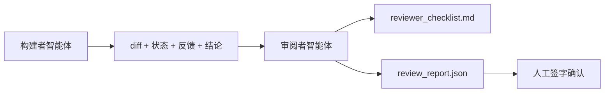

# 审阅者智能体：将构建者与评分者分开

> 写代码的智能体不能给代码评分。审阅者是第二个循环，它拥有不同的系统提示、不同的目标，并且只能读取构建者产出的所有内容。构建者与审阅者之间的间隙，是大多数可靠性的来源。

**类型：** 构建
**语言：** Python（标准库）
**前置要求：** 第 14 阶段 · 第 38 节（验证门）
**用时：** 约 55 分钟

## 学习目标

- 说明同一个智能体为什么不能可靠地审阅自己的工作。
- 构建一个消费构建者工件并输出结构化审阅报告的审阅者智能体循环。
- 编写一份按具体维度而不是凭感觉评分的审阅 rubric。
- 将审阅者接入工作台，让人工审阅步骤从真实工件开始。

## 问题所在

你让智能体修复一个 bug。它编辑了四个文件，运行测试，然后报告完成。验证门（第 14 阶段 · 第 38 节）确认验收已经运行且范围没有越界。验证门说 `passed: true`。你合并。两天后，你发现这个修复解决的是 bug 的错误半边。

验收是必要条件，但不是充分条件。审阅者会提出验收无法提出的问题：这是否解决了正确的问题？它有没有在没有标记的情况下扩大范围？它有没有记录本该被质疑的假设？它有没有把工作台留在一个下一次会话可以接续的状态？

## 核心概念



### 审阅 rubric

五个维度，每项得分 0 到 2 分。

| 维度 | 问题 |
|-----------|----------|
| 问题匹配度 | 这项变更解决的是任务原文所述的问题，而不是附近的另一个问题吗？ |
| 范围纪律 | 编辑是否局限于契约，或者是否有意扩大了契约？ |
| 假设 | 所有隐藏假设都写在了某个可供审阅的地方吗？ |
| 验证质量 | 验收命令真的证明了目标，还是只证明了一个较弱的版本？ |
| 交接准备度 | 下一次会话能从当前状态干净地接手吗？ |

总分为 10 分。低于 7 分是软失败；低于 5 分是硬失败。

### 审阅者是独立角色，而不是独立模型

你可以让审阅者与构建者使用同一个模型。纪律来自角色分离：不同的系统提示、不同的输入、对 diff 没有写权限。姿态的改变就是信号的改变。

### 审阅者不能编辑 diff

审阅者读取 diff、状态、反馈和结论。它写出一份报告，但不会修改 diff。如果报告说“修复这个”，下一轮由构建者处理修复；然后审阅者重新审阅。混合角色会破坏这道间隙。

### 审阅 rubric 与验证门

验证门（第 14 阶段 · 第 38 节）检查确定性事实：验收是否运行、规则是否通过、范围是否保持。审阅者作出定性判断：做的是正确的工作吗，是否记录了假设，交接是否可用。两者都必需。

```figure
wb-builder-marker
```

## 动手构建

`code/main.py` 实现：

- 一个汇总审阅者读取的工件的 `ReviewerInputs` 数据类。
- 每个维度一个函数的 rubric 评分器。本节中每个函数都是确定性的、仅用于演示的 stub；真实实现会调用 LLM。
- 一个 `review_report.json` 写入器，包含五项得分、总分和结论（`pass`、`soft_fail`、`hard_fail`）。
- 两个演示案例：干净的变更，以及“测试正确、问题错误”的变更。

运行：

```text
python3 code/main.py
```

输出：两份写入磁盘的审阅报告，以及一张显示各维度得分的控制台表格。

## 生产环境中的模式

真实数据如下：Cloudflare 在 2026 年 4 月的 AI Code Review 系统中，30 天内在 5,169 个代码库的 48,095 个合并请求上运行了 131,246 次审阅。审阅中位完成时间为 3 分 39 秒。最多七个专门审阅者（安全、性能、代码质量、文档、发布管理、合规、Engineering Codex）在 Review Coordinator 下并行运行，由协调器去重发现并判断严重性。顶级模型只留给协调器；专门审阅者运行在更便宜的层级。

四种模式可以让这种方式规模化运行。

**专门审阅者池，而不是一个巨型审阅者。** 一个带五维 rubric 的审阅者适合个人代码库。一旦代码库包含安全关键、性能关键和文档表面，就应拆成使用更小提示词的专门审阅者。协调器负责去重；专门审阅者不运行完整 rubric。模型层级分离也随之出现：便宜的专门审阅者，昂贵的协调器。

**把偏差缓解当作设计要求，而不是优化项。** LLM 评判者会表现出四种可靠的偏差（Adnan Masood，2026 年 4 月）：位置偏差（GPT-4 在 (A,B) 与 (B,A) 排序下约有 40% 的不一致）、冗长偏差（较长输出会带来约 15% 的得分膨胀）、自偏好（评判者偏爱同一模型家族的输出）、权威偏差（评判者会过高评价提到知名作者的内容）。缓解措施包括：评估两种排序，只计入一致的胜出；使用明确奖励简洁性的 1–4 分量表；轮换不同模型家族的评判者；评分前去掉作者姓名。

**校准集，而不是凭感觉。** 准备一个包含 10–20 个历史任务、且已知正确结论的集合。每次修改提示词，都在这组任务上运行审阅者。如果与历史记录的一致率低于 80%，在审阅者交付之前就需要修订 rubric。团队迟早会遇到这个规律，最好从一开始就采用校准集。

**与验证门配合的混合规范。** 验证门（第 14 阶段 · 第 38 节）处理确定性检查（验收是否运行、测试是否通过、范围是否保持）。审阅者处理语义检查（做的是正确的工作吗，是否记录了假设，交接是否可用）。Anthropic 在 2026 年的指导明确提出这种分工：不要让审阅者重复验证门已经证明的内容。

## 实际使用

生产环境中的用法：

- **Claude Code 子智能体。** 构建者结束任务后运行审阅者子智能体；它在 PR 上发布带 rubric 得分的评论。
- **OpenAI Agents SDK handoff。** 任务完成时，构建者将任务交给审阅者。审阅者可以带着发现列表交回，也可以交给人工。
- **双模型配对。** 构建者使用更快、更便宜的模型；审阅者使用更强的模型和更小的上下文，专注于判断。

当人工无法完成每一次审阅时，审阅者就是工作台增加的第二双眼睛。

## 交付

`outputs/skill-reviewer-agent.md` 会生成项目专用的审阅 rubric、一个接入构建者工件的审阅者智能体 stub，以及与验证门的集成，让人工审阅从一份书面报告而不是空白页面开始。

## 练习

1. 添加一个针对你所在产品领域的第六个维度。说明为什么它不能被现有五个维度吸收。
2. 使用两种不同的系统提示（简洁、详细）运行审阅者。哪一种会产出人工更可能阅读的报告？
3. 为每个维度添加 `confidence` 字段。当最低维度的置信度低于 0.6 时，拒绝交付报告。
4. 构建一个校准集：10 个已有历史记录且正确结论已知的任务收尾。对它们运行审阅者。它在哪些地方与历史记录不一致？
5. 添加“请求更多证据”的能力：审阅者可以在评分前向构建者请求一次具体的测试运行。正确的退避策略是什么，才能避免形成循环？

## 关键术语

| 术语 | 人们常说 | 实际含义 |
|------|----------------|------------------------|
| Reviewer rubric（审阅 rubric） | “检查清单” | 五个维度、每项 0–2 分，并为每个维度写明问题 |
| Soft fail（软失败） | “需要修改” | 总分低于 7；构建者收到需要处理的发现 |
| Hard fail（硬失败） | “拒绝” | 总分低于 5，或任一维度为 0；停止并呈现给人工 |
| Role separation（角色分离） | “不同提示词” | 同一个模型也可承担两个角色；纪律来自输入和姿态 |
| Confidence floor（置信度下限） | “不要交付低信号报告” | rubric 不确定时拒绝输出结论 |

## 延伸阅读

- [OpenAI Agents SDK handoff](https://openai.github.io/openai-agents-python/handoffs/)
- [Anthropic Claude Code 子智能体](https://code.claude.com/docs/en/sub-agents)
- [Cloudflare，大规模编排 AI 代码审阅](https://blog.cloudflare.com/ai-code-review/)——7 个专门审阅者 + 协调器架构，30 天 13.1 万次运行
- [Agent-as-a-Judge：用智能体评估智能体（OpenReview / ICLR）](https://openreview.net/forum?id=DeVm3YUnpj)——DevAI 基准，366 项分层解决方案要求
- [Adnan Masood，基于 rubric 的评估与 LLM-as-a-Judge：方法、偏差与实证验证](https://medium.com/@adnanmasood/rubric-based-evals-llm-as-a-judge-methodologies-and-empirical-validation-in-domain-context-71936b989e80)——四种偏差与缓解方法
- [MLflow，LLM-as-a-Judge 评估](https://mlflow.org/llm-as-a-judge)——面向分离式构建者/评估器的生产工具
- [LangChain，如何用人工修正校准 LLM-as-a-Judge](https://www.langchain.com/articles/llm-as-a-judge)——校准集工作流
- [Evidently AI，LLM-as-a-Judge：完整指南](https://www.evidentlyai.com/llm-guide/llm-as-a-judge)
- [Arize，LLM 评判者——入门与预构建评估器](https://arize.com/llm-as-a-judge/)
- 第 14 阶段 · 第 05 节——Self-Refine 和 CRITIC（单智能体自审阅基线）
- 第 14 阶段 · 第 30 节——评估驱动的智能体开发（校准集生成器）
- 第 14 阶段 · 第 38 节——审阅者读取的验证门
- 第 14 阶段 · 第 40 节——审阅报告输入的交接包
