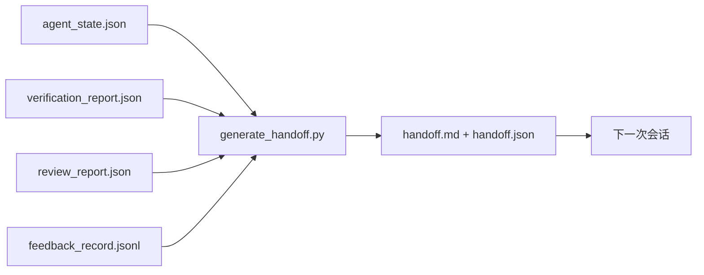

# 多会话交接

> 会话即将结束，但工作还没有结束。交接包是这样一种工件：它把“智能体工作了一个小时”变成“下一次会话在第一分钟就能产出成果”。要有意识地构建它，不要把它当作事后补丁。

**类型：** 构建
**语言：** Python（标准库）
**前置要求：** 第 14 阶段 · 第 34 节（代码库记忆）、第 14 阶段 · 第 38 节（验证）、第 14 阶段 · 第 39 节（审阅者）
**用时：** 约 50 分钟

## 学习目标

- 识别每个交接包都需要的七个字段。
- 从工作台工件生成交接，而不是手写散文。
- 将大体量反馈日志裁剪成适合交接的摘要。
- 让下一次会话的第一步行动具有确定性。

## 问题所在

会话结束。智能体说“很好，我们取得了进展”。下一次会话打开。下一个智能体问：“我们上次停在哪里？”第一个智能体的回答已经消失。下一个智能体重新发现现状、重新运行同样的命令、重新询问人工同样的问题，并花 30 分钟恢复上一个会话最后 30 秒的状态。

一个糟糕的交接所造成的成本，会在任务的整个生命周期中每次会话反复支付。修复方法是在会话结束时自动生成一个包：改了什么、为什么改、尝试过什么、什么失败了、还剩什么、下次先做什么。

## 核心概念



### 每份交接都携带的七个字段

| 字段 | 回答的问题 |
|-------|---------------------|
| `summary` | 做了什么，用一段话概括 |
| `changed_files` | 一眼看懂 diff |
| `commands_run` | 实际执行了什么 |
| `failed_attempts` | 尝试过什么，以及为什么没有奏效 |
| `open_risks` | 下一个会话可能遇到什么问题，严重程度如何 |
| `next_action` | 下一次会话先采取的具体行动 |
| `verdict_pointer` | 验证报告 + 审阅报告的路径 |

`next_action` 是承重字段。一份包含其他一切却没有 `next_action` 的交接，是状态报告，不是交接。

### 交接应当生成，而不是手写

手写的交接就是在困难日子里最容易被跳过的交接。生成器读取工作台工件并输出交接包。智能体的任务是把工作台留在生成器能够总结的状态中，而不是书写总结。

### 两种形式：人类可读与机器可读

`handoff.md` 供人阅读。`handoff.json` 供下一次智能体加载。两者来自相同的源工件。如果二者不一致，以 JSON 为准。

### 裁剪反馈日志

完整的 `feedback_record.jsonl` 可能有数百条记录。交接只携带最后 K 条，以及所有非零退出的条目。下一次会话如有需要可以加载完整日志，但交接包要保持小巧。

### 留下干净状态

交接描述工作。干净状态让工作可恢复。两者不是一回事。如果下一次会话打开时面对半应用的 diff、智能体忘记清理的临时文件、一个游离分支，以及在真正运行前就报错的测试，那么再完美的 `handoff.md` 也毫无价值。下一次智能体前十分钟会用于收拾上一个智能体留下的残局，而不是构建功能；任务生命周期中的每次会话都会因此累积成本。

功能可用不等于会话结束。会话只有在工作台处于生成器可以概括、下一次会话可以信任的状态时才结束。清理是一个独立阶段，应在交接前运行；它是一项检查，而不是习惯，因为困难日子里最容易跳过的就是习惯。

| 检查项 | 干净意味着 | 脏状态会阻塞，因为 |
|-------|-------------|----------------------|
| 工作树 | 每项变更都已提交，或明确 stash 并附带备注 | 半应用的 diff 看起来像下一次智能体有意留下的工作 |
| 临时工件 | 没有遗留 `*.tmp`、草稿目录、调试打印或注释掉的代码块 | 游离文件污染 diff 和下一次智能体的心智模型 |
| 测试 | 绿色，或红色但在 `open_risks` 中写明失败 | 静默的红色测试是下一次会话会踩到的陷阱 |
| 功能看板 | `feature_list.json` 的状态反映现实（第 14 阶段 · 第 36 节） | 过时的看板会把下一次会话引向已经完成的工作 |
| 分支 | 位于预期分支，没有 detached HEAD，也没有孤儿分支 | 错误的分支意味着下一次会话的第一条提交会落到错误位置 |

清理阶段会输出一份记录阻塞问题的 `clean_state.json`；空列表是交接生成器写入交接包前断言的前置条件。建立在脏工作树上的交接不是交接，而是把残局转发出去。两份工件相互配合：清理证明工作台可以安全离开，交接证明下一次会话知道从哪里开始。

```figure
wb-handoff-packet
```

## 动手构建

`code/main.py` 实现：

- 一个加载器，将状态、结论、审阅和反馈汇总到单个 `WorkbenchSnapshot` 中。
- 一个 `generate_handoff(snapshot) -> (markdown, payload)` 函数。
- 一个筛选器，选择最后 K 条反馈以及所有非零退出。
- 一个演示运行，将 `handoff.md` 和 `handoff.json` 写在脚本旁边。

运行：

```text
python3 code/main.py
```

输出：打印交接正文，并在磁盘上写入两个文件。

## 生产环境中的模式

Codex CLI、Claude Code 和 OpenCode 各自采用不同的压缩方式；结构化交接包位于三者之上。

**压缩策略可以不同，但包的 schema 不应不同。** Codex CLI 的 POST /v1/responses/compact 是服务端不透明的 AES blob（OpenAI 模型的快速路径）；回退方案是把本地“交接摘要”追加为 `_summary` 用户角色消息。Claude Code 在上下文达到 95% 时运行五阶段渐进式压缩。OpenCode 会按时间隐藏消息，并生成一份包含五个标题的 LLM 摘要。三种机制不同，但需求相同：将压缩后仍需保留的内容序列化为可移植工件。这个工件就是交接包。

**新会话交接不是压缩。** 压缩延长一次会话；交接则干净地关闭一次会话并开始下一次。Hermes Issue #20372（2026 年 4 月）的描述是正确的：当原地压缩开始降低质量时，智能体应写下精简交接、结束会话，并在新上下文中恢复。交接包让这种转换成本很低。错误做法是一直压缩到质量崩溃；修复方法是为提前且干净的交接预留预算。

**每个分支和主题只保留一个活动交接。** 多智能体协作更多会被过时交接破坏，而非被糟糕的模型输出破坏。始终包含 `branch`、`last_known_good_commit`，以及 `active | superseded | archived` 之一的 `status`。过时交接会被归档；只有活动交接驱动下一次会话。这一区分了“交接即笔记”和“交接即状态”。

**在上下文达到 50–75% 时收尾，不要等到墙。** 手写模式手册（CLAUDE.md + HANDOVER.md）显示，与在 95% 上下文预算时结束相比，在 50–75% 时结束效果最好。交接包生成器能在压缩工件污染源状态之前干净地运行。上下文还完整时写入很便宜；模型已经开始迷失时写入就很昂贵。

## 实际使用

生产环境中的用法：

- **会话结束 hook。** 用户关闭聊天时，运行时触发生成器。交接包进入 `outputs/handoff/<session_id>/`。
- **PR 模板。** 生成器的 Markdown 也是 PR 正文。审阅者无需打开其他五个文件即可阅读。
- **跨智能体交接。** 使用一个产品（Claude Code）构建，再用另一个产品（Codex）继续。交接包就是通用语言。

这个包小巧、规律、生成成本低。每次会话都使用它，节省的成本会不断复利。

## 交付

`outputs/skill-handoff-generator.md` 会生成一个针对项目工件路径的生成器、一个会话结束 hook，以及下一次智能体在启动时读取的 `handoff.json` schema。

## 练习

1. 添加 `assumptions_to_validate` 字段，暴露构建者记录但审阅者得分未超过 1 的每个假设。
2. 对失败运行与通过运行采用不同的反馈摘要裁剪方式。为这种不对称性辩护。
3. 加入“给人工的问题”列表。一个问题达到什么门槛，才应进入交接包而不是聊天消息？
4. 让生成器具有幂等性：运行两次产生同一个包。要做到这一点，哪些内容必须稳定？
5. 添加“下一次会话前置条件”部分，准确列出下一次会话行动前必须加载的工件。

## 关键术语

| 术语 | 人们常说 | 实际含义 |
|------|----------------|------------------------|
| Handoff packet（交接包） | “会话摘要” | 携带七个字段、同时提供 Markdown 和 JSON 的生成工件 |
| Next action（下一步行动） | “先做什么” | 启动下一次会话的一个具体步骤 |
| Feedback trim（反馈裁剪） | “日志摘要” | 最后 K 条记录加上每条非零退出记录 |
| Status report（状态报告） | “我们做了什么” | 缺少 `next_action` 的文档；有用，但不是交接 |
| Verdict pointer（结论指针） | “收据” | 指向验证 + 审阅报告的路径，用于追溯 |

## 延伸阅读

- [Anthropic，面向长时运行智能体的有效工作台](https://www.anthropic.com/engineering/effective-harnesses-for-long-running-agents)
- [OpenAI Agents SDK handoff](https://openai.github.io/openai-agents-python/handoffs/)
- [Codex Blog，Codex CLI 上下文压缩：架构、配置与长会话管理](https://codex.danielvaughan.com/2026/03/31/codex-cli-context-compaction-architecture/)——POST /v1/responses/compact 与本地回退
- [Justin3go，摆脱沉重记忆：Codex、Claude Code、OpenCode 中的上下文压缩](https://justin3go.com/en/posts/2026/04/09-context-compaction-in-codex-claude-code-and-opencode)——三家产品的压缩比较
- [JD Hodges，Claude 交接提示词：如何在会话间保持上下文（2026）](https://www.jdhodges.com/blog/ai-session-handoffs-keep-context-across-conversations/)——CLAUDE.md + HANDOVER.md，50–75% 上下文预算
- [Mervin Praison，多智能体编码会话中的交接管理：不丢连续性地获得新上下文](https://mer.vin/2026/04/managing-handoffs-in-multi-agent-coding-sessions-fresh-context-without-losing-continuity/)——分布式系统视角
- [Hermes Issue #20372——上下文压缩变得危险时自动交接到新会话](https://github.com/NousResearch/hermes-agent/issues/20372)
- [Hermes Issue #499——上下文压缩质量改进](https://github.com/NousResearch/hermes-agent/issues/499)——Codex CLI 中面向交接的提示词
- [Microsoft Agent Framework，压缩](https://learn.microsoft.com/en-us/agent-framework/agents/conversations/compaction)
- [OpenCode，上下文管理与压缩](https://deepwiki.com/sst/opencode/2.4-context-management-and-compaction)
- [LangChain，面向智能体的上下文工程](https://www.langchain.com/blog/context-engineering-for-agents)
- 第 14 阶段 · 第 34 节——生成器读取的状态文件
- 第 14 阶段 · 第 38 节——交接包指向的验证结论
- 第 14 阶段 · 第 39 节——交接包中捆绑的审阅报告
