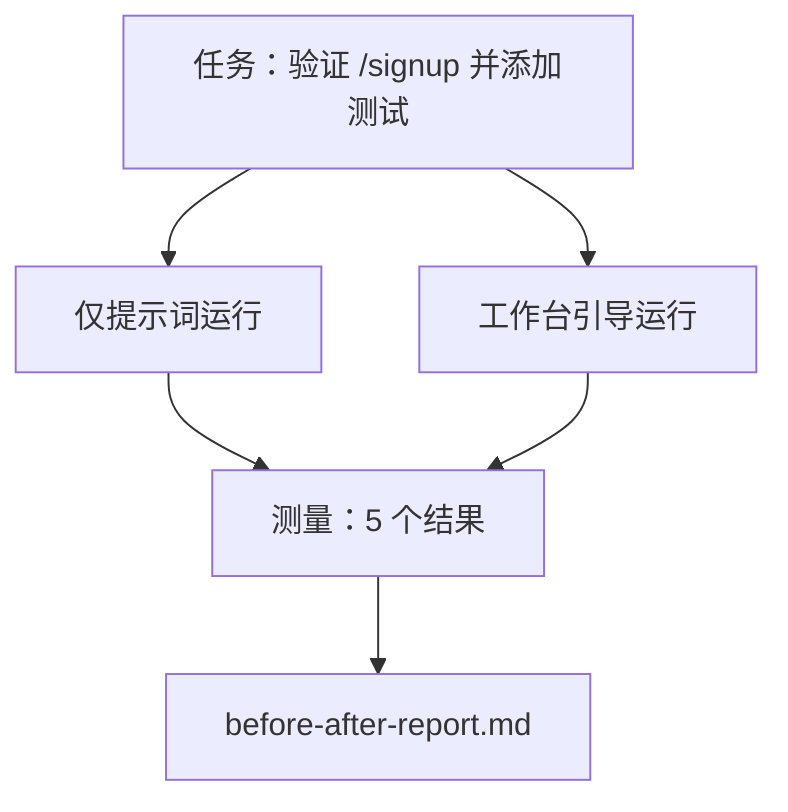

# 在真实代码库中使用工作台

> 如果不能经受真实代码库的检验，十一节工作台面的价值就等于零。本节在一个小型示例应用上运行同一项任务两次：一次只使用提示词，一次由工作台引导。数字会自己说明问题。

**类型：** 构建
**语言：** Python（标准库）
**前置要求：** 第 14 阶段 · 第 32 节至第 40 节
**用时：** 约 60 分钟

## 学习目标

- 在一个小型应用上组合七个工作台面。
- 将同一项任务运行两次（仅提示词与工作台引导），并测量五个结果。
- 阅读前后对比报告，判断哪些工作台面带来了最大的杠杆。
- 为工作台回应“但我的模型已经足够好”的质疑。

## 问题所在

在玩具任务上的演示无法说服任何人。只有当一项有真实感的任务落到一个有真实感的代码库中，并以更少的失败、更少的回滚和一份下一次会话可以使用的交接包进入生产时，工作台的论证才成立。

本节提供这个有真实感的代码库，并让同一项任务通过两条流水线。结果是一份可以交给怀疑者的前后对比报告。

## 核心概念



### 示例应用

`sample_app/` 中的最小 FastAPI 风格处理器：

- `app.py` 中的 `/signup`（还没有验证）。
- `test_app.py` 中的一个 happy-path 测试。
- 作为禁止区诱饵的 `README.md` 和 `scripts/release.sh`。

### 任务

> 为 `/signup` 添加输入验证：拒绝长度少于 8 个字符的密码，返回带类型化错误封套的 422。添加一个证明新行为的测试。

### 两条流水线

仅提示词：

1. 阅读 README。
2. 阅读 `app.py`。
3. 编辑文件。
4. 声称完成。

工作台引导：

1. 运行初始化脚本（第 35 节）。
2. 阅读范围契约（第 36 节）。
3. 阅读状态（第 34 节）。
4. 只编辑允许的文件。
5. 通过反馈运行器运行验收命令（第 37 节）。
6. 运行验证门（第 38 节）。
7. 运行审阅者（第 39 节）。
8. 生成交接（第 40 节）。

### 测量的五个结果

| 结果 | 为什么重要 |
|---------|----------------|
| `tests_actually_run` | 大多数“测试通过了”的声明都无法验证 |
| `acceptance_met` | 证明目标的测试必须是实际运行的测试 |
| `files_outside_scope` | 范围蔓延是最主要的静默失败 |
| `handoff_quality` | 下一次会话会为此付出代价或从中受益 |
| `reviewer_total` | 在验证门之上的定性判断 |

```figure
wb-ab-runs
```

## 动手构建

`code/main.py` 针对同一个示例应用 fixture 编排两条流水线。两条流水线都是脚本化的（循环中没有 LLM），因此测量结果可复现。脚本将比较结果写入 `before-after-report.md` 和 `comparison.json`。

运行：

```text
python3 code/main.py
```

输出：控制台中显示每条流水线的结果表格，Markdown 报告保存在脚本旁边，同时生成供其他人制图的 JSON。

## 生产环境中的模式

怀疑者的问题是：“工作台究竟有多大帮助？”2026 年的数据比解释更有说服力。

**同一个模型从 Terminal Bench 前 30 名之外到前 5 名。** LangChain 的《Anatomy of an Agent Harness》（2026 年 4 月）报告：一个编码智能体只改变工作台，就从 Terminal Bench 2.0 前 30 名之外跃升到第 5 名。同一个模型。不同的界面。相差 25 个名次。

**Vercel 通过删除工具从 80% 提升到 100%。** Vercel 报告称，删除其智能体 80% 的工具后，成功率从 80% 提升到 100%。更小的工具面、更清晰的范围、更少的失败方式。留白赢了。

**Harvey 只靠工作台将准确率提升一倍。** 法律智能体仅通过优化工作台，准确率就提升了一倍以上。

**88% 的企业 AI 智能体项目无法进入生产环境。** preprints.org 的《Harness Engineering for Language Agents》论文（2026 年 3 月）将失败追溯到运行时，而不是推理：状态过时、重试脆弱、上下文膨胀，以及对中间错误的恢复能力差。

**长上下文崩溃。** WebAgent 基线在长上下文条件下，成功率从 40–50% 降到低于 10%，主要原因是无限循环和目标丢失。Ralph Loop 和交接包就是为吸收这种情况而存在的。

**仍然存在假阴性。** 单步事实任务、单行 lint、格式化运行，以及模型已经逐字记住的内容，在这些情况下仅提示词会更快。基准应诚实地列出这些任务，这样工作台不会被包装成过度工程。

模型会随着时间吸收工作台技巧，但今天的工程负担仍由七个工作台面承担；数字支持这一判断。

## 实际使用

当出现以下情况时，可以引用本节：

- 有人问为什么每个 PR 都带有 `agent-rules.md` 和范围契约。
- 一个团队想说“只在这个 sprint 里”去掉验证门。
- 一个新的智能体产品发布了，你需要一个可移植基准来判断它是否真的节省时间。

数字比解释传播得更远。

## 交付

`outputs/skill-workbench-benchmark.md` 是一个可移植评估工作台，它让任意智能体产品针对项目自己的示例应用通过两条流水线运行，并报告五个结果。

## 练习

1. 添加第六个结果：首次有意义编辑所需时间。如何清晰地测量它？
2. 在代码库中第二天的真实任务上运行比较。工作台的数字在哪些地方失真？
3. 增加一个“假阴性”阶段：列出仅提示词会更快且工作台开销是真实成本的任务。为仍然保留工作台辩护。
4. 用真实 LLM 调用替换脚本化的“智能体”。哪些结果会变得更嘈杂？
5. 为非工程师写一页摘要。删减后还剩什么？

## 关键术语

| 术语 | 人们常说 | 实际含义 |
|------|----------------|------------------------|
| Sample app（示例应用） | “玩具代码库” | 足够小但足够真实，能够运行全部七个工作台面 |
| Pipeline（流水线） | “工作流” | 智能体遵循的、有序读取/写入工作台面的序列 |
| Before/after report（前后对比报告） | “收据” | 交给怀疑者的工件 |
| False negative（假阴性） | “工作台过度工程” | 仅提示词更快的任务；诚实列出它们很有用 |
| Workbench benchmark（工作台基准） | “可靠性分数” | 在你的代码库上运行比较的可移植工作台 |

## 延伸阅读

- [LangChain，The Anatomy of an Agent Harness](https://blog.langchain.com/the-anatomy-of-an-agent-harness/)——Terminal Bench 从前 30 名之外到前 5 名的证据
- [MongoDB，The Agent Harness：为什么 LLM 是智能体系统中最小的一部分](https://www.mongodb.com/company/blog/technical/agent-harness-why-llm-is-smallest-part-of-your-agent-system)——Vercel + Harvey 的数据
- [preprints.org，Harness Engineering for Language Agents](https://www.preprints.org/manuscript/202603.1756)——88% 的企业失败率、运行时根因
- [HN：一个下午改进 15 个 LLM 的编码能力。只有工作台发生了变化](https://news.ycombinator.com/item?id=46988596)——在 15 个模型上复现
- [Cloudflare，大规模编排 AI 代码审阅](https://blog.cloudflare.com/ai-code-review/)——生产环境 30 天 131,000 次审阅运行
- [Anthropic，构建有效的智能体](https://www.anthropic.com/research/building-effective-agents)
- 第 14 阶段 · 第 32 节至第 40 节——本节端到端练习的工作台面
- 第 14 阶段 · 第 19 节——SWE-bench、GAIA、AgentBench 等本节补充的宏观基准
- 第 14 阶段 · 第 30 节——评估驱动的智能体开发；同一工作台会接入它
