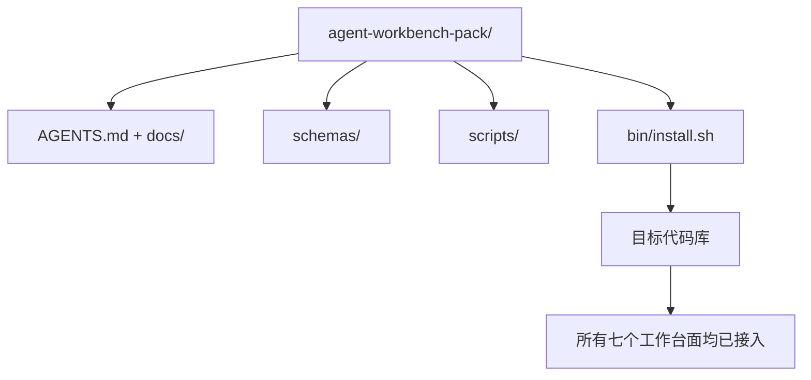

# 结课项目：交付可复用的智能体工作台包

> mini-track 以一个可以放进任意代码库的包收尾。十一节工作台面被压缩进一个目录，你可以执行 `cp -r`，第二天早上就让智能体可靠地工作。结课项目就是这套课程赖以交付的工件。

**类型：** 构建
**语言：** Python（标准库）
**前置要求：** 第 14 阶段 · 第 31 节至第 41 节
**用时：** 约 75 分钟

## 学习目标

- 将七个工作台面打包到一个可直接放入代码库的目录中。
- 固定 schema、脚本和模板，让新代码库获得一个已知良好的基线。
- 添加一个幂等地铺设工作台包的安装脚本。
- 决定哪些内容留在包内、哪些内容排除在外，并为每项取舍辩护。

## 问题所在

存在于 Google Doc、聊天历史和三个半记得的脚本中的工作台，每个季度都会被重新构建。解决办法是一个版本化的包：一个包含工作台面、schema、脚本和单命令安装器的代码库或目录。

本节结束时，你会把 `outputs/agent-workbench-pack/` 交付到磁盘上，并拥有一个能将它放入任意目标代码库的 `bin/install.sh`。

## 核心概念



### 包的布局

```text
outputs/agent-workbench-pack/
├── AGENTS.md
├── docs/
│   ├── agent-rules.md
│   ├── reliability-policy.md
│   ├── handoff-protocol.md
│   └── reviewer-rubric.md
├── schemas/
│   ├── agent_state.schema.json
│   ├── task_board.schema.json
│   └── scope_contract.schema.json
├── scripts/
│   ├── init_agent.py
│   ├── run_with_feedback.py
│   ├── verify_agent.py
│   └── generate_handoff.py
├── bin/
│   └── install.sh
└── README.md
```

### 哪些内容留在包内，哪些排除在外

包内：

- 工作台面 schema。它们就是契约。
- 上述四个脚本。它们就是运行时。
- 上述四份文档。它们就是规则与 rubric。

包外：

- 项目专用任务。任务属于目标代码库的看板，不属于工作台包。
- 厂商 SDK 调用。工作台包与框架无关。
- 入门说明文字。包位于团队已有的入门材料旁边，而不是其中。

### 安装器

一个简短的 `bin/install.sh`（或 `bin/install.py`）：

1. 如果没有 `--force`，拒绝覆盖已有的工作台包。
2. 将工作台包复制到目标代码库。
3. 如果存在 `.github/workflows/`，就接入 CI。
4. 打印下一步：填写看板、设置验收命令、运行初始化脚本。

### 版本化

工作台包携带 `VERSION` 文件。需要迁移的 schema 升级和脚本变更会提升主版本。只有文档变更会提升补丁版本。目标代码库的 `agent_state.json` 会记录它是针对哪个工作台包版本初始化的。

```figure
wb-pack-install
```

## 动手构建

`code/main.py` 将工作台包组装到本节旁边的 `outputs/agent-workbench-pack/` 中，使用本 mini-track 前面课程的 schema 和脚本，以及你已经写好的文档作为初始内容。

运行：

```text
python3 code/main.py
```

脚本会复制并固定这些工作台面，写入 README，打印包的树形结构，并以零退出结束。重复运行是幂等的。

## 生产环境中的模式

一个包只有能够经受分叉、更新和不友好的上游时才有价值。四种模式可以提供这层保障。

**`VERSION` 是契约，而不是营销。** 主版本升级需要状态迁移。次版本升级需要重新运行检查器。补丁版本升级只允许文档变更。安装器每次安装都会把 `.workbench-version` 写入目标代码库；如果目标的锁定版本与包的 `VERSION` 不一致，`lint_pack.py` 就拒绝交付。这正是 `npm`、Cargo 和 `pyproject.toml` 经历十年变化仍能存活的方式；智能体不会改变这条规则。

**用一个来源支持跨工具分发。** Nx 通过一个 `nx ai-setup`，从单一配置铺设 `AGENTS.md`、`CLAUDE.md`、`.cursor/rules/`、`.github/copilot-instructions.md` 和一个 MCP 服务器。工作台包也应如此；安装器生成符号链接（`ln -s AGENTS.md CLAUDE.md`），让单一事实来源扩散到每个编码智能体。为了支持不同工具而分叉工作台包，是一种失败模式。

**`uninstall.sh` 遇到非平凡状态就拒绝。** 卸载工作台包不能删除用户的 `agent_state.json`、`task_board.json` 或 `outputs/`。卸载器删除 schema、脚本、文档和 `AGENTS.md`（可以用 `--keep-agents-md` 选择保留），并且在状态文件存在任何未提交变更时拒绝继续。状态属于用户；工作台包不拥有它。

**作为可发布的 skill 分发：SkillKit 风格。** 工作台包作为 SkillKit skill 交付：`skillkit install agent-workbench-pack` 可以从单一来源将它铺设到 32 个 AI 智能体中。工作台包代码库是事实来源；SkillKit 是分发渠道。厂商锁定被消除，七个工作台面保持不变。

## 实际使用

工作台包有三种交付位置：

- **作为放入代码库的目录。** `cp -r outputs/agent-workbench-pack /path/to/repo`。
- **作为公开模板代码库。** Fork 后定制，由 `VERSION` 控制漂移。
- **作为 SkillKit skill。** 接入智能体产品，让单个命令完成铺设。

工作台包是配方；每次安装都是一次出餐。

## 交付

`outputs/skill-workbench-pack.md` 会生成一个针对项目调整的工作台包：根据团队历史收紧规则、匹配代码库的范围 glob，并增加一个领域专用的 rubric 维度。

## 练习

1. 决定哪个可选的第五份文档值得提升为规范包的一部分。为这项取舍辩护。
2. 将安装器改写为带有 `--dry-run` 标志的 Python。比较它与 bash 版本的人机工程学。
3. 添加一个能够安全移除工作台包、并在状态文件存在非平凡历史时拒绝操作的 `bin/uninstall.sh`。什么算非平凡？
4. 添加 `lint_pack.py`，当工作台包偏离 `VERSION` 时失败。将它接入工作台包自身代码库的 CI。
5. 编写从手工工作台迁移到此工作台包的运行手册。怎样安排操作顺序，才能把停机时间降到最低？

## 关键术语

| 术语 | 人们常说 | 实际含义 |
|------|----------------|------------------------|
| Workbench pack（工作台包） | “起步套件” | 携带全部七个工作台面的版本化目录 |
| Installer（安装器） | “设置脚本” | 幂等铺设工作台包的 `bin/install.sh` |
| Pack version（包版本） | “VERSION” | schema/脚本变更提升主版本，文档变更提升补丁版本 |
| Drop-in pack（即插即用包） | “cp -r 就能运行” | 无需逐代码库定制，第一天就能工作 |
| Forkable template（可分叉模板） | “GitHub 模板” | GitHub 的“使用此模板”可以克隆的公开代码库 |

## 延伸阅读

- 第 14 阶段 · 第 31 节至第 41 节——这个包捆绑的所有工作台面
- [SkillKit](https://github.com/rohitg00/skillkit)——把这个 skill 安装到 32 个 AI 智能体中
- [Nx Blog，教你的 AI 智能体如何在 monorepo 中工作](https://nx.dev/blog/nx-ai-agent-skills)——跨六种工具的单一来源生成器
- [agents.md——开放规范](https://agents.md/)——你的包路由器必须实现的内容
- [HKUDS/OpenHarness](https://github.com/HKUDS/OpenHarness)——等价于工作台包的参考实现
- [andrewgarst/agentic_harness](https://github.com/andrewgarst/agentic_harness)——带 Redis 后端和评估套件的参考实现
- [Augment Code，一份好的 AGENTS.md 就是一次模型升级](https://www.augmentcode.com/blog/how-to-write-good-agents-dot-md-files)——包文档的质量标准
- [Anthropic，面向长时运行智能体的有效工作台](https://www.anthropic.com/engineering/effective-harnesses-for-long-running-agents)
- [Anthropic，长时运行应用开发的工作台设计](https://www.anthropic.com/engineering/harness-design-long-running-apps)
- 第 14 阶段 · 第 30 节——消费这个包的验证门的评估驱动智能体开发
- 第 14 阶段 · 第 41 节——这个包要改进的前后对比基准
