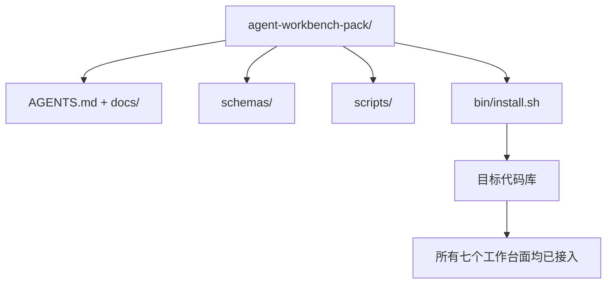

# 结课项目：交付可复用的智能体工作台包

> mini-track 以一个可以放进任意代码库的包收尾。十一节工作台面被压缩进一个目录，你可以执行 `cp -r`，第二天早上就让智能体可靠地工作。结课项目就是这套课程赖以交付的工件。

**类型：** 构建
**语言：** Python（标准库）
**前置要求：** 第 14 阶段 · 第 31 节至第 41 节
**用时：** 约 75 分钟

## 学习目标

- 将七个工作台面打包到一个可直接放入代码库的目录中。
- 固定 schema、脚本和模板，让新代码库获得一个已知良好的基线。
- 添加一个幂等地铺设工作台包的安装脚本。
- 决定哪些内容留在包内、哪些内容排除在外，并为每项取舍辩护。
- 展示一次智能体辅助的代码库改动，并提供审核者可以复现的证据。

## 问题所在

存在于 Google Doc、聊天历史和三个半记得的脚本中的工作台，每个季度都会被重新构建。解决办法是一个版本化的包：一个包含工作台面、schema、脚本和单命令安装器的代码库或目录。

本节结束时，你会把 `outputs/agent-workbench-pack/` 交付到磁盘上，并拥有一个能将它放入任意目标代码库的 `bin/install.sh`。

## 核心概念 <!-- learning-atlas: the-concept -->


```mermaid
flowchart TD
  Pack[agent-workbench-pack/] --> Docs[AGENTS.md + docs/]
  Pack --> Schemas[schemas/]
  Pack --> Scripts[scripts/]
  Pack --> Bin[bin/install.sh]
  Bin --> Repo[目标代码库]
  Repo --> Surfaces[所有七个工作台面均已接入]
```

### 包的布局

```text
outputs/agent-workbench-pack/
├── AGENTS.md
├── docs/
│   ├── agent-rules.md
│   ├── reliability-policy.md
│   ├── handoff-protocol.md
│   └── reviewer-rubric.md
├── schemas/
│   ├── agent_state.schema.json
│   ├── task_board.schema.json
│   └── scope_contract.schema.json
├── scripts/
│   ├── init_agent.py
│   ├── run_with_feedback.py
│   ├── verify_agent.py
│   └── generate_handoff.py
├── bin/
│   └── install.sh
└── README.md
```

### 哪些内容留在包内，哪些排除在外

包内：

- 工作台面 schema。它们就是契约。
- 上述四个脚本。它们就是运行时。
- 上述四份文档。它们就是规则与 rubric。

包外：

- 项目专用任务。任务属于目标代码库的看板，不属于工作台包。
- 厂商 SDK 调用。工作台包与框架无关。
- 入门说明文字。包位于团队已有的入门材料旁边，而不是其中。

### 安装器

一个简短的 `bin/install.sh`（或 `bin/install.py`）：

1. 如果没有 `--force`，拒绝覆盖已有的工作台包。
2. 将工作台包复制到目标代码库。
3. 如果存在 `.github/workflows/`，就接入 CI。
4. 打印下一步：填写看板、设置验收命令、运行初始化脚本。

### 版本化

工作台包携带 `VERSION` 文件。需要迁移的 schema 升级和脚本变更会提升主版本。只有文档变更会提升补丁版本。目标代码库的 `agent_state.json` 会记录它是针对哪个工作台包版本初始化的。

```figure
wb-pack-install
```

## 动手构建

`code/main.py` 将工作台包组装到本节旁边的 `outputs/agent-workbench-pack/` 中，使用本 mini-track 前面课程的 schema 和脚本，以及你已经写好的文档作为初始内容。

运行：

```text
python3 code/main.py
```

脚本会复制并固定这些工作台面，写入 README，打印包的树形结构，并以零退出结束。重复运行是幂等的。

## 生产环境中的模式

一个包只有能够经受分叉、更新和不友好的上游时才有价值。四种模式可以提供这层保障。

**`VERSION` 是契约，而不是营销。** 主版本升级需要状态迁移。次版本升级需要重新运行检查器。补丁版本升级只允许文档变更。安装器每次安装都会把 `.workbench-version` 写入目标代码库；如果目标的锁定版本与包的 `VERSION` 不一致，`lint_pack.py` 就拒绝交付。这正是 `npm`、Cargo 和 `pyproject.toml` 经历十年变化仍能存活的方式；智能体不会改变这条规则。

**用一个来源支持跨工具分发。** Nx 通过一个 `nx ai-setup`，从单一配置铺设 `AGENTS.md`、`CLAUDE.md`、`.cursor/rules/`、`.github/copilot-instructions.md` 和一个 MCP 服务器。工作台包也应如此；安装器生成符号链接（`ln -s AGENTS.md CLAUDE.md`），让单一事实来源扩散到每个编码智能体。为了支持不同工具而分叉工作台包，是一种失败模式。

**`uninstall.sh` 遇到非平凡状态就拒绝。** 卸载工作台包不能删除用户的 `agent_state.json`、`task_board.json` 或 `outputs/`。卸载器删除 schema、脚本、文档和 `AGENTS.md`（可以用 `--keep-agents-md` 选择保留），并且在状态文件存在任何未提交变更时拒绝继续。状态属于用户；工作台包不拥有它。

**作为可发布的 skill 分发：SkillKit 风格。** 工作台包作为 SkillKit skill 交付：`skillkit install agent-workbench-pack` 可以从单一来源将它铺设到 32 个 AI 智能体中。工作台包代码库是事实来源；SkillKit 是分发渠道。厂商锁定被消除，七个工作台面保持不变。

## 实际使用

工作台包有三种交付位置：

- **作为放入代码库的目录。** `cp -r outputs/agent-workbench-pack /path/to/repo`。
- **作为公开模板代码库。** Fork 后定制，由 `VERSION` 控制漂移。
- **作为 SkillKit skill。** 接入智能体产品，让单个命令完成铺设。

工作台包是配方；每次安装都是一次出餐。

## 交付

`outputs/skill-workbench-pack.md` 会生成一个针对项目调整的工作台包：根据团队历史收紧规则、匹配代码库的范围 glob，并增加一个领域专用的 rubric 维度。

## 练习

1. 决定哪个可选的第五份文档值得提升为规范包的一部分。为这项取舍辩护。
2. 将安装器改写为带有 `--dry-run` 标志的 Python。比较它与 bash 版本的人机工程学。
3. 添加一个能够安全移除工作台包、并在状态文件存在非平凡历史时拒绝操作的 `bin/uninstall.sh`。什么算非平凡？
4. 添加 `lint_pack.py`，当工作台包偏离 `VERSION` 时失败。将它接入工作台包自身代码库的 CI。
5. 编写从手工工作台迁移到此工作台包的运行手册。怎样安排操作顺序，才能把停机时间降到最低？

## 职业实践：用证据验证一次代码库改动

打包演示证明了组装脚本能运行并生成文件。智能体能否完成新任务、生成的检查能否验证该任务、部署后的系统能否工作，都需要各自的证据。请分别说明这些结论。

在你拥有或获准修改的代码库中，选择一个小型真实任务，使用一个你已有权限使用的编码智能体。修复缺陷、实现范围明确的功能或改进运行流程都可以；本练习不要求安装多个智能体。

在打包实验之外，另行安排一次工作时段。将下方链接的证据模板复制到你自己的 `learning-artifacts/` 目录。保留仓库中已提交的模板和工作台包，作为参考材料。

### 1. 界定任务并选择自主程度

使用第 43 节的任务框架和第 44 节的证据计划。记录起始 revision、可观察目标、非目标、允许改动的路径和验收证据。明确哪位真实用户或运维人员需要这项行为。

选择工作模式：逐步指导、设检查点的实现，或有明确边界的自主运行。说明任务的不确定性、后果和可逆性为何适合该模式。小型本地重构所需的检查点可能少于访问控制改动。

设置实际耗时预算；如果智能体提供相应能力，也设置 token 或费用上限。无法获取的测量值应如实记录。为反复失败、新权限需求、预算耗尽或未解决的契约决策定义停止条件，并写明由谁解决。

### 2. 准备满足任务需要的最小环境

查找相关实现、调用方、测试和本地指令。记录每个来源为何需要进入上下文，以及哪些当前证据可以推翻过期笔记。不要默认加载整个代码库。

对每项相关扩展作出明确选择：skill 提供可重复执行的流程，MCP 工具提供访问能力，hook 执行确定性检查，plugin 打包能力。只保留任务需要的扩展，并授予足以完成工作的最小权限。

记录一项你拒绝添加的扩展会带来的上下文或维护成本。重新核对一条过期记忆或指令；如果证据支持，就在学习者自己的配置中退役或替换它。重新运行受影响的检查，确认移除后没有丢失必要约束。

### 3. 记录基线并实现改动

编辑前，运行最接近任务的现有检查，并展示所请求行为的当前状态。保留命令、revision、结果和证据位置。尚未存在的功能也有基线：记录当前响应或不受支持的操作。

让智能体在契约范围内实现改动。维护干预日志，记录每次纠正、权限变化或计划调整的原因。委派是可选的；如果需要其他执行者，先应用第 45 节的所有权与集成契约。

### 4. 质疑验收证据

选择能观察改动位置的证明方式。对于 UI，重新构建并在相关屏幕宽度下检查实际提供的用户流程；对于 API，检查请求和序列化响应；对于 CLI，运行构建后的命令并检查退出码和输出。选择任务所需的检查，并说明其局限。

依据任务契约写出预期结果，独立于智能体的实现。在可丢弃的副本中引入一种具体错误，例如接受无效值或遗漏响应中的必需字段。运行同一项验收检查，它必须因该错误而失败。

如果检查仍通过，先加强断言或观察方式，再信任它。恢复正确实现并重新运行至通过，保留失败和通过两次运行的凭据。语法错误或损坏的测试环境不能证明检查能发现该回归。

对照原始目标和允许路径审查最终 diff，包括测试改动。请同伴或独立审查会话在不编辑实现的前提下质疑最薄弱的证明。最终判断仍由你负责；另一个智能体表示赞同不能充当执行证据。

### 5. 演练运行与恢复

在可丢弃的本地或预发布环境中运行改动后的产物。为每次观察标注 `local`、`staging` 或 `live`，并记录确切的 revision 或产物标识。本地演练支持本地结论；本练习不要求部署到生产环境。

选择一个与任务相关的失败信号，设置阈值、观察窗口和负责人。说明越过阈值后的应对方式。在演练中安全地触发该信号，保留观察到的日志、指标或响应。

演练回滚到已知正常的产物，检查先前行为是否恢复。涉及持久化数据时，也要考虑数据恢复；仅替换二进制文件可能无法撤销数据改动。记录你未能验证的恢复步骤。

### 6. 改进下一次运行并交接

将结果与基线比较，包括耗时、可获取的用量数据和人工干预。一次任务只能说明该次任务的情况，不能证明智能体通常更快或更可靠。

按第 46 节的方法，将一次已观察到的纠正落实为测试、更小的权限边界、自动化或更清楚的示例，并重新运行受影响的检查。移除临时引入的错误，向下一次会话明确交代最终分支、改动文件、未解决风险和下一步行动。

### 人工审查量规

请审查者检查证据文件，并至少复现最薄弱的验收检查。为每一行标记 `demonstrated`（已证明）、`needs revision`（需修订）或 `unverified`（未验证），附上证据位置和原因。填写字段和通过打包脚本都不能替代这些观察。

| 维度 | 审查者应质疑的证据 |
|---|---|
| 任务与自主程度 | 起始行为、明确范围的目标、权限依据、预算和可执行的停止规则 |
| 上下文与环境 | 相关来源、工具访问依据，以及重新核对过的退役决策 |
| 验证 | 实际的改动前后行为，以及同一检查能拒绝的刻意错误结果 |
| 审查与运行 | 已检查的 diff、独立质疑、注明环境的运行观察和已演练的恢复 |
| 迭代与交接 | 一项已验证的改进、如实说明的局限、清理后的最终状态和可复现的下一步行动 |

声称任务完成前，先解决 `needs revision` 项。无法取得的证据保留为 `unverified`，并据此缩小结论范围。作品集展示的是你在一个有明确边界的任务中的工程判断，不保证获得录用或具备部署条件。

## 交付成果

保留可复用工作台包，以及你完成的 [career-agent-evidence.md](https://github.com/rohitg00/ai-engineering-from-scratch/blob/main/phases/14-agent-engineering/42-agent-workbench-capstone/outputs/career-agent-evidence.md) 副本。该模板将任务框架、执行计划、运行凭据、审查、恢复演练和交接串联成一个可审查的案例。

## 关键术语

| 术语 | 人们常说 | 实际含义 |
|------|----------------|------------------------|
| Workbench pack（工作台包） | “起步套件” | 携带全部七个工作台面的版本化目录 |
| Installer（安装器） | “设置脚本” | 幂等铺设工作台包的 `bin/install.sh` |
| Pack version（包版本） | “VERSION” | schema/脚本变更提升主版本，文档变更提升补丁版本 |
| Drop-in pack（即插即用包） | “cp -r 就能运行” | 无需逐代码库定制，第一天就能工作 |
| Forkable template（可分叉模板） | “GitHub 模板” | GitHub 的“使用此模板”可以克隆的公开代码库 |

## 延伸阅读

- 第 14 阶段 · 第 31 节至第 41 节——这个包捆绑的所有工作台面
- [SkillKit](https://github.com/rohitg00/skillkit)——把这个 skill 安装到 32 个 AI 智能体中
- [Nx Blog，教你的 AI 智能体如何在 monorepo 中工作](https://nx.dev/blog/nx-ai-agent-skills)——跨六种工具的单一来源生成器
- [agents.md——开放规范](https://agents.md/)——你的包路由器必须实现的内容
- [HKUDS/OpenHarness](https://github.com/HKUDS/OpenHarness)——等价于工作台包的参考实现
- [Augment Code，一份好的 AGENTS.md 就是一次模型升级](https://www.augmentcode.com/blog/how-to-write-good-agents-dot-md-files)——包文档的质量标准
- [Anthropic，面向长时运行智能体的有效工作台](https://www.anthropic.com/engineering/effective-harnesses-for-long-running-agents)
- [Anthropic，长时运行应用开发的工作台设计](https://www.anthropic.com/engineering/harness-design-long-running-apps)
- 第 14 阶段 · 第 30 节——消费这个包的验证门的评估驱动智能体开发
- 第 14 阶段 · 第 41 节——这个包要改进的前后对比基准
