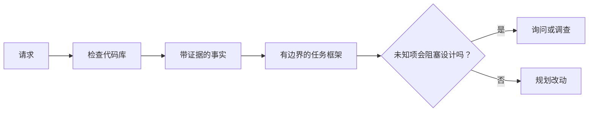

# 在智能体编写代码前界定任务

> 编码智能体可以很快实现清晰的任务，也可以很快实现含糊的任务。速度相同，代价不同。

**类型：** 学习 + 构建
**语言：** Python（标准库）
**前置要求：** Phase 14 第 31、36 节
**用时：** 约 60 分钟

## 学习目标

- 在编辑前把请求转化为有边界的任务框架。
- 将代码库事实与假设、开放问题分开。
- 定义允许路径、禁止路径和验收证据。
- 判断何时侦察已经足够，可以开始工作。

## 昂贵的失败

“增加重复邮箱保护”听起来很具体，其实并不是。唯一性应该属于 API、领域服务还是数据库？比较是否区分大小写？现有的错误形状是什么？允许迁移吗？哪个测试能证明行为正确？

一个能力很强的智能体会用看似合理的选择填上这些空白。这才是危险之处：实现可以整洁、测试可以通过，却仍然与系统不兼容。

因此，编码智能体工作的第一个单元不是编辑，而是由代码库证据支撑的任务框架。

## 任务框架

一个有用的框架有六个字段：

| 字段 | 要回答的问题 |
|---|---|
| 目标 | 哪个可观察行为必须改变？ |
| 代码库事实 | 你在代码、测试、配置或历史中核实了什么？ |
| 允许路径 | 改动可以落在哪里？ |
| 禁止路径 | 哪些内容必须保持不动？ |
| 验收证据 | 哪些命令或观察可以证明目标达成？ |
| 未知项 | 哪些决定仍需要证据或人的判断？ |

事实需要凭据。“API 对重复请求使用 409”只有在你能指向现有测试或处理器时才是事实。文件路径和行号已经足够；如果涉及行为，命令结果更好。



## 侦察是在寻找约束

不要阅读整个代码库。搜索那些会约束改动的表面：

1. 当前行为及其调用方。
2. 最接近的现有测试。
3. 公共契约或序列化形状。
4. 约束该路径的项目说明。
5. 构建与验证命令。
6. 能显示本地模式的相似已完成改动。

当每个计划中的决定都得到证据支持、被明确委派，或被列为未知项时就停止。继续阅读往往只是逃避决策。

## 未知项不是失败

未知项是受控的缺口；假设则是对缺口给出的、没有控制的答案。

对每个未知项分类：

- **可发现：** 代码库或运行中的系统可以回答它。
- **可决定：** 任务契约授予智能体选择权。
- **人的决定：** 选择会改变产品行为、成本、风险或公开兼容性。
- **延期：** 选择超出当前切片，属于非目标。

智能体应继续处理可发现和已委派的未知项。在把人的决定埋进代码之前，应在此暂停。

## 先确定验收，再实现

先写证明，再写补丁。证明可以是：

- 一个聚焦的单元或集成测试命令；
- 一个带视口名称和预期状态的浏览器流程；
- 一个具体的请求和精确响应契约；
- 一个带阈值的性能测量；
- 一个确认没有修改无关文件的范围检查。

“测试通过”不是证明计划。要写明确切的证明命令或观察，以及它证明的主张。

## 动手构建

实验会创建一个 `TaskFrame`，验证它的边界与证据，并写出 `outputs/task-frame.md`。

运行：

```bash
python3 code/main.py
python3 -m unittest discover code/tests -v
```

用四种方式破坏示例：删除目标、删除事实凭据、让允许路径与禁止路径重叠，以及删除验收命令。验证器应分别以不同原因拒绝每个框架。

## 在真实代码库中使用

在要求智能体编辑前：

1. 把目标写成行为，而不是文件改动。
2. 记录两三个带精确证据的事实。
3. 写出最小的允许路径集合。
4. 明确写出负空间。
5. 写出能关闭任务的命令或观察。
6. 列出尚未获得依据的决定。

框架应该能放在一屏内。如果放不下，任务可能包含多个可以独立验证的改动。

## 练习

1. 不提出解决方案，为一个代码库中的真实缺陷建立任务框架。
2. 找出框架中的一条其实是假设的陈述，用证据替换它。
3. 增加一个会改变公共契约的人的未知项。
4. 将一个宽泛的允许路径拆成最小的安全集合。
5. 为验收证据增加一个范围凭据。

## 延伸阅读

- [Nuseibeh and Easterbrook, Requirements Engineering: A Roadmap](https://www.cs.toronto.edu/~sme/papers/2000/ICSE2000.pdf)，用于把实现锚定在真实目标和不断变化的约束上。
- [Yang et al., SWE-agent: Agent-Computer Interfaces Enable Automated Software Engineering](https://arxiv.org/abs/2405.15793)，用于理解编码智能体周围的接口如何改变其效果。

## 你要保留的成果

保留 `outputs/task-frame.md`。下一节会把它作为有证据支撑的执行计划输入。
