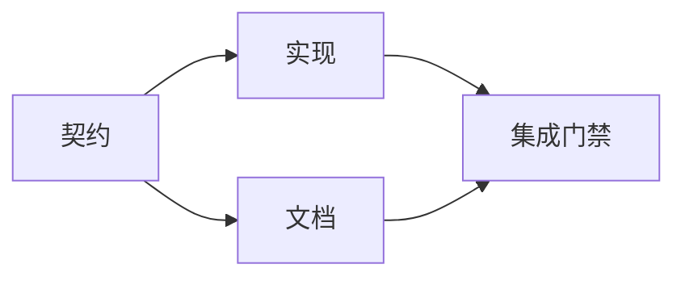

# 构建有证据支撑的执行计划

> 计划不是更漂亮的待办清单，而是一张依赖图：每次改动都有理由，每个终端节点都有证明。

**类型：** 学习 + 构建
**语言：** Python（标准库）
**前置要求：** Phase 14 第 43 节
**用时：** 约 65 分钟

## 学习目标

- 把任务框架转化为带证据和证明的工作项。
- 用依赖而不是散文式顺序建模先后关系。
- 在编辑前发现缺少的事实、未知依赖和循环。
- 区分可以同时运行的步骤与必须等待的步骤。

## 智能体计划为何失败

薄弱的计划只是用将来时重复请求：

1. 更新 API。
2. 增加测试。
3. 更新文档。

这样的清单没有说明发现了什么、为什么这些文件是正确位置、哪个契约先变化，或者哪些工作可以并行。智能体可以完成每一步，却仍然制造返工。

强计划会为每个工作项作出五个承诺：

| 承诺 | 用途 |
|---|---|
| 标识符 | 为依赖和交接提供稳定引用 |
| 改动 | 最小的行为或契约变化 |
| 证据 | 支持这次改动的代码库事实 |
| 依赖 | 开始前必须成立的工作 |
| 证明 | 关闭该工作项的确切检查 |

## 先规划契约，再规划实现

当多个表面依赖同一行为时，先定义行为。这样测试、实现、文档和集成可以共享一份契约，而不是各自发明四种版本。



这张图暴露了安全的并发点：契约确定后，实现和文档可以同时进行；集成要等待两者都完成。

## 证据会改变计划

代码库证据不是装饰。它应该有能力改变工作：

- 一个已有辅助函数让计划中的新抽象变得多余。
- 一个兼容性测试迫使你增加迁移步骤。
- 一个部署约束让 schema 变更移到另一项任务。
- 一个公开响应类型改变实现和文档的先后顺序。

如果证据不可能改变计划，它可能就不是支持该决定的证据。

## 为中断设计

编码智能体会话可能意外结束。可恢复的计划要让工作项足够小，使另一个会话能够判断：

- 哪一项已经完成；
- 哪个证明已经运行；
- 哪些工件发生了变化；
- 哪些依赖现在已解除阻塞；
- 下一项安全工作是什么。

不要只把状态编码在聊天中打勾。把计划存放在工作旁边。

## 计划验证

出现以下情况时，应在执行前拒绝计划：

- 标识符重复；
- 工作项没有证据；
- 工作项没有证明；
- 依赖指向未知工作项；
- 依赖图包含循环；
- 第一个不可逆动作发生在相关不确定性解决之前。

前五项可以机械检查；最后一项需要判断，应明确指出。

## 动手构建

`code/main.py` 建模工作项，验证凭据，使用拓扑排序计算执行波次，并写出 `outputs/evidence-plan.json`。

运行：

```bash
python3 code/main.py
python3 -m unittest discover code/tests -v
```

示例会产生三个波次：先定义契约；实现与文档同时进行；最后运行集成门禁。

## 与编码智能体一起使用

要求智能体在改文件前先产出计划。检查计划的三点：

1. 每个路径和行为主张都有代码库凭据。
2. 每个工作项都有一个清晰的完成证明。
3. 图会把昂贵或不可逆的工作推迟到相关不确定性解决之后。

批准这份计划，而不是一句“我会小心”的模糊承诺。

## 练习

1. 增加一项需要明确人工批准的迁移工作。
2. 创建一个循环，并解释它背后隐藏的产品分歧。
3. 拆分一个拥有两个证明命令的工作项。
4. 增加一个无需接触现有两个分支、可以在第二波执行的工作项。
5. 为依赖失效的工作者定义取消规则。

## 延伸阅读

- [Nuseibeh and Easterbrook, Requirements Engineering: A Roadmap](https://www.cs.toronto.edu/~sme/papers/2000/ICSE2000.pdf)，用于理解目标、规范、共识和演进之间的迭代关系。
- [Barry Boehm, A Spiral Model of Software Development and Enhancement](https://dl.acm.org/doi/10.1145/12944.12948)，用于围绕风险解决工作排序，而不是固定的线性顺序。

## 你要保留的成果

保留 `outputs/evidence-plan.json`。下一节会把它作为委派契约。
