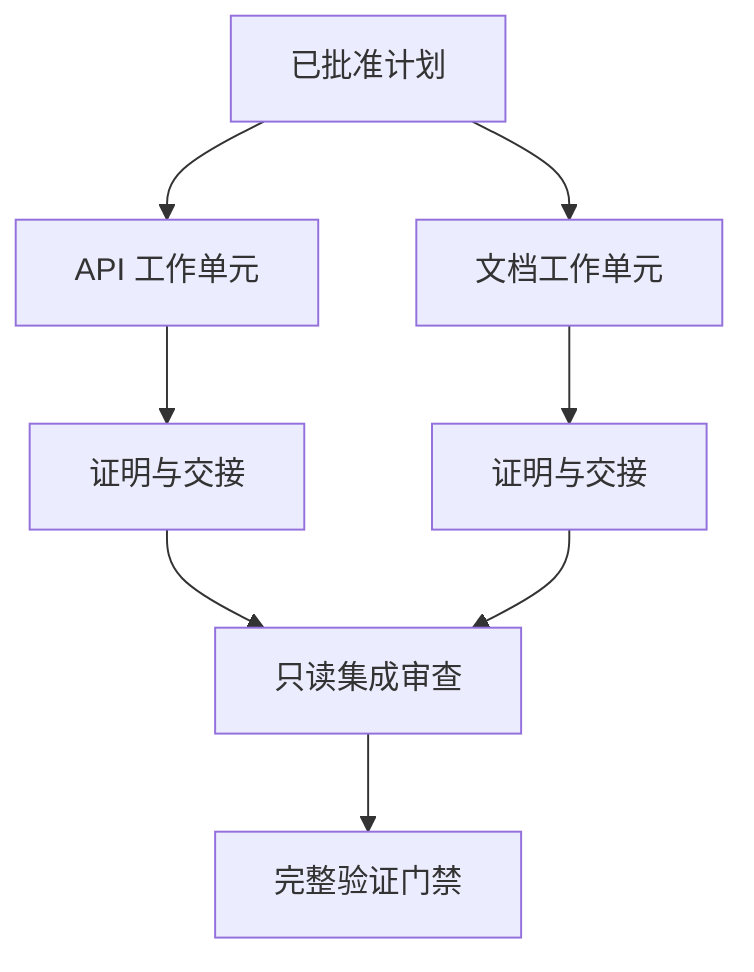

# 用隔离和合并契约委派智能体工作

> 只有在工作彼此独立时，并行智能体才会节省墙钟时间；否则它们只是把一个清晰任务变成更快失败的协调问题。

**类型：** 学习 + 构建
**语言：** Python（标准库）
**前置要求：** Phase 14 第 39、44 节
**用时：** 约 70 分钟

## 学习目标

- 根据真正的独立性判断是否值得委派。
- 给每个工作者分配排他的文件所有权和明确证明。
- 根据依赖计算执行波次。
- 设计安全合并智能体工作的契约。

## 并行性测试

不要因为有更多智能体可用就委派。满足以下至少一项时才委派：

- 两项调查可以独立回答不同的未知项；
- 两项实现拥有不相交的文件和契约；
- 审查者可以检查已完成工件而无需修改它；
- 缓慢的外部检查可以与本地工作同时进行。

当智能体需要相同文件、相同未解决的决定或同一个可变环境时，保持串行。

## 工作单元就是契约

每个委派单元需要：

| 字段 | 含义 |
|---|---|
| 目标 | 一个可观察结果 |
| 负责人 | 一个承担责任的工作者 |
| 路径 | 排他的写入所有权 |
| 依赖 | 开始前必须完成的单元 |
| 证明 | 集成者收到的确切证据 |
| 交接 | 改动文件、已作决定和剩余风险 |

“处理后端”不是工作单元。“在 `app/accounts.py` 中实现重复检查，并用聚焦的账户测试证明它”才是。

## 隔离的三层

1. **文件系统隔离：** 独立 worktree 或沙箱防止意外共享编辑。
2. **所有权隔离：** 契约防止两个工作者有意拥有重叠文件。
3. **状态隔离：** 独立日志和输出防止一个工作者覆盖另一个人的证据。

文件系统隔离不能解决所有权问题。两个干净的 worktree 仍然可能产出冲突设计；合并契约必须在开始前解决共享接口。



## 集成者不应重做工作

集成者应：

1. 确认每份交接符合分配的范围。
2. 阅读证明输出，而不只读工作者的摘要。
3. 按依赖顺序组合改动。
4. 运行跨单元的完整门禁。
5. 拒绝隐性的范围扩张。
6. 把冲突记录为新决定，而不是静默编辑。

如果集成需要重写工作者的大部分结果，原来的拆分就是错误的。

## 人与智能体的角色

委派不会消除人的判断。人仍然负责改变公共行为、风险、权限或不可逆成本的选择。智能体可以负责有边界的调查、实现、验证和审查。

这是经过校准的自主性：证据充分且容易回滚时给予系统自由，后果高时要求回到检查点。

## 动手构建

实验会检查路径重叠，验证依赖，计算安全执行波次，并写出 `outputs/delegation-plan.json`。

运行：

```bash
python3 code/main.py
python3 -m unittest discover code/tests -v
```

让文档单元改为拥有 `app/`。计划应因它与 API 单元重叠而阻塞。

## 练习

1. 把一个真实改动拆成两个独立工作单元和一个集成者。
2. 找出一个看似独立、实际不独立的并行拆分，并说明共享的决定。
3. 增加一个只读研究工作者，让它产出事实表。
4. 增加一个合并门禁，检查最终改动文件集合是否符合所有单元契约。
5. 为依赖失效的工作者定义取消规则。

## 延伸阅读

- [Reid Smith, The Contract Net Protocol](https://doi.org/10.1109/TC.1980.1675516)，用于了解分布式任务分配和结果报告的早期形式化处理。
- [Eric Horvitz, Principles of Mixed-Initiative User Interfaces](https://dl.acm.org/doi/10.1145/302979.303030)，用于判断自动化何时应行动、何时应把控制权交还给人。

## 你要保留的成果

保留 `outputs/delegation-plan.json`。它记录拆分为何安全、谁拥有路径，以及集成必须收到什么证明。
