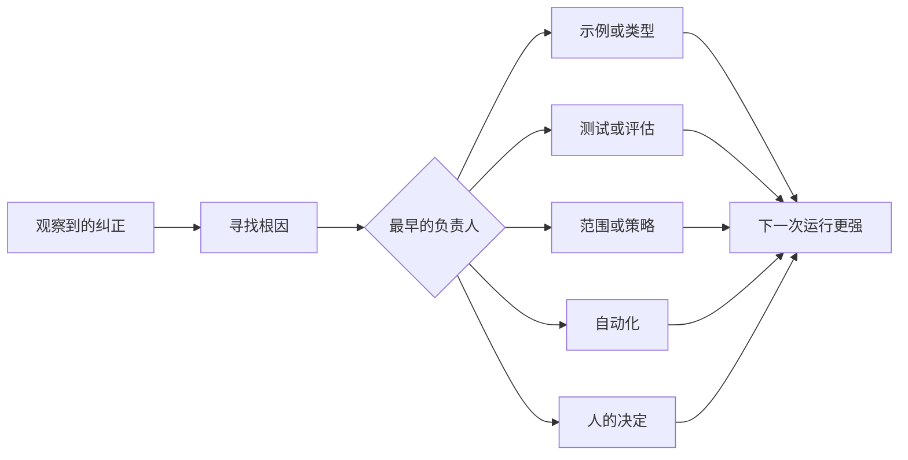

# 把每次智能体纠正变成系统改进

> 只存在于聊天中的纠正只能修复一次运行；被提升为测试、边界、示例或工具的纠正，会改进之后的每次运行。

**类型：** 学习 + 构建
**语言：** Python（标准库）
**前置要求：** Phase 14 第 37 至第 41 节
**用时：** 约 65 分钟

## 学习目标

- 把智能体纠正转化为持久控制。
- 把每项控制放在最早能够阻止复发的层级。
- 用稳定指纹去重重复经验。
- 退役不再保护真实风险的控制。

## 纠正就是证据

当你告诉智能体“不要编辑那个文件”时，你已经发现范围边界并不是可执行的。当你说“这个输出形状不对”时，你已经发现缺少示例或测试。当设置又一次失败时，你已经发现环境知识应该进入自动化。

把纠正看成关于工作系统的观察，而不是提示词写得不好的失败。

## 提升到最早有效的层

按以下顺序处理：

| 反复出现的失败 | 持久目标 |
|---|---|
| 错误结果或回归 | 测试或评估 |
| 超出范围或不安全的动作 | 范围或权限策略 |
| 重复的设置或命令错误 | 自动化或工具 |
| 重复的输出格式错误 | 规范示例和验证器 |
| 含糊的本地约定 | 带场景检查的指令 |
| 产品分歧 | 人的决策记录 |

越早的控制越便宜。能阻止无效状态的类型，比稍后才发现问题的审查意见更强；聚焦测试比要求智能体记住某件事的一段文字更强。



## 棘轮记录

记录：

- 症状；
- 根因；
- 后果；
- 复发次数；
- 选择的控制；
- 控制的验证方式；
- 负责人；
- 复查或退役日期。

不要把每个一次性偏好都提升为规则。当复发或后果足以证明永久复杂度值得时，才提升这次纠正。

## 把原因与症状分开

“智能体编辑了 README”是症状。可能的原因包括：

- 任务允许了代码库根目录；
- 文档被默认视为安全；
- 计划把实现和文档捆在了一起；
- 两个工作者的所有权发生重叠。

每个原因属于不同控制。只重复症状的规则，在下一种略有不同的情况中仍会失败。

## 控制也会衰减

旧控制可能互相冲突、膨胀上下文，并编码一个已经不存在的系统。每条被提升的规则都需要退役检查，在以下情况中删除或重写它：

- 底层架构发生变化；
- 更强的可执行控制替代了它；
- 在有意义的时间窗口内，失败没有再次出现；
- 控制造成的摩擦大于它防止的风险。

目标不是最长的指令文件，而是保留来之不易的判断所需的最小系统。

## 动手构建

实验会分类纠正，将它们提升为控制，为重复项生成指纹，并写出 `outputs/feedback-ratchet.json`。

运行：

```bash
python3 code/main.py
python3 -m unittest discover code/tests -v
```

增加两条措辞不同但原因相同的纠正。改进规范化过程，让它们合并为一个控制，同时不合并不相关的失败。

## 练习

1. 从最近一次编码会话中取五条纠正，分类它们真正的负责人。
2. 用可执行测试替换一条文字规则。
3. 增加后果加权，让一次严重事件也能立即被提升。
4. 为实验输出增加负责人和退役日期。
5. 审查一条现有智能体指令，只有在证明存在更强控制后才删除它。

## 延伸阅读

- [Basili, Caldiera, and Rombach, The Goal Question Metric Approach](https://www.cs.toronto.edu/~sme/CSC444F/handouts/GQM-paper.pdf)，用于把目标转化为问题和可操作的测量。
- [Shinn et al., Reflexion](https://arxiv.org/abs/2303.11366)，用于理解不改变模型权重、仅通过反馈轨迹改进后续决定。
- [Madaan et al., Self-Refine](https://arxiv.org/abs/2303.17651)，用于理解任务循环中的迭代反馈和修订。

## 你要保留的成果

保留 `outputs/feedback-ratchet.json`。它是智能体辅助工程路径的持久终点，也是未来工作台改动的输入。
