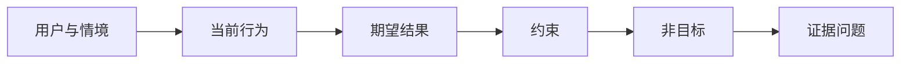

# 先定义结果，再选择产出

> 快速实现会放大选错问题的代价。先塑造结果，让速度朝正确方向发挥作用。

**类型：** 学习 + 构建
**语言：** Python（标准库）
**前置要求：** 无
**用时：** 约 60 分钟

## 学习目标

- 在不命名解决方案的情况下写出结果框架。
- 识别用户、情境、当前行为和期望变化。
- 明确约束与非目标。
- 在解决方案泄漏固化为范围前发现它。

## 产出不是结果

“构建一个事件助手”说出了产出，却没有说明谁需要它、什么会变好，或哪些内容必须保持安全。

结果框架这样表达：

> 生产告警到达时，值班工程师能在两分钟内识别故障服务和安全的下一步动作，同时诊断保持只读且可审计。

这句话既可以由软件、运行手册、数据修复，也可以由更小的界面改动来满足。它让团队关注结果，而不是某个人最先想象出的工件。

## 六部分框架

| 部分 | 要回答的问题 |
|---|---|
| 用户 | 谁直接经历这个问题？ |
| 情境 | 它在何时、何处发生？ |
| 当前行为 | 今天发生了什么，包括临时办法？ |
| 期望结果 | 哪个可观察状态应该改善？ |
| 约束 | 哪些安全、策略、成本或兼容性限制是固定的？ |
| 非目标 | 哪些诱人的相邻工作被排除？ |



## 找出解决方案泄漏

当结果陈述包含尚未由证据证明的产品形态、界面、模型选择、框架或架构时，就泄漏了解决方案。

- “用户每周收到一份 AI 摘要”泄漏了摘要和频率。
- “用户在批准前理解账户变化”描述的是结果。
- “部署一个向量数据库”泄漏了基础设施。
- “审查时可以获得相关策略证据”描述的是能力。

如果兼容性确实固定了技术，可以在约束中写出技术；同时记录它为何被固定。

## 约束保护结果

约束不是实现细节，而是真实世界目标的一部分：

- 诊断期间不写入生产环境；
- 响应不超过事件处理时间预算；
- 现有审计事件仍是权威来源；
- 不增加新的运行时依赖；
- 无障碍行为保持不变。

通过违反固定约束而达到结果的构建，并没有真正达到结果。

## 非目标创造边界

非目标防止有用的切片膨胀成平台。好的非目标足够具体，可以用来拒绝工作：

- 不做自动修复；
- 不新增告警路由系统；
- 不取代事件指挥官；
- 本切片不做历史分析。

## 动手构建

实验会验证 `OutcomeFrame`，并写出 `outputs/outcome-frame.json`。

```bash
python3 code/main.py
python3 -m unittest discover code/tests -v
```

把期望结果替换为“使用事件助手”。验证器应指出结果中泄漏了提议的产出。

## 练习

1. 把待办清单中的一个功能请求改写为结果框架。
2. 增加一个会改变可行解决方案的约束。
3. 增加两个能让第一个切片保持小规模的非目标。
4. 识别最早可以证伪期望结果的观察。
5. 写出三个可以满足同一结果的不同产出。

## 延伸阅读

- [Nuseibeh and Easterbrook, Requirements Engineering: A Roadmap](https://www.cs.toronto.edu/~sme/papers/2000/ICSE2000.pdf)，用于把真实世界目标作为软件工作的锚点。
- [Dardenne, van Lamsweerde, and Fickas, Goal-Directed Requirements Acquisition](https://doi.org/10.1016/0167-6423(93)90021-G)，用于将高层目标细化为约束和可操作需求。

## 你要保留的成果

保留 `outputs/outcome-frame.json`。下一节会用人们实际执行的工作流来检验它。
