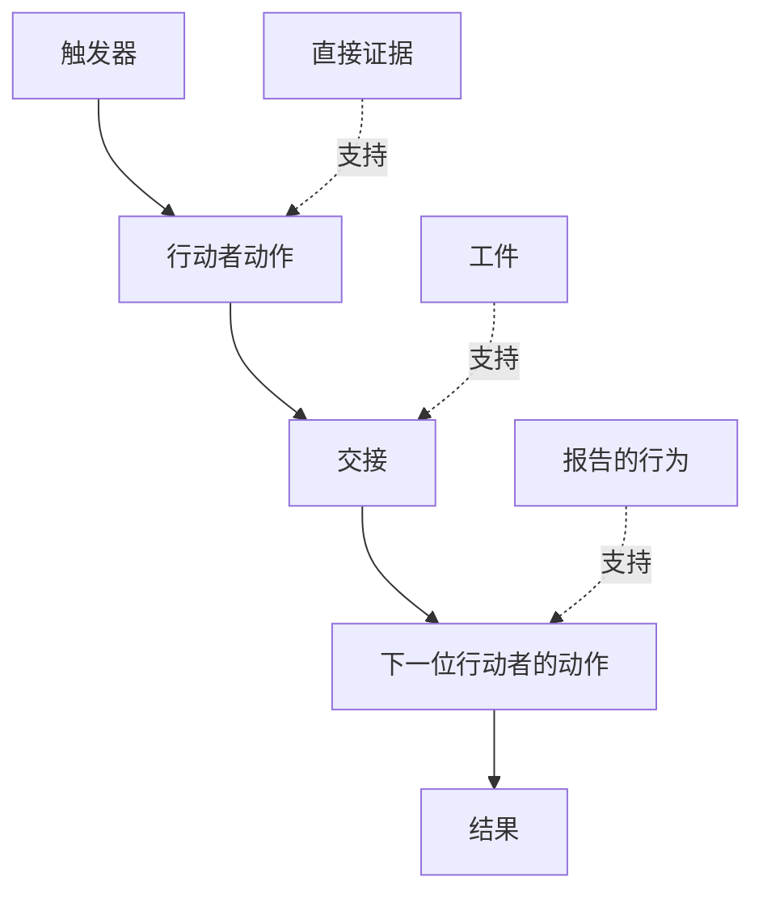

# 发现人们实际执行的工作流

> 需求不是坐在会议室里等人收集的；它们散落在动作、临时办法、记录和分歧中。

**类型：** 学习 + 构建
**语言：** Python（标准库）
**前置要求：** Phase 14 第 47 节
**用时：** 约 70 分钟

## 学习目标

- 用带证据的有序动作建模当前工作流。
- 区分直接观察与他人报告或推断出的行为。
- 找到摩擦、交接、权限和隐藏状态。
- 保持不确定主张可见，不把它们悄悄变成需求。

## 从当前系统开始

不要先问人们想要什么功能。先重建现在发生的事情。

对每一步记录：

| 字段 | 示例 |
|---|---|
| 行动者 | 值班工程师 |
| 触发器 | 生产告警到达 |
| 动作 | 打开告警，然后搜索仪表盘 |
| 输入 | 告警载荷和部署记录 |
| 输出 | 候选服务和负责人 |
| 摩擦 | 在三个工具之间切换上下文 |
| 权限 | 事件指挥官批准写入 |
| 证据 | 屏幕录制、事件日志、运行手册 |

工作流比屏幕更大。它还包括等待、复制粘贴、旁路沟通、批准、错误恢复，以及人们已经不再注意的步骤。

## 证据有强弱

使用一个简单的证据梯度：

1. **直接行为：** 观察、追踪、录制或系统事件。
2. **工件：** 工单、运行手册、日志、表单或完成的输出。
3. **报告的行为：** 某人描述自己怎么做。
4. **推断：** 团队推测可能发生了什么。

四类证据都可能有用，但只有前两类直接证明当前行为。标明其余类型，避免置信度无声地膨胀。



## 搜索四种东西

- **摩擦：** 重复劳动、延迟、重新输入或恢复。
- **隐藏状态：** 由记忆、聊天或个人笔记携带的事实。
- **权限：** 被允许作出重大改变的人或系统。
- **例外：** 正常工作流不再正常的情形。

AI 功能常常在交接和例外处失败，因为塑造时只考虑了顺利路径。

## 不要把分歧平均掉

两个用户可能因为合理原因执行不同的工作流。在理解差异是否代表以下情况前，先保留这些变体：

- 不同角色；
- 不同风险级别；
- 旧流程与当前流程；
- 专业程度不同；
- 真正的策略分歧。

平均后的工作流可能谁也描述不了。

## 动手构建

实验会在每个工作流步骤上保存证据，验证顺序和置信度，计算直接证据比例，并写出 `outputs/workflow-evidence.json`。

```bash
python3 code/main.py
python3 -m unittest discover code/tests -v
```

增加一个部署记录缺失的例外路径。保持主顺序不变，并记录分支从何处开始。

## 练习

1. 不访谈任何人，只根据日志重建一个工作流。
2. 访谈一位用户，标记仍然缺少直接证据的每条主张。
3. 增加一个权限边界和一个失败恢复步骤。
4. 建模两个工作流变体，不要把它们合并。
5. 找出一个只移除可见步骤、却留下隐藏工作的提议功能。

## 延伸阅读

- [Nuseibeh and Easterbrook, Requirements Engineering: A Roadmap](https://www.cs.toronto.edu/~sme/papers/2000/ICSE2000.pdf)，尤其关注把需求获取视为解释、建模和验证，而不只是记录。
- [Gotel and Finkelstein, An Analysis of the Requirements Traceability Problem](https://doi.org/10.1109/ICRE.1994.292398)，用于理解保持需求与其来源关系的困难。

## 你要保留的成果

保留 `outputs/workflow-evidence.json`。它会把观察到的摩擦和不确定性转化为下一节的假设图。
