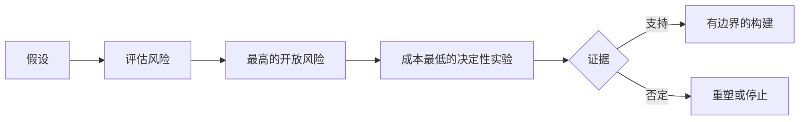

# 绘制假设图，先解决风险最高的假设

> 路线图把不确定性藏在功能里；假设图则揭示功能值得存在之前必须成立的条件。

**类型：** 学习 + 构建
**语言：** Python（标准库）
**前置要求：** Phase 14 第 48 节
**用时：** 约 65 分钟

## 学习目标

- 把提议的工作转化为明确的假设。
- 分别评估影响、不确定性和不可逆性。
- 根据风险而不是兴奋程度选择下一项实验。
- 用证据和决定替换已经验证的假设。

## 每次构建都包含赌注

一个事件工具可能依赖以下条件全部成立：

- 告警上下文包含足够信息来识别服务；
- 工程师信任一个并非自己推导出的建议；
- 期望的响应时间在运营上有意义；
- 可以在不越过不安全权限的情况下访问所需数据；
- 工作流发生得足够频繁，值得维护。

这些不是实现任务，而是构建要有价值、可用、可行且安全所需的条件。

## 假设分类

| 类别 | 要回答的问题 |
|---|---|
| 价值 | 结果是否足够重要？ |
| 可用性 | 用户能理解并采取行动吗？ |
| 可行性 | 在现有数据和约束下，系统能产出它吗？ |
| 可持续性 | 组织能承担成本、所有权和运营吗？ |
| 安全 | 它失败时能否避免不可接受的后果？ |

把假设写成可证伪的陈述。“功能有用”无法测试；“十名值班工程师中有八名在只读结果下能更快识别正确服务”则可以。

## 风险不是一个数字

实验使用 1 到 5 的三个维度：

- **影响：** 假设为假时的损害。
- **不确定性：** 当前证据的薄弱程度。
- **不可逆性：** 作出承诺后再学习的成本。

示例分数将影响乘以不确定性，再加上不可逆性。这个公式不是普遍规则；它的作用是迫使团队说明为什么一个未知项应当先于另一个被解决。



## 设计实验，而不是确认仪式

有用的测试包含：

- 可能为假的主张；
- 一个总体或真实样本；
- 一个可观察结果；
- 在结果出现前决定的阈值；
- 针对通过、失败和证据含糊三种情况的下一步决定。

避免只证明团队能够把想法构建出来的测试。

## 可逆性会改变顺序

高后果且不可逆的选择需要更早获得证据。只读回放可以先于生产集成；临时适配器可以先于数据迁移；人工批准的建议可以先于自动动作。

构建的形状应该跟随不确定性的形状。

## 动手构建

实验会为假设排序，区分已测试和开放主张，选出风险最高的开放项，并写出 `outputs/assumption-map.json`。

```bash
python3 code/main.py
python3 -m unittest discover code/tests -v
```

修改风险最高假设的证据，观察下一项实验如何变化。

## 练习

1. 为你想构建的功能写出五个假设。
2. 增加一个功能列表遗漏的安全假设。
3. 定义一个会让你停止构建的阈值。
4. 用更便宜的决定性测试替换一个大型实验。
5. 将风险排序与路线图优先级比较，并解释差异。

## 延伸阅读

- [Barry Boehm, A Spiral Model of Software Development and Enhancement](https://dl.acm.org/doi/10.1145/12944.12948)，用于理解一种在深入承诺前解决不确定性的风险驱动开发循环。
- [Dardenne, van Lamsweerde, and Fickas, Goal-Directed Requirements Acquisition](https://doi.org/10.1016/0167-6423(93)90021-G)，用于在暴露障碍和约束的同时细化目标。

## 你要保留的成果

保留 `outputs/assumption-map.json`。下一节会用它来选择能产生决定性证据的最小切片。
