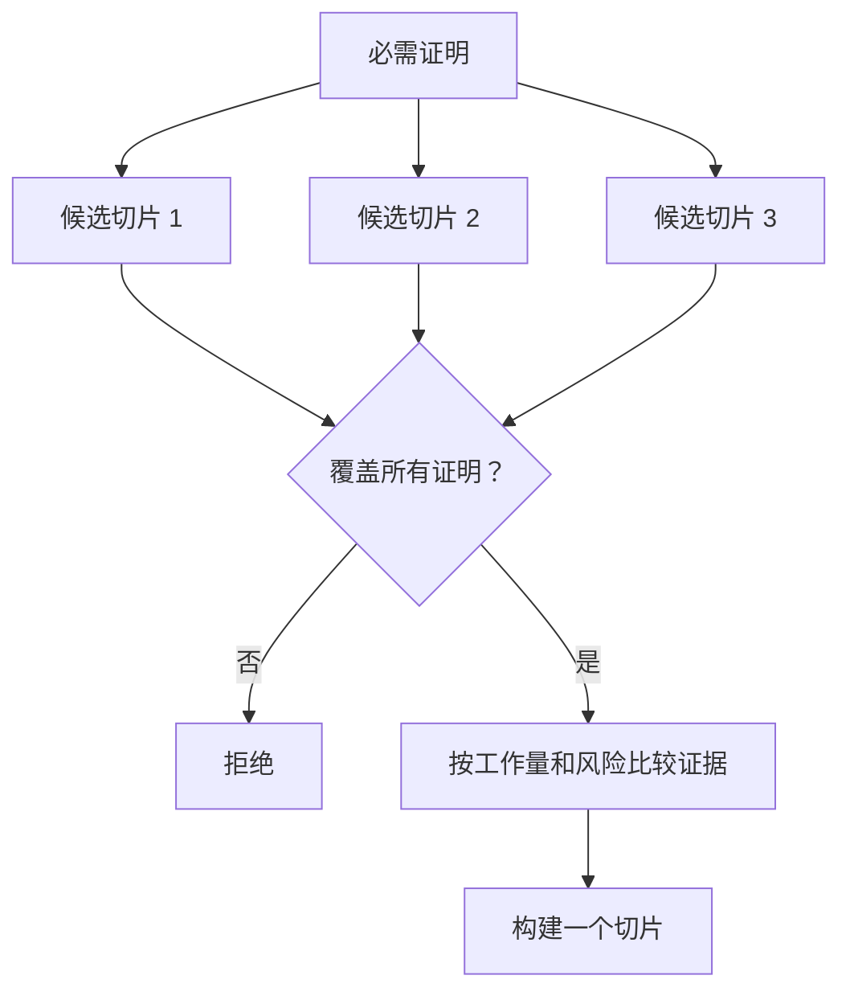

# 选择能改变决定的最小切片

> 只有能证明重要事情时，小才有用。无法改变下一步决定的微型构建，只是不完整。

**类型：** 学习 + 构建
**语言：** Python（标准库）
**前置要求：** Phase 14 第 49 节
**用时：** 约 65 分钟

## 学习目标

- 根据要证明的假设定义切片。
- 平衡结果价值、不确定性减少、工作量和后果。
- 用可逆证据替代过早的生产承诺。
- 拒绝遗漏工作流风险部分的切片。

## 垂直意味着端到端证据

有用的切片要跨过观察结果所需的最小真实工作流。它可以在用户、数据、时长和能力上很窄，但不能通过移除恰好要测试的不确定性来变窄。

例如：

- 对十个真实事件进行只读回放，可以测试服务识别和操作者信任。
- 使用合成数据的精美仪表盘可能测试理解，却不能测试数据可行性。
- 生产自动修复器一次测试所有事情，但后果不可接受。

## 先定义必需证明

取风险最高的开放假设，把它们转成必需证明集合。候选切片只有覆盖该集合才有资格入选。

然后比较合格切片的：

| 维度 | 方向 |
|---|---|
| 结果价值 | 越多越好 |
| 减少的不确定性 | 越多越好 |
| 工作量 | 越少越好 |
| 后果 | 越少越好 |
| 可逆性 | 越高越好 |

实验的分数刻意保持简单。资格门禁比算术更重要。



## 常见的伪最小切片

- **只有界面的最小切片：** 移除了数据和运营不确定性。
- **只有基础设施的最小切片：** 证明技术可行，却没有用户价值。
- **只有顺利路径的最小切片：** 遗漏制造大部分风险的例外。
- **演示最小切片：** 产出有说服力的工件，却没有可重复测量。
- **平台最小切片：** 在一个工作流赢得建设资格前就先造可复用机器。

## 增加停止规则

在实现前写清楚切片失败时会发生什么：

- 放弃这个结果；
- 改变目标用户或情境；
- 测试另一种机制；
- 收集更好的证据；
- 进一步收窄权限。

如果每种结果都导向“继续构建”，这个切片就不是实验。

## 动手构建

实验会按必需证明筛选候选项，为合格切片打分，并写出 `outputs/slice-decision.json`。

```bash
python3 code/main.py
python3 -m unittest discover code/tests -v
```

增加一个只证明一个必需假设、但更便宜的候选项。即使数值分数很高，它仍应因不合格而不能入选。

## 练习

1. 为同一个结果设计三个后果程度不同的切片。
2. 在给切片打分前写出必需证明集合。
3. 移除一项能力，同时保留决定性证据。
4. 为失败的试点增加停止规则。
5. 找出一个应在切片之后再建设的可复用平台组件。

## 延伸阅读

- [Barry Boehm, A Spiral Model of Software Development and Enhancement](https://dl.acm.org/doi/10.1145/12944.12948)，用于让每个开发循环匹配它必须解决的风险。
- [Lenarduzzi and Taibi, MVP Explained: A Systematic Mapping Study on the Definitions of Minimal Viable Product](https://arxiv.org/abs/1609.07592)，用于理解“最小”和“可行”在软件产品实践中的歧义。

## 你要保留的成果

保留 `outputs/slice-decision.json`。它记录为什么这个切片是能改变决定的最小切片。
