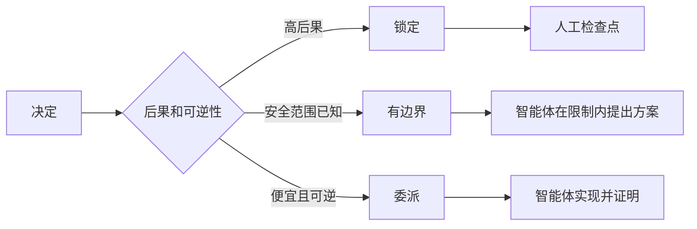

# 编写保留判断空间的规格说明

> 有用的规格说明固定不变量和证据，同时保留可逆的实现选择。它是决策边界，不是逐幕脚本。

**类型：** 学习 + 构建
**语言：** Python（标准库）
**前置要求：** Phase 14 第 50 节
**用时：** 约 75 分钟

## 学习目标

- 区分结果、不变量、示例、非目标和证明。
- 将决定标记为锁定、有边界或委派。
- 在选择便宜且可逆时保留智能体判断。
- 当后果或公开行为发生变化时要求人工检查点。

## 两种糟糕的极端

描述不足的任务要求智能体猜测系统；描述过度的任务要求它照抄一个可能已经错误的设计。

有用的中间状态是一份可执行契约：

| 表面 | 用途 |
|---|---|
| 结果 | 可观察的结果 |
| 不变量 | 始终必须保持的条件 |
| 示例 | 揭示意图的具体案例 |
| 非目标 | 有意排除的相邻行为 |
| 决策策略 | 哪些选择被锁定、有边界或被委派 |
| 证明 | 完成前需要的证据 |

## 三种决定模式

- **锁定：** 智能体不得选择。用于公共兼容性、权限、安全、不可逆成本或产品承诺。
- **有边界：** 智能体可以在明确限制内选择。用于搜索预算、重试次数、允许依赖或已知接口族。
- **委派：** 智能体拥有选择权，但必须解释。用于本地结构、名称、可逆重构和实现细节。



## 用示例规定行为

示例比形容词更能压缩意图。“有帮助”“健壮”“可用于生产”都不可执行。一组正常、边界、失败和禁止案例，可以让构建者和验证者都有具体对象可对照。

示例不能替代不变量。一个通过的案例无法证明普遍的安全规则。

## 证明必须匹配主张

- 单元测试证明本地函数契约。
- 线缆测试证明序列化和传输行为。
- 浏览器流程证明界面路径。
- 回放集合证明具有代表性的案例范围。
- 审计日志证明权限边界确实成立。

不要用较低层级的证据证明较高层级的主张。

## 有意保留未知项

规格说明可以说“实现可以选择任何能在时间预算内返回结果的只读数据源”。这不是含糊，而是带边界和证明要求的有意委派决定。

当证据发生变化时，规格说明也应演进。保留锁定和有边界选择背后的理由，后来的团队就无需考古也能修改它们。

## 动手构建

实验会验证每个契约表面，检查决定模式，并写出 `outputs/executable-specification.json`。

```bash
python3 code/main.py
python3 -m unittest discover code/tests -v
```

把生产写入决定从锁定改成委派。解释为什么 schema 可以接受这个值，而产品风险不允许这样做。

## 练习

1. 把一个待办条目转成六个规格说明表面。
2. 用一个不变量和两个示例替换三条实现指令。
3. 标记每个决定，并为每个锁定或有边界的决定说明理由。
4. 为每个不变量增加证明凭据。
5. 删除一条没有证据或风险理由的约束。

## 延伸阅读

- [Nuseibeh and Easterbrook, Requirements Engineering: A Roadmap](https://www.cs.toronto.edu/~sme/papers/2000/ICSE2000.pdf)，用于理解目标、精确规格、验证、共识和演进之间的关系。
- [Zave and Jackson, Four Dark Corners of Requirements Engineering](https://doi.org/10.1145/267895.267896)，用于区分环境假设、需求和规格说明。
- [Gotel and Finkelstein, An Analysis of the Requirements Traceability Problem](https://doi.org/10.1109/ICRE.1994.292398)，用于保留需求为何存在以及来自哪里的关系。

## 你要保留的成果

保留 `outputs/executable-specification.json`。它会成为编码智能体和人工审查者共享的契约。
