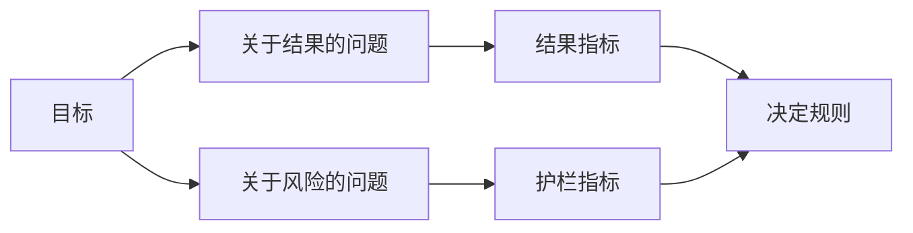

# 在结果出现前设计成功指标

> 测量应该回答一个决定，而不是装饰仪表盘。先从目标出发，推导问题，再选择能回答问题的最小指标。

**类型：** 学习 + 构建
**语言：** Python（标准库）
**前置要求：** Phase 14 第 47、51 节
**用时：** 约 70 分钟

## 学习目标

- 从结果目标推导问题和指标。
- 在观察结果前定义阈值、窗口、来源和方向。
- 将结果指标与护栏指标、反向指标配对。
- 让评估证据匹配构建必须支持的决定。

## 目标、问题、指标

先写出目标：

> 缩短识别受影响服务的时间，同时不增加不安全动作。

推导问题：

- 正确服务识别得有多快？
- 识别出的服务有多大比例是正确的？
- 诊断是否仍保持只读？
- 这个工作流是否增加了忽略告警或操作者负担？

然后选择把这些问题操作化的指标。



## 指标需要契约

每个指标都需要：

| 字段 | 示例 |
|---|---|
| 名称 | `median_identification_seconds` |
| 方向 | 至多 |
| 阈值 | 120 |
| 窗口 | 十次事件回放 |
| 来源 | 回放事件日志 |
| 总体 | 试点中的值班工程师 |
| 类型 | 结果或护栏 |

没有来源和窗口，数字就无法复现；没有阈值，它就无法驱动决定。

## 结果指标、护栏指标和反向指标

- **结果指标：** 期望状态是否改善？
- **护栏指标：** 固定约束是否仍然成立？
- **反向指标：** 局部改善是否把成本或伤害转移到了其他地方？

对事件工作流来说，速度还不够。正确性、生产写入、操作者负担和漏掉告警，都能防止一个快速但不安全的结果。

## 离线与在线证据

离线回放有助于重复和覆盖边界；有边界的试点有助于观察真实行为、信任和工作流影响。两者不能相互替代。

使用能够回答当前决定的最便宜证据。不要只因实现已经就绪，就把真实用户暴露进来。

## 在测量前决定

在看到结果前写出通过、失败和含糊三条路径。否则团队会为了保护构建而移动阈值。

例如：

- 通过：正确服务率至少 0.9，且中位时间至多 120 秒；
- 失败：发生任何生产写入，或正确率低于 0.75；
- 含糊：改善很小且方差很大，需要更大的回放集合。

## 动手构建

实验会验证测量计划，评估包含边界值的阈值，记录缺失值，并写出 `outputs/measurement-report.json`。

```bash
python3 code/main.py
python3 -m unittest discover code/tests -v
```

删除护栏指标，观察为什么即使结果指标仍然存在，计划也会变得无效。

## 练习

1. 从一个结果目标推导三个问题。
2. 增加一个能捕捉成本转移到其他角色的反向指标。
3. 为每个指标定义来源、总体和窗口。
4. 在生成数值前写出通过、失败和含糊三种决定。
5. 找出一个容易收集、却不能改变决定的指标并删除它。

## 延伸阅读

- [Basili, Software Modeling and Measurement: The Goal/Question/Metric Paradigm](https://drum.lib.umd.edu/items/8119803a-362b-42ec-b6ce-2311713e7236)，用于从明确目标推导可操作测量。
- [Basili, Caldiera, and Rombach, The Goal Question Metric Approach](https://www.cs.toronto.edu/~sme/CSC444F/handouts/GQM-paper.pdf)，用于把方法应用为反馈和改进系统。

## 你要保留的成果

保留 `outputs/measurement-report.json`。它定义原型、试点或生产阶段的证据门禁。
