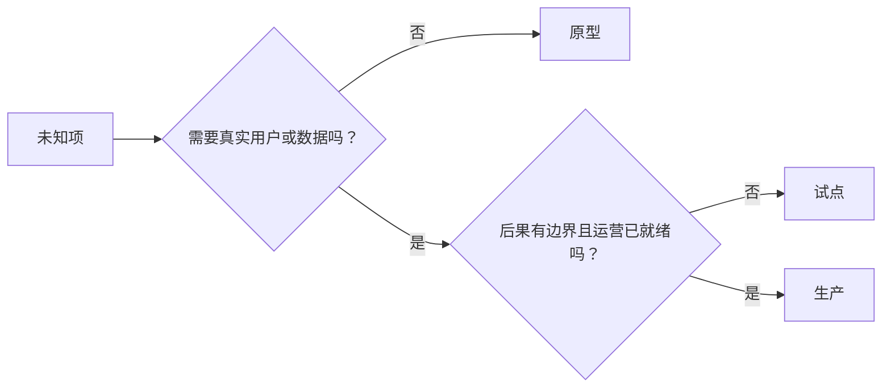

# 有意识地选择原型、试点或生产

> 这三者是不同的学习环境，不是不同的精致程度。选择能以最小不必要后果回答当前未知项的阶段。

**类型：** 学习 + 构建
**语言：** Python（标准库）
**前置要求：** Phase 14 第 50 至第 52 节
**用时：** 约 70 分钟

## 学习目标

- 根据未知项、受众、数据、后果和准备度选择构建阶段。
- 定义各阶段的控制和退出条件。
- 防止原型悄悄变成生产系统。
- 在证据和运营足以支撑前，延迟授予真实权限。

## 三个不同的问题

| 阶段 | 主要问题 |
|---|---|
| 原型 | 这种机制能产出证据吗？ |
| 试点 | 在有边界的真实受众和条件下，它能安全工作吗？ |
| 生产 | 我们能以承诺的可靠性和风险水平持续负责它吗？ |

原型可以在技术上完成，却仍然是可丢弃的。试点可以使用生产数据，同时限制受众和权限。生产从组织接受持续责任时开始。

## 原型

当未知项不需要真实用户或真实数据时使用原型。让它保持：

- 可丢弃；
- 隔离；
- 行为范围窄；
- 明确写出学习问题；
- 不做虚假的运营保证。

在机制进入下一阶段前，不要优化架构。

## 试点

当未知项需要真实行为、真实数据或真实工作流，但后果或准备度还不适合广泛发布时，使用试点。

试点需要：

- 指定的受众；
- 明确的人工负责人；
- 有边界的持续时间和权限；
- 审计与回滚；
- 结果和护栏阈值；
- 针对扩大、修改或停止的退出条件。

## 生产

生产需要的不只是部署：

- 服务级别目标；
- 值班与事件责任；
- 安全与隐私审查；
- 成本与容量控制；
- 回滚与恢复；
- 持续监测；
- 退役路径。



## 阶段漂移

当原型获得用户、数据或权限，却没有获得所有权时，原型代码就会变得危险。在配置、访问控制、遥测和文档中标出原型与试点边界。警告横幅不够。

系统自身应该能显示它所处的阶段。

## 动手构建

实验会从决定上下文中选择阶段，返回所需控制，并写出 `outputs/stage-decisions.json`。

```bash
python3 code/main.py
python3 -m unittest discover code/tests -v
```

把试点示例改成低后果且运营已就绪。解释还需要什么证据才能支持进入生产。

## 练习

1. 按学习阶段而不是部署状态，为三个当前项目分类。
2. 写出包含停止决定的试点退出条件。
3. 增加一个防止原型接触生产数据的技术控制。
4. 找出让构建成为生产系统的第一个运营责任。
5. 为有边界的试点设计一份回滚凭据。

## 延伸阅读

- [Barry Boehm, A Spiral Model of Software Development and Enhancement](https://dl.acm.org/doi/10.1145/12944.12948)，用于让每次迭代的承诺匹配已解决的风险。
- [Fagerholm et al., Building Blocks for Continuous Experimentation](https://doi.org/10.1145/2601248.2601276)，用于理解持续实验所需的组织与技术条件。

## 你要保留的成果

保留 `outputs/stage-decisions.json`。它记录每个阶段为何合理，以及进入下一阶段前必须具备哪些控制。
