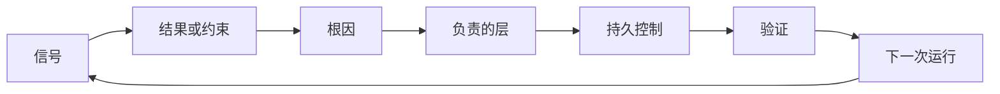

# 构建带有所有权和退役机制的反馈棘轮

> 一次交付关闭一个构建循环，却打开了学习循环。证据必须改变系统，否则它只是没人负责的遥测。

**类型：** 学习 + 构建
**语言：** Python（标准库）
**前置要求：** Phase 14 第 46、53 节
**用时：** 约 75 分钟

## 学习目标

- 把事件、评估、用户行为和纠正转化为有人负责的行动。
- 将每个信号路由到上下文、评估、策略、运行时或待办列表。
- 按严重程度和频率确定复发优先级。
- 为每项控制提供退役条件。

## 反馈就是基础设施

团队可以收集追踪、评估、支持工单和事件日志，却完全不从中学习。缺少的是提升机制：从观察到持久改动的一条明确定义路径，并且有负责人和证明。

循环是：

1. 观察一个具体信号；
2. 将它连接到结果、约束或假设；
3. 找到拥有该原因的最早系统层；
4. 创建一个有边界的改动；
5. 验证复发的可能性变小；
6. 复查控制是否仍应保留。

## 路由到负责的层

| 信号 | 目标 |
|---|---|
| 误报、回归、错误结果 | 评估或测试 |
| 缺少上下文、重复工作、过期事实 | 上下文来源或检索路径 |
| 不安全动作或权限缺口 | 策略或权限边界 |
| 超时、重试风暴、依赖不可用 | 运行时控制 |
| 新产品需要或未解决的权衡 | 已塑形的待办项 |

在最早有效的层解决原因。如果测试或权限可以让失败变得不可能，就不要再增加一段提示词。



## 所有权是控制的一部分

每项棘轮行动都需要：

- 一个负责人；
- 基于后果和复发的优先级；
- 要改动的工件；
- 证明改动的验证方式；
- 复查或过期窗口；
- 退役条件。

没有负责人的改进，只是格式更好的观察。

## 退役过期控制

反馈系统会积累策略，而策略可能变得矛盾且昂贵。在以下情况中复查控制：

- 架构或工作流发生变化；
- 更低层的不变量替代了更高层的指令；
- 在选择的窗口内，受保护的失败没有出现；
- 控制阻碍合法工作的次数超过了它防止伤害的次数。

退役也需要证据。不要只因为控制看起来旧就删除它。

## 连接构建反馈和编码智能体反馈

同一个棘轮服务于两条路径：

- 产品证据改变结果框架、假设、切片或测量计划。
- 编码智能体纠正改变测试、上下文、范围、自动化或交接。
- 事件可以同时改变产品边界和智能体工作台。

这就是为什么塑造构建不是编码开始前就结束的阶段；它会持续贯穿每次被接受的改动。

## 动手构建

实验会分类信号，创建有人负责的棘轮行动，为它们排序，并写出 `outputs/feedback-backlog.json`。

```bash
python3 code/main.py
python3 -m unittest discover code/tests -v
```

增加一个运行时超时信号，确认它被路由到运行时，而不是一般待办列表。

## 练习

1. 把一个事件和一条用户投诉转化为棘轮行动。
2. 找出能防止每次复发的最早层级。
3. 为实验输出增加验证命令或观察。
4. 为一条策略规则定义退役条件。
5. 将一条已接受的纠正追溯回下一份任务框架。

## 延伸阅读

- [Basili, Caldiera, and Rombach, The Goal Question Metric Approach](https://www.cs.toronto.edu/~sme/CSC444F/handouts/GQM-paper.pdf)，用于通过目标导向的测量进行组织学习。
- [Fagerholm et al., Building Blocks for Continuous Experimentation](https://doi.org/10.1145/2601248.2601276)，用于理解把证据连接到持续产品开发的技术与组织循环。
- [Nuseibeh and Easterbrook, Requirements Engineering: A Roadmap](https://www.cs.toronto.edu/~sme/papers/2000/ICSE2000.pdf)，用于理解需求如何在系统生命周期中演进。

## 你要保留的成果

保留 `outputs/feedback-backlog.json`。它是产品判断与交付路径的闭环成果，也是下一份结果框架的输入。
