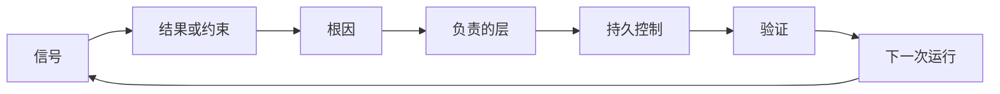

# 构建带有所有权和退役机制的反馈棘轮

> 一次交付关闭一个构建循环，却打开了学习循环。证据必须改变系统，否则它只是没人负责的遥测。

**类型：** 学习 + 构建
**语言：** Python（标准库）
**前置要求：** Phase 14 第 46、53 节
**用时：** 约 75 分钟

## 学习目标

- 把事件、评估、用户行为和纠正转化为有人负责的行动。
- 将每个信号路由到上下文、评估、策略、运行时或待办列表。
- 按严重程度和频率确定复发优先级。
- 为每项控制提供退役条件。
- 用证据和取舍说明交付决策，并明确承担责任的负责人。

## 反馈就是基础设施

团队可以收集追踪、评估、支持工单和事件日志，却完全不从中学习。缺少的是提升机制：从观察到持久改动的一条明确定义路径，并且有负责人和证明。

循环是：

1. 观察一个具体信号；
2. 将它连接到结果、约束或假设；
3. 找到拥有该原因的最早系统层；
4. 创建一个有边界的改动；
5. 验证复发的可能性变小；
6. 复查控制是否仍应保留。

## 路由到负责的层

| 信号 | 目标 |
|---|---|
| 误报、回归、错误结果 | 评估或测试 |
| 缺少上下文、重复工作、过期事实 | 上下文来源或检索路径 |
| 不安全动作或权限缺口 | 策略或权限边界 |
| 超时、重试风暴、依赖不可用 | 运行时控制 |
| 新产品需要或未解决的权衡 | 已塑形的待办项 |

在最早有效的层解决原因。如果测试或权限可以让失败变得不可能，就不要再增加一段提示词。


```mermaid
flowchart LR
  S[信号] --> O[结果或约束]
  O --> R[根因]
  R --> D[负责的层]
  D --> C[持久控制]
  C --> V[验证]
  V --> N[下一次运行]
  N --> S
```

## 所有权是控制的一部分

每项棘轮行动都需要：

- 一个负责人；
- 基于后果和复发的优先级；
- 要改动的工件；
- 证明改动的验证方式；
- 复查或过期窗口；
- 退役条件。

没有负责人的改进，只是格式更好的观察。

## 退役过期控制

反馈系统会积累策略，而策略可能变得矛盾且昂贵。在以下情况中复查控制：

- 架构或工作流发生变化；
- 更低层的不变量替代了更高层的指令；
- 在选择的窗口内，受保护的失败没有出现；
- 控制阻碍合法工作的次数超过了它防止伤害的次数。

退役也需要证据。不要只因为控制看起来旧就删除它。

## 连接构建反馈和编码智能体反馈

同一个棘轮服务于两条路径：

- 产品证据改变结果框架、假设、切片或测量计划。
- 编码智能体纠正改变测试、上下文、范围、自动化或交接。
- 事件可以同时改变产品边界和智能体工作台。

这就是为什么塑造构建不是编码开始前就结束的阶段；它会持续贯穿每次被接受的改动。

## 动手构建

实验会分类信号，创建有人负责的棘轮行动，为它们排序，并写出 `outputs/feedback-backlog.json`。

```bash
python3 code/main.py
python3 -m unittest discover code/tests -v
```

增加一个运行时超时信号，确认它被路由到运行时，而不是一般待办列表。

## 实践实验：为挫折后的决策负责

从你所选职业路线的作品集项目中选择一个工作流，完成一次决策、小型实验和复查。将证据记录在[职业交付模板](https://github.com/rohitg00/ai-engineering-from-scratch/blob/main/phases/14-agent-engineering/54-build-the-feedback-ratchet/outputs/career-delivery-evidence.md)中。

Python 实验仅生成待办行动示例；它不会观察用户或测量干预效果，也不能证明你已具备职业实践能力。运行实验是本练习的准备。

### 1. 确认发生了什么

记录用户、任务、当前工作流和你希望改善的结果。链接到经同意采集的观察、已脱敏的支持记录，或可复现的任务追踪。区分你观察到的事实、他人报告的信息和你的推断。

找出一次挫折：未成立的假设、无法使用的结果、意外成本或延误的交接。说明哪项证据改变了你的认识。针对挫折作出应对和决策，不要围绕它编写成功故事。

如果无法接触用户，就与同伴或按明确场景开展模拟，并标明模拟性质。将模拟观察与真实用户证据分开记录。不要编造访谈、批准、采用情况或业务影响。

### 2. 在权限范围内推进

列出未知项，选择能解答最关键未知项、成本最低的可逆行动。说明你可以决定什么、哪些选择受现有约定限制，以及哪些操作在执行前需要授权。

例如，等待客户数据使用许可时，你可以准备脱敏的离线回放。主动推进意味着完成已获授权的工作，并明确说明受阻的决策；你的访问权限和批准权不会因此扩大。

### 3. 比较方案并向决策负责人简报

为无需了解实现细节的人写一份简短决策说明，包括：

- 用户问题，以及改变计划的证据；
- 至少两个方案；如果合理，纳入成本更低的人工方案或无需开发的方案；
- 质量、交互设计、工作量、运行成本和风险方面的取舍；
- 你的建议、剩余不确定性和需要作出的决策；
- 决策负责人、受影响的利益相关者，以及作出决策的期限。

请一位同伴扮演受影响的利益相关者，质疑一项取舍。记录异议，以及它是否、如何改变你的建议。将角色扮演反馈标为模拟，不能用它代替真实利益相关者的同意。

### 4. 开展有明确边界的实验

根据需要回答的问题，选择原型、试点或生产工作。收集结果前，定义受众、数据、权限、时长、回滚方式，以及继续、调整或停止的条件。

从用户起点走完交互流程，直到完成任务。加入一个错误输出或数据缺失场景。观察用户是否能在没有你暗中帮助的情况下发现失败、纠正并恢复。

将人工审查和纠正时间计入工作流。模型响应更快，完整任务仍可能耗时更长，或更难让人信任。

### 5. 比较结果与经济性

使用相同的指标定义、任务群体、采集方法和可比的观察窗口，记录基线与后续结果。在数值旁保留样本数量、排除项和证据链接。条件发生变化时，说明为何限制了比较。

纳入一项用户结果、一项质量或安全护栏，以及人工审查总投入。即使没有达到目标，也要记录结果。小样本或模拟样本只能支持有限的学习结论，不能证明业务影响。

用模型调用、重试、配套服务和人工审查估算每个成功完成任务的成本。说明人工费率假设，并区分实测用量与估算。将该成本与人工替代方案或项目的价值假设比较。

通过既有的 [LLM FinOps 课程](https://aiengineeringfromscratch.com/lesson?path=phases/17-infrastructure-and-production/27-finops-llms)深入理解成本归因与单位经济性。更换模型只是可能的应对之一；缩小工作流范围或保留人工步骤，可能更符合产品需要。

### 6. 完成闭环

根据事先声明的标准，建议继续、调整或停止。如果证据不足以得出结论，写明缺少哪项观察，以及下一次有明确边界的测试。记录承担责任的决策负责人的回应；尚未作出决策时，保留待定状态。

选择一项对交付流程本身的改进：更清楚的任务框架、更早的用户流程走查、更好的审查清单、更小的智能体交接范围，或更精确的评估案例。指定负责人和复查日期。

复查时，决定保留、修订还是退役这项改进，并记录支持该选择的证据。如果新清单只增加工作，却没有防止目标失败，就没有依据将它长期保留。

## 交付成果

将 [career-delivery-evidence.md](https://github.com/rohitg00/ai-engineering-from-scratch/blob/main/phases/14-agent-engineering/54-build-the-feedback-ratchet/outputs/career-delivery-evidence.md) 复制到你自己的项目中，填写并附上证据链接。保留仓库中的模板供重复使用。将决策说明、交互流程走查、测量比较和有人负责的后续行动，一并放入职业作品集产物。

## 验证

与同伴一起使用以下人工验收量规。为每行标记 **met**（已满足）、**needs work**（需改进）或 **not observed**（未观察），并提供证据链接或明确缺少的观察。填好字段不能证明判断合理。

| 检查项 | 满足要求的证据 |
|---|---|
| 工作流有事实依据 | 可追溯的观察支持问题判断；他人报告、推断和模拟均已标明。 |
| 遵守权限边界 | 下一步可逆工作明确，受限操作须等待实际决策负责人授权。 |
| 说明取舍 | 记录可信的替代方案、利益相关者异议、建议和明确的决策请求。 |
| 测试交互 | 走查覆盖成功、失败、恢复和人工审查投入。 |
| 比较结果 | 基线与后续结果的定义一致；样本、护栏、成本和比较局限可见。 |
| 为挫折负责 | 证据改变了继续、调整或停止的决策，并明确由谁负责下一步行动。 |
| 改进流程 | 一项工作流改进具有负责人、复查日期，以及依据证据作出的保留、修订或退役决定。 |

即使所有模拟步骤都通过，未观察到的真实用户行为仍是证据缺口。在作品集结论中保留该边界，并写明还需要哪项观察来补齐证据。

## 练习

1. 把一个事件和一条用户投诉转化为棘轮行动。
2. 找出能防止每次复发的最早层级。
3. 为实验输出增加验证命令或观察。
4. 为一条策略规则定义退役条件。
5. 将一条已接受的纠正追溯回下一份任务框架。

## 延伸阅读

- [Basili, Caldiera, and Rombach, The Goal Question Metric Approach](https://www.cs.toronto.edu/~sme/CSC444F/handouts/GQM-paper.pdf)，用于通过目标导向的测量进行组织学习。
- [Fagerholm et al., Building Blocks for Continuous Experimentation](https://doi.org/10.1145/2601248.2601276)，用于理解把证据连接到持续产品开发的技术与组织循环。
- [Nuseibeh and Easterbrook, Requirements Engineering: A Roadmap](https://www.cs.toronto.edu/~sme/papers/2000/ICSE2000.pdf)，用于理解需求如何在系统生命周期中演进。

## 你要保留的成果

保留 `outputs/feedback-backlog.json` 作为路由示例，并保留你完成的职业交付证据，记录自己的决策。两者共同为产品判断与交付路径形成闭环，并为下一份结果框架提供依据。
