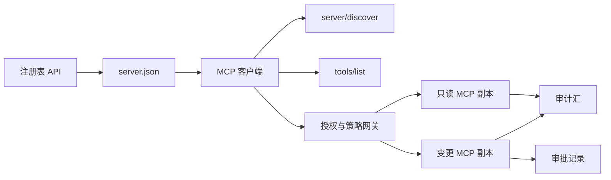

# 毕业项目 13：带 Registry 与治理的无状态 MCP 服务器

> 生产级 MCP 不是一个服务器进程，而是一串契约：可发布的元数据、实时发现、无状态请求信封、授权、策略、审计和部署证据。

**类型：** 毕业项目
**语言：** Python 和 TypeScript 参考模型；生产实现可使用任意语言
**前置课程：** 第 11、13、14、17 和 18 阶段
**必修 MCP 深入课程：** [第 28 课：工具契约](../../../13-tools-and-protocols/28-mcp-tool-contracts-and-content/docs/en.md)、[第 29 课：可靠性](../../../13-tools-and-protocols/29-mcp-reliability-cancellation-and-flow-control/docs/en.md)、[第 30 课：Registry 供应链](../../../13-tools-and-protocols/30-mcp-registry-supply-chain-and-drift/docs/en.md)和[第 31 课：一致性运营](../../../13-tools-and-protocols/31-mcp-conformance-versioning-and-operations/docs/en.md)
**协议目标：** MCP `2026-07-28`
**用时：** 约 25 小时

## 学习目标

- 实现无状态 MCP 请求与结果信封。
- 将 Registry 元数据与实时协议发现分开。
- 构建确定性、感知缓存的工具发现。
- 为每次工具调用执行发行者、受众、scope 和审批策略。
- 部署不依赖会话亲和性的 Streamable HTTP。
- 在 wire、授权、策略、Registry 和审计边界证明行为正确。

## 必修 MCP 前置路径

在将本毕业项目视为生产就绪之前，按顺序完成四节关联的 Phase 13 课程：

1. [第 28 课](../../../13-tools-and-protocols/28-mcp-tool-contracts-and-content/docs/en.md)定义本服务器必须暴露的工具、schema、内容、分页、完成、路由和错误契约。
2. [第 29 课](../../../13-tools-and-protocols/29-mcp-reliability-cancellation-and-flow-control/docs/en.md)定义取消竞态、截止时间、幂等性、背压、重试和重连行为。
3. [第 30 课](../../../13-tools-and-protocols/30-mcp-registry-supply-chain-and-drift/docs/en.md)定义命名空间、来源、准入 pin、Registry 状态、漂移、账本和回滚证据。
4. [第 31 课](../../../13-tools-and-protocols/31-mcp-conformance-versioning-and-operations/docs/en.md)定义 golden 与 negative transcript、严格版本时代、SDK 差分检查、代理证明、脱敏、健康检查和发布门。

本毕业项目整合这些产物，不用一次 happy-path SDK 测试替代它们。

## 问题

一个内部平台需要只读数据工具和少量改变状态的工具。开发者必须能够发现服务器、理解连接方式、检查它的实时能力，并且只能调用自己获准使用的操作。

难点不在于注册一个函数，而在于保持六种不同事实相互对齐：

1. `server.json` 说明服务器可以在哪里安装或访问。
2. `server/discover` 说明实时进程当前支持什么。
3. 每个请求说明使用哪个协议修订版和客户端能力。
4. 授权把调用者绑定到正确的发行者、资源和 scope。
5. 策略决定这一次具体动作能否运行。
6. 审计证据记录哪些内容跨过边界，同时不泄漏秘密或敏感载荷。

只要其中一项发生漂移，平台就可能列出一个无法访问的服务器，把不兼容的客户端路由过去，接受为其他资源签发的 token，或在没有预期审查的情况下暴露破坏性动作。

## 两层发现机制

Registry 和实时 MCP 服务器回答的是不同问题。

| 层 | 契约 | 回答的问题 |
|---|---|---|
| 发布 | `server.json` 和 Registry API | 这是什么服务器，包或远程端点在哪里，如何配置？ |
| 运行时 | `server/discover` | 该进程支持哪些协议版本、能力、扩展和服务器身份？ |

官方 Registry 使用带版本的 `server.json` schema。远程条目可以写出 Streamable HTTP URL：

```json
{
  "$schema": "https://static.modelcontextprotocol.io/schemas/2025-12-11/server.schema.json",
  "name": "com.example/internal-readonly",
  "title": "Internal Read-Only Tools",
  "description": "Read-only incident and data lookup tools.",
  "version": "1.0.0",
  "remotes": [
    {
      "type": "streamable-http",
      "url": "https://mcp.internal.example.com/readonly"
    }
  ]
}
```

Registry schema 版本与 MCP 协议修订版相互独立。不要为了让日期相同而改写其中一个。每份文档都要依据自己的契约验证。

Schema 有效并不能证明命名空间所有权。验证过 `example.com` 的发布者使用反向 DNS 命名空间 `com.example/*` 或其子命名空间。Registry 身份验证流程证明所有权。保留域标签的正常顺序，改变顺序就代表另一个命名空间。

标准库模型的 `validate_registry_document` 函数有意只是部分远程 profile 验证器。它检查官方要求的 `name`、`description` 和 `version` 字段，可选的 `title`，发布名称和长度约束，具体版本形状，以及每个 `streamable-http` 或 `sse` 远程的 HTTP(S) URL 形状。它还要求 `remotes` 非空，因为本毕业项目始终会对远程端点做 live probe。`validate_publisher_namespace` 单独将名称与已验证的发布者域名比较；`validate_runtime_alignment` 将发布名称和版本与实时 `serverInfo` 比较。官方 schema 还支持仅包含 package 的记录和更多远程字段。发布前，应使用固定版本的官方 JSON Schema 或 `mcp-publisher` 验证完整文档；不要把这个无依赖子集说成完整 schema 验证。

服务器必须实现 `server/discover`；客户端可以在其他方法之前调用它。本毕业项目的客户端会在解析端点后调用它，并收到当前协议修订版和实时能力：

```json
{
  "resultType": "complete",
  "supportedVersions": ["2026-07-28"],
  "capabilities": {
    "tools": {
      "listChanged": false
    }
  },
  "_meta": {
    "io.modelcontextprotocol/serverInfo": {
      "name": "com.example/internal-readonly",
      "version": "1.0.0"
    }
  },
  "ttlMs": 3600000,
  "cacheScope": "public"
}
```

私有目录可以索引额外的所有权、审查或生命周期数据，但不能把这些数据伪造为 MCP wire 字段或根 `server.json` 字段。将组织策略放在已发布记录旁边。确实需要公开自定义元数据时，使用 Registry 的 `_meta.io.modelcontextprotocol.registry/publisher-provided` 扩展，并遵守 4 KB 限制。

## 无状态 MCP 核心

MCP 修订版 `2026-07-28` 删除了协议会话以及 `initialize` / `notifications/initialized` 握手，也删除了 `Mcp-Session-Id`。

每个请求都在 `params._meta` 中携带协议上下文：

```json
{
  "io.modelcontextprotocol/protocolVersion": "2026-07-28",
  "io.modelcontextprotocol/clientCapabilities": {},
  "io.modelcontextprotocol/clientInfo": {
    "name": "internal-platform-client",
    "version": "1.0.0"
  }
}
```

版本和能力是请求事实，不是连接事实。负载均衡器可以把连续请求发送给不同的健康副本，因为任一副本都能从消息本身验证请求。

普通结果包含 `resultType: "complete"`。服务器应在每个结果的 `_meta.io.modelcontextprotocol/serverInfo` 中放入自己的身份。缺失或非字符串的协议版本属于无效参数 `-32602`。错误 `-32022` 只用于“提供了字符串但不受支持”的情况，其 data 必须精确为 `{"supported": ["2026-07-28"], "requested": "..."}`。

### 可缓存的发现

对于相同的有效工具集合，`tools/list` 必须是确定性的。结果包括：

- `ttlMs`，给客户端的新鲜度提示；
- `cacheScope`，取值为 `public` 或 `private`；
- 稳定的工具顺序，使相同列表可以复用提示缓存；
- `resultType: "complete"` 和服务器身份元数据。

按用户的授权通常应产生 `cacheScope: "private"`。不要把用户特有的工具可见性放在共享 public cache 后面。

## Streamable HTTP

网络服务器暴露一个接受 POST 的 MCP 端点。每个 JSON-RPC 请求或通知都有自己的 POST。

对于请求，服务器返回一个 JSON 对象，或返回限定在该请求范围内的 SSE 流。长连接的 `subscriptions/listen` 请求会携带选择加入的变更通知。当前传输没有独立 GET 流、会话 DELETE、会话 header 或 `Last-Event-ID` 重放。

每个请求包含：

- `MCP-Protocol-Version`，与 body 元数据匹配；
- `Mcp-Method`，与 JSON-RPC 方法匹配；
- 对 `tools/call`、`resources/read` 和 `prompts/get` 使用 `Mcp-Name`；
- `Accept: application/json, text/event-stream`。

使用指定的 `-32020` 错误拒绝镜像 header 不匹配。验证 `Origin`，将本地开发服务器绑定到 loopback，认证远程客户端，并将关闭的请求范围 SSE 响应视为取消。



```figure
cf-mcp-gate
```

## 授权与策略

传输元数据不是授权。每次调用都要验证授权。

对于远程服务器：

1. 发现受保护资源元数据。
2. 为该资源选择授权服务器。
3. 优先使用 Client ID Metadata Documents 注册客户端；将 Dynamic Client Registration 视为兼容性支持。
4. 授权时发送 resource indicator。
5. 将返回的 `iss` 与本次流程记录的授权服务器比较。
6. 按发行者为客户端凭证建立键。绝不跨发行者复用注册数据。
7. 在 MCP 服务器验证 token 的发行者、受众或资源、过期时间和 scope。
8. 对具体工具和参数再做一次策略决策。

`readOnlyHint` 和 `destructiveHint` 等工具注解帮助客户端呈现风险，但不是可信的授权控制。

### 审批是记录，不是魔法 scope

改变状态的调用需要一条审批记录，绑定 actor、工具、规范化参数或摘要、目标环境、过期时间，以及一次性或可重复使用策略。单独一条聊天消息不是审批证据。

Python 模型用排序后的 key 对规范 JSON 做哈希，再将摘要与 token subject、工具名、服务器 URL 和过期时间绑定。即使只改动一个参数，重放该记录也会在 handler 运行前失败。审批是独立证据，不是添加到访问 token 上的 scope。

当高风险工具分离确实能降低爆炸半径时，将它们放在可独立审查的表面上。只有凭证、策略、部署身份和审计控制也分离时，这种分离才有用。

## 动手构建

### 1. 建模发布元数据

创建并通过 schema 验证 `server.json`。使用位于发布者已认证命名空间中的稳定名称，并在适用时加入版本、描述、官方 `repository` 或 `packages` 元数据，以及 remote 或 stdio 传输。将秘密声明为环境变量输入，绝不要写入字面值。

### 2. 实现实时发现

在任何 feature RPC 之前实现 `server/discover`。公布支持的协议版本、能力、扩展和服务器身份。加入使用 `-32022` 的版本拒绝案例。

### 3. 实现无状态信封

要求每个请求携带协议版本和客户端能力。每个结果返回 `resultType` 和服务器身份。删除初始化状态、连接范围的能力缓存和会话标识符。

### 4. 构建工具面

从两个只读工具和一个改变状态的工具开始。为每个工具提供有界 JSON Schema、精确描述、确定性结果形状和诚实的注解。客户端依赖结构化结果时，增加输出 schema。

### 5. 增加感知缓存的列表

用稳定顺序返回工具，并带 `ttlMs` 和 `cacheScope`。分别演练缓存过期与列表变更通知行为。

### 6. 增加授权与策略

验证发行者、受众、过期时间和 scope。对每次工具调用执行策略决策。将审批绑定到精确的高风险动作。在执行 handler 前拒绝缺失或过期的审批。

### 7. 分离 Registry 与运行时验证

验证静态 `server.json` 记录，然后用 `server/discover` 探测远程端点。发布的 remote、身份、版本或必需能力与实时进程不一致时报告漂移。

### 8. 增加审计证据

记录 actor、发行者、资源、工具、策略决策、请求标识符、trace 上下文、延迟和结果。持久化前对敏感参数和结果脱敏或取摘要。将审计汇放在模型可见上下文之外。

### 9. 演练水平扩展

在负载均衡器后放置两个无状态副本。发送至少 100 个并发请求，证明正确性不依赖亲和性。如果工具需要跨调用状态，就生成明确的不透明 handle，并将它存放在共享耐久系统中。

### 10. 穿过真实 wire

针对实际服务器二进制运行一致性检查。捕获请求 header 和 JSON body，而不只是 SDK 对象。演练错误版本、header 不匹配、缺失 scope、受众错误、参数格式错误、handler 失败、取消和缓存过期。

## 必需证据包

提交物必须包含以下五类证据，否则不完整：

| 证据 | 最低证明 | 来源课程 |
|---|---|---|
| Wire | golden 与 negative 案例的脱敏原始 header 和 JSON-RPC body，包括元数据类型失败、header 不匹配、不支持版本、缺失或未知 `resultType`、通知无响应和响应 ID 匹配 | [第 31 课](../../../13-tools-and-protocols/31-mcp-conformance-versioning-and-operations/docs/en.md) |
| Proxy | 同一个稳定案例直接运行一次、经部署的中间层运行一次，带 ingress、origin、egress 状态和 body 摘要；证明协议错误不会折叠为通用 500，流不会被缓冲 | [第 29 课](../../../13-tools-and-protocols/29-mcp-reliability-cancellation-and-flow-control/docs/en.md)和[第 31 课](../../../13-tools-and-protocols/31-mcp-conformance-versioning-and-operations/docs/en.md) |
| Admission | 已验证的发布者命名空间、不可变 Registry 记录摘要、artifact 或 remote 来源、实时 `server/discover` 身份和能力观察、descriptor pin、当前 Registry 状态及准入账本事件 | [第 30 课](../../../13-tools-and-protocols/30-mcp-registry-supply-chain-and-drift/docs/en.md) |
| Retry | 取消与完成竞态、明确超时、安全的读取重试、变更幂等键、重连重新获取，以及请求取消不会静默变成持久任务取消的证明 | [第 29 课](../../../13-tools-and-protocols/29-mcp-reliability-cancellation-and-flow-control/docs/en.md) |
| Rollback | 精确的上一版本、准入和 artifact 摘要、descriptor pin、活动 Registry 状态、当前健康窗口、路由恢复结果及脱敏决策证据 | [第 30 课](../../../13-tools-and-protocols/30-mcp-registry-supply-chain-and-drift/docs/en.md)和[第 31 课](../../../13-tools-and-protocols/31-mcp-conformance-versioning-and-operations/docs/en.md) |

随发布保存脱敏包的摘要。如果缺少任何一类，就暂停发布。不要从进程内分派器推断代理行为，从 Registry 存在推断准入，从新的 JSON-RPC id 推断重试安全性，也不要从“上一份部署”推断回滚就绪。

## 本地参考模型

Python 模型展示 Registry 元数据、反向 DNS 发布者命名空间验证、发布到运行时的身份检查、实时发现、确定性工具列表、每请求元数据、可信发行者/受众/过期时间/scope 检查、动作绑定审批、文档化的部分 Registry 验证器、策略和不打开网络套接字的审计：

```bash
cd phases/19-capstone-projects/13-mcp-server-with-registry
python3 code/main.py
python3 -m unittest discover -s code/tests -v
```

TypeScript 项目不使用 MCP SDK，通过 stdio 暴露无状态 JSON-RPC 形状。它的 `tools/call` 路径强制执行 `tools/list` 宣布的相同有界输入 schema；已知工具的无效参数会返回带 `isError: true` 的 complete 结果，但不会调用执行器：

```bash
cd phases/19-capstone-projects/13-mcp-server-with-registry/code/ts
npm install
npm run typecheck
npm test
npm run demo
```

这些模型证明本地契约逻辑，但不能证明 HTTP header、OAuth 交换、Registry 发布、OPA 集成、负载均衡或收集器接收。

## Wire 示例

```http
POST /mcp HTTP/1.1
Host: mcp.internal.example.com
Content-Type: application/json
Accept: application/json, text/event-stream
MCP-Protocol-Version: 2026-07-28
Mcp-Method: tools/call
Mcp-Name: postgres.readonly
Authorization: Bearer REDACTED

{
  "jsonrpc": "2.0",
  "id": 42,
  "method": "tools/call",
  "params": {
    "name": "postgres.readonly",
    "arguments": {"sql": "SELECT 1"},
    "_meta": {
      "io.modelcontextprotocol/protocolVersion": "2026-07-28",
      "io.modelcontextprotocol/clientCapabilities": {},
      "io.modelcontextprotocol/clientInfo": {
        "name": "internal-platform-client",
        "version": "1.0.0"
      }
    }
  }
}
```

## 交付

提交一个包含以下内容的仓库：

- 通过 schema 验证的 `server.json`；
- 只读和改变状态的服务器表面；
- `server/discover`、确定性的 `tools/list` 和策略门控的 `tools/call`；
- 带两个可互换副本的 Streamable HTTP 部署；
- 授权与审批集成；
- Registry 发布者或私有 Registry API 适配器；
- 策略定义和动作绑定审批记录；
- 脱敏审计输出和 trace 传播；
- wire 与 proxy 失败证据；
- 带脱敏包摘要的准入、重试、健康和回滚证据。

| 权重 | 评判项 | 证据 |
|---:|---|---|
| 25 | 协议正确性 | 无状态请求元数据、发现、结果、header 和 negative 案例 |
| 20 | 授权 | 发行者、受众、过期时间、scope 和动作绑定审批案例 |
| 15 | Registry 完整性 | 有效 `server.json`、发布记录、实时发现探测和漂移报告 |
| 15 | 策略与安全 | allow、deny、格式错误、过期审批和敏感数据案例 |
| 15 | 规模与可靠性 | 两个副本、无亲和性依赖、取消、超时和恢复 |
| 10 | 可审计性 | 接收端脱敏审计与 trace 证据 |

## 练习

1. 改变已发布的 remote URL，但保持实时服务器不变。让 Registry 验证报告精确漂移。
2. 使用相同输入发送两次 `tools/list`，证明工具顺序按字节稳定。然后让 `ttlMs` 过期并刷新。
3. 发送有效 body，但使用不同的 `MCP-Protocol-Version` header。返回 `-32020`，且不要调用策略或工具。
4. 为只读服务器签发 token，再将它提交给改变状态的服务器。证明受众验证在 handler 运行前失败。
5. 将审批绑定到一个规范参数摘要。改变一个字段，证明审批不能重放。
6. 将连续调用路由到交替副本。凡是流程需要持久化的地方，用明确的共享 handle 替代隐藏的进程内存。
7. 断开请求范围的 SSE 连接，再用新的 JSON-RPC 请求 ID 重试。验证没有使用 `Last-Event-ID` 恢复路径。

## 关键术语

| 术语 | 人们常说 | 实际含义 |
|---|---|---|
| Stateless MCP | “任何地方都没有状态” | 没有协议会话；跨调用状态由服务器显式管理 |
| `server.json` | “工具 manifest” | 用于命名、打包、配置和传输的 Registry 元数据 |
| `server/discover` | “握手” | 用于实时版本和能力的正常必需 RPC，不是会话初始化器 |
| Cache scope | “能缓存吗？” | 可缓存结果是否适合共享或私有复用 |
| Policy decision | “token 允许了” | 针对 actor、工具、目标、参数和上下文的独立决策 |
| Approval record | “有人点了同意” | 在过期策略下绑定一个 actor 和一项后果性动作的证据 |
| Explicit handle | “会话 ID” | 用于命名服务器管理状态的普通应用数据，不是协议连接状态 |

## 延伸阅读

- [MCP 2026-07-28 关键变化](https://modelcontextprotocol.io/specification/2026-07-28/changelog)
- [Streamable HTTP](https://modelcontextprotocol.io/specification/2026-07-28/basic/transports/streamable-http)
- [服务器发现](https://modelcontextprotocol.io/specification/2026-07-28/server/discover)
- [MCP 授权](https://modelcontextprotocol.io/specification/2026-07-28/basic/authorization)
- [官方 Registry server.json 要求](https://github.com/modelcontextprotocol/registry/blob/main/docs/reference/server-json/official-registry-requirements.md)
- [官方 Registry OpenAPI 契约](https://registry.modelcontextprotocol.io/openapi.yaml)
