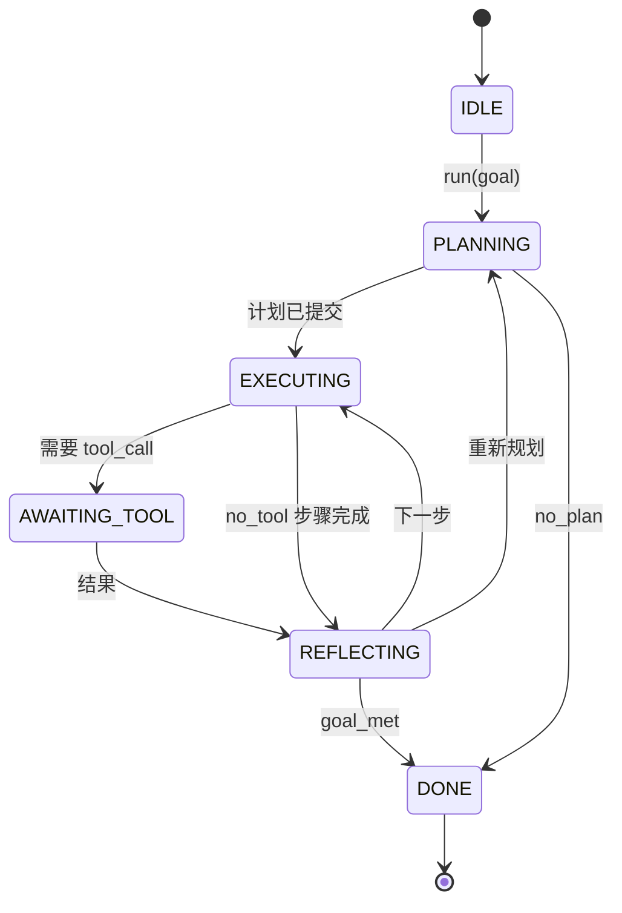

# 智能体 Harness 循环契约

> Harness 就是智能体，模型是协处理器。本课将冻结一份可接入任意模型的循环契约。

**类型：** 构建
**语言：** Python
**前置课程：** 第 13 阶段课程 01–07、第 14 阶段课程 01
**用时：** 约 90 分钟

## 学习目标
- 将智能体 harness 循环规定为具有显式转换的确定性状态机。
- 实现十个生命周期 hook 主题，供操作者接入策略、遥测和防护栏。
- 定义两个拉取点，让循环把控制权交还调用方，并在新输入上恢复。
- 强制每个会话的轮次、工具调用次数和墙钟时间预算，超限时不泄露部分状态。
- 发出包含十一种事件类型的类型化流，让下游 UI 和追踪器无需检查循环内部即可订阅。

```figure
cf-loop-contract
```

## 框架

一个无人值守运行四十轮的编程智能体不是聊天循环，而是一个节点可被操作者拦截、边可被操作者审计的状态机。写下契约后，更换模型、工具或策略不再需要重构，只需注册即可。

本课构建这份契约：命名六种状态、十个 hook 主题、两个拉取点、十一种事件类型和一个预算包络。Harness 的其他部分（工具注册表、JSON-RPC 传输、分发器、规划器）都接入这个形状。

## 状态

循环有六种状态，其中五种是活动状态，一种是终止状态。



`IDLE` 是唯一合法入口，`DONE` 是唯一合法出口。`AWAITING_TOOL` 是唯一会产生拉取点的状态，其他转换都是内部转换。

状态机是确定性的。给定同一事件日志，Harness 会重新进入同一状态；因此调试时可以回放会话，而不必再次调用模型。

## Hook 主题

Hook 是操作者进入循环的接缝。Harness 触发十个主题，每个主题可有任意数量的订阅者，按注册顺序触发。订阅者可以修改载荷、抛出异常中止本轮，或返回哨兵值跳过下一步。

```text
before_plan         after_plan
before_tool_call    after_tool_call
before_step         after_step
on_error
on_pause
on_budget_exceeded
on_complete
```

这种形状与 Claude Code、Cursor 和 OpenCode 到 2025 年中逐渐趋同的设计相似。名称描述功能而非品牌：阻止 `rm -rf` 的 hook 位于 `before_tool_call`，发送 OpenTelemetry span 的 hook 位于 `after_step`，让暂停会话恢复的 hook 位于 `on_pause`。

## 拉取点

循环两次交还控制权。第一次是在 `AWAITING_TOOL`：没有工具结果就无法继续；第二次是在预算耗尽或 hook 明确要求人工审查时触发的 `on_pause`。

拉取点不是异常，而是返回值。调用方检查 Harness 状态，获取 Harness 请求的内容，然后调用 `resume(payload)`。Harness 从停止处继续。这与 Python 生成器的形状相同；传输方式由你选择：TUI 中是按键，MCP 中是 `tools/call`，队列中则是轮询任务。

## 事件流

循环在契约指定的位置把事件追加到类型化流。该流只追加，订阅者可以从任意偏移量回放。十一种事件类型如下：

- `session.start` — 调用 `run(goal)` 时发出一次
- `plan.draft` — 规划器返回草案计划时发出
- `plan.commit` — 草案提交为活动计划后发出
- `step.start` — 每个执行步骤开始时发出
- `step.end` — 每个执行步骤结束时发出
- `tool.call` — 需要工具的步骤把控制权交给调用方时发出
- `tool.result` — 带工具结果恢复时发出
- `tool.error` — 带错误恢复，或 hook 中止调用时发出
- `budget.warn` — 达到预算限制时发出
- `session.pause` — 循环因预算或 hook 暂停时发出
- `session.complete` — 循环到达 `DONE` 时发出一次

事件不复制 hook 载荷。Hook 是命令式的（修改、终止），事件是观测式的（记录、发送），应将二者视为正交机制。

## 预算包络

会话携带三项限制：轮次数、工具调用次数、墙钟秒数。每轮将 turns 加一，每次工具调用将 tool calls 加一；每次状态转换都会检查墙钟时间。任一限制达到后，循环触发 `on_budget_exceeded`，发出 `budget.warn`，并在下一拉取点因预算超限转入 `IDLE`。

预算不是杀开关，而是让出控制权。调用方决定延长预算后恢复，还是关闭会话。

## 本课不做什么

本课不调用模型、不注册真实工具，也不实现传输；这些是后续四课的内容。本课钉牢契约，使后续四课能直接接入而无需重写。

`main.py` 中的确定性规划器只是替身：它返回三个步骤的硬编码计划，其中两个需要工具结果。重点是循环，而不是计划。

## 如何阅读代码

`HarnessLoop` 是主类，负责保存状态、触发 hook、发出事件。`Budget` 跟踪限制，`Event` 是流上的类型化包络，`HookRegistry` 是分发表。只有 `_transition` 会改变状态，因此状态机不变量集中在一个位置。

从头到尾阅读 `main.py`，再阅读 `code/tests/test_loop.py`。测试固定了每条转换以及每个 hook 的触发顺序。

## 进一步探索

生产环境构建 Harness 最难的不是状态机，而是让契约真正可执行。它必须经受规划器热重载、返回畸形 JSON 的工具，以及在四十轮会话进行到三分之二时于 `before_tool_call` 抛异常的 hook。本课测试覆盖这些失败模式，请运行、破坏并添加案例。

下一课加入工具注册表，之后是 JSON-RPC 传输，再之后是分发器。到第二十四课，本课的循环将以真实预算运行真实计划并调用真实工具。
