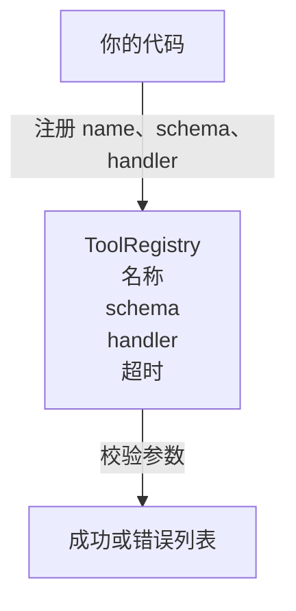

# 带 Schema 校验的工具注册表

> 智能体无法校验的工具，就无法调用。先构建注册表和 schema 检查器，再构建工具。

**类型：** 构建
**语言：** Python
**前置课程：** 第 13 阶段课程 01–07、第 14 阶段课程 01
**用时：** 约 90 分钟

## 学习目标
- 保存工具名 → schema → handler 的类型化注册表，让分发器查询一次后即可信任。
- 实现覆盖实际工具调用九成需求的 JSON Schema 2020-12 子集。
- 返回精确的 JSON Pointer 风格错误路径，让模型一次往返即可自我修正。
- 未显式指定 override 时拒绝重复注册，避免静默覆盖导致生产工具目录漂移。
- 让校验器保持纯函数（无 I/O、无时间、无全局变量），以便在回放日志上重新运行。

```figure
cf-registry-validate
```

## 为什么注册表先于工具

2026 年的编程智能体注册工具多到模型无法在一个上下文窗口中容纳。非平凡的 Harness 会注册两百个工具，并在每轮展示十到四十个。注册表是“有哪些工具”“参数形状是什么”“调用哪个 handler”的事实来源；这三个答案固定后，Harness 的其余部分就不用猜了。

我们要避免的错误是没有 schema 就发布 handler，或没有校验就发布 schema。这两种情况都很常见，也都会把下一层（第二十三课的分发器）变成猜谜游戏，唯一的失败信号是 handler 的堆栈跟踪。

## 工具记录的形状

```text
ToolRecord
  name        : str          (unique, lowercase alphanumeric and underscore segments separated by dots, e.g., snake_case.segment.case)
  description : str          (one line, shown to the model)
  schema      : dict         (JSON Schema 2020-12 subset)
  handler     : Callable     (async or sync, returns Any)
  idempotent  : bool         (dispatcher uses this for retry decisions)
  timeout_ms  : int          (override per-tool dispatcher default)
```

校验器只接触 schema，handler 对它是不透明的。我们刻意分离二者：schema 是数据，handler 是代码。混在一起会诱使你把校验逻辑放进 handler，这正是我们要阻止的 bug。

## JSON Schema 2020-12 子集

完整的 2020-12 规范是一篇论文；我们需要八个关键字。

```text
type           string / number / integer / boolean / object / array / null
properties     map of property name -> schema
required       list of property names
enum           list of allowed primitive values
minLength      integer, applies to strings
maxLength      integer, applies to strings
pattern        ECMA-262-compatible regex, applies to strings
items          schema applied to every array element
```

这已经足够覆盖工具 API 的实际需求。未加入的关键字（oneOf、anyOf、allOf、$ref、条件语句）在生产 schema 中有效，但会把校验器变成带循环的树遍历器。我们要构建的是注册表，不是 JSON Schema 引擎。

## JSON Pointer 错误路径

校验失败时，校验器返回错误列表，每条错误携带指向输入的 JSON Pointer 路径。Pointer 是由属性名和数组索引组成、以斜杠开头的序列。

```text
{"a": {"b": [1, 2, "x"]}}
                    ^
                    /a/b/2
```

模型读取错误路径比读取句子更可靠。如果 schema 要求 `args.user.email` 而模型传入整数，错误应为 `/user/email`，并带有 `expected_type: string`。模型下一次调用即可修正，无需再经历一轮自然语言交流。

## 注册与覆盖

`register(name, schema, handler, **opts)` 默认拒绝重复注册；调用方必须传入 `override=True` 才能替换。这是运维卫生：代码库两个部分静默注册同名工具，是生产中需要一周才能找到的 bug。

注册表提供三个读取方法：`get(name)` 返回记录或抛出异常；`validate(name, args)` 返回 `Ok` 或错误列表；`names()` 按注册顺序返回工具名。

## 校验器是什么、又不是什么

它是对 schema 树的一次递归遍历，是纯函数，不调用 handler，不强制转换类型（字符串 `"42"` 不通过 number schema），也不会静默截断。

它不是安全边界。恶意 handler 在通过校验后仍可能作恶；第二十三课的分发器会加入超时和沙箱层。注册表负责形状。

## 形状



## 如何阅读代码

`code/main.py` 定义 `ToolRegistry`、`ToolRecord`、`ValidationError` 和八个校验器函数。校验器根据 `schema["type"]` 分派；带 `enum` 的 schema 则作为无类型枚举检查。每个类型校验器返回空列表或 `ValidationError` 列表；顶层遍历器合并错误，并在深入时补上路径片段。

`code/tests/test_registry.py` 覆盖注册、覆盖、校验成功、带路径的校验失败，以及子集中每个关键字。

## 进一步探索

落地后最需要的两个扩展是：针对本地 definitions 块的 `$ref` 解析，以及严格形状用的 `additionalProperties: false`。二者都很小，也都是工具目录超过五十个后常见的增强；本课为保持一次阅读可完成而省略。

下一课（第二十二课）构建 JSON-RPC stdio 传输，把注册表暴露给模型客户端；再下一课（第二十三课）用带超时和重试的分发器封装二者。
