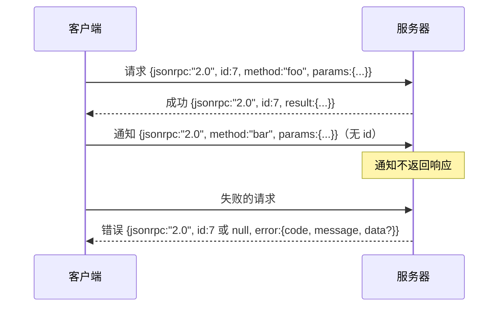

# 基于换行分隔 Stdio 的 JSON-RPC 2.0

> 模型客户端和工具服务器之间的传输是基于 stdio 的 JSON-RPC。亲手实现一次，就能理解每一层 framing 究竟在付出什么代价。

**类型：** 构建
**语言：** Python
**前置课程：** 第 13 阶段课程 01–07、第 14 阶段课程 01
**用时：** 约 90 分钟

## 学习目标

- 在 stdin 和 stdout 上，以换行分隔 JSON 的形式实现 JSON-RPC 2.0。
- 映射五个标准错误码（-32700、-32600、-32601、-32602、-32603），并用正确的语义呈现它们。
- 区分请求、响应、通知和批处理，而不凭空创造新的包络键。
- 每行处理一个解析错误，且不让它污染流的其余部分。
- 使用 `io.BytesIO` 构建一个自终止演示，使课程无需启动子进程即可运行。

```figure
cf-jsonrpc-frames
```

## 为什么 JSON-RPC 仍是通用语

2026 年，一个编程智能体在单个会话中可能与十二个工具服务器通信。每个服务器都是独立进程或远程端点。线路格式自 2013 年以来一直没有改变。JSON-RPC 2.0 只有两页规范，却能持续存在，是因为它的替代方案（gRPC、每次调用一次 HTTP、自定义二进制协议）都要付出 JSON-RPC 不需要付出的取舍：它们往往只能在流式传输、批处理或与传输方式耦合之间选择一部分。JSON-RPC 可以对称地运行于 stdio、socket、websocket 和 HTTP；只要双方遵守规范，客户端甚至可以驱动一个从未见过的服务器。

本课构建 stdio 变体。消息采用换行分隔的 JSON，每个请求占一行，每个响应也占一行，传输边界就是 `\n`。

## 线路形状

存在四种包络形状，其中两种由客户端发送，两种由服务器发送。



通知没有 `id`。服务器不得响应通知。如果服务器对通知返回响应，客户端就无法把它关联回调用位置。这个单一规则让 framing 的计算保持简单。

批处理是请求或通知组成的 JSON 数组。服务器以响应数组回应，其中每个非通知条目对应一个响应，顺序可以任意。如果批处理中的每一项都是通知，服务器就不发送任何内容。

## 五种错误码

```text
-32700  Parse error      JSON could not be parsed
-32600  Invalid Request  Envelope shape is wrong
-32601  Method not found
-32602  Invalid params
-32603  Internal error
```

-32000 到 -32099 之间的错误码保留给服务器自定义错误，其他错误码由应用定义。本课只使用上述五种。如果 handler 抛出异常，传输层会把它包装为 -32603，并把异常类名放入 `data.exception`。

解析错误有一条特殊规则：响应中的 `id` 是 `null`，因为请求尚未成功解析到足以提取 id 的程度。

## 换行 framing 与 BytesIO 演示

传输层一次读取一行。一行是截至并包括 `\n` 的字节。如果某行无法解析，传输层会写出一个 `id: null` 的 -32700 响应，然后继续读取。流不会被污染，下一行会从头解析。

本课把一对 `io.BytesIO` 对象包装成 stdin 和 stdout。服务器读请求直到 EOF，为每个请求写响应，然后返回；客户端再读回这些响应。没有进程启动，也没有超时。由于 Python 的 `io` 接口提供同样的 `.readline()` 和 `.write()` 契约，其传输行为与真实子进程管道一致。

## 方法分发

传输层不知道有哪些方法存在。它把请求交给由 harness 提供的可调用对象 `handler(method, params)`。handler 返回结果或抛出异常，三种异常类会映射到特定错误码：

```text
MethodNotFound -> -32601
InvalidParams  -> -32602
Anything else  -> -32603 with exception name in data
```

传输层永远不会看到工具注册表。注册表位于 handler 后方，这正是我们需要的分层：传输层负责 JSON-RPC，注册表负责工具形状，第二十三课的分发器把二者串起来。

## 出错时的流行为

```text
client writes              server reads             server writes
---------------            -----------              -------------
{...valid request...}      parses ok                {...response, id matches...}
{...broken json...         parse fails              {id:null, error: -32700}
{...valid request...}      parses ok                {...response, id matches...}
{...missing method...}     invalid envelope         {id:X, error: -32600}
```

损坏的 JSON 不会停止循环。缺少 `method` 字段也不会停止循环。handler 异常同样不会停止循环。传输层会持续读取，直到 EOF。

## 通知与非对称流

通知是即发即忘。harness 用通知发送进度事件、取消信号和日志行。长时间运行的工具可以用通知流式发送状态，而不必为每次状态更新都进行往返。

本课实现一个出站通知辅助函数 `write_notification`。服务器在请求执行期间用它发送进度。演示展示了这种模式：请求到达后，handler 发出两条进度通知，最后写入最终响应。

## 如何阅读代码

`code/main.py` 定义 `StdioTransport`、解析辅助函数 `parse_request`、三个写入辅助函数（`write_response`、`write_error`、`write_notification`）以及分发循环 `serve`。错误码常量位于模块级别。

`code/tests/test_transport.py` 覆盖五种错误码、通知（不写响应）、批处理（输入数组、输出数组、跳过通知）、损坏 JSON（返回解析错误后继续），以及 handler 在一次调用中间写入通知的非对称流程。

## 进一步探索

这套传输已经足够支撑后续课程。生产级传输还会增加三件事。第一是在转发过程中保留一个关联 ID（你的 `id` 已经承担这一职责，但在网状系统中还需要额外的外层 trace ID）。第二是取消通道（例如带有正在执行调用 ID 的 `$/cancelRequest` 通知）。第三是内容类型协商握手，让同一个 socket 可以说 JSON-RPC，也可以说 Streamable HTTP。这些都不会改变线路，只会增加元数据。
