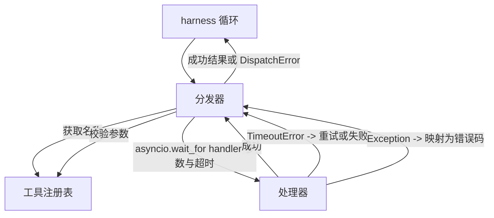
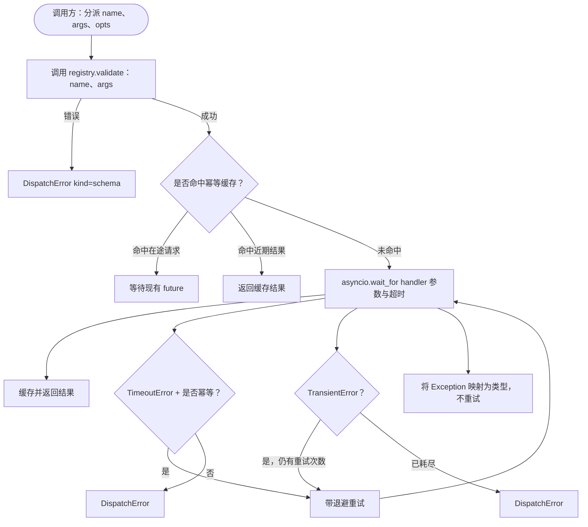

# 函数调用分发器

> 分发器承担 schema 作出的每项承诺：超时、重试、去重和错误映射，全部集中在一道接缝上。

**类型：** 构建
**语言：** Python
**前置课程：** 第 13 阶段课程 01–07、第 14 阶段课程 01
**用时：** 约 90 分钟

## 学习目标

- 为每次工具调用设置超时，在循环挂起之前返回类型化错误。
- 使用带抖动和最大尝试次数的指数退避重试。
- 用幂等键去重重试，避免慢速原调用与重试发生竞态、导致同一操作执行两次。
- 将 handler 异常和传输故障映射到 harness 循环已经理解的统一错误包络。
- 用并发上限约束并行分发，避免一次扇出四十个工具调用而耗尽事件循环。

```figure
cf-dispatch-retry
```

## 分发器位于何处

它位于 harness 循环（第二十课）和工具注册表（第二十一课）之间。传输层（第二十二课）把请求送入循环，循环把工具调用交给分发器。分发器调用注册表、运行 handler，然后返回结果或 JSON-RPC 风格的错误包络。



分发器是唯一了解计时器、重试和幂等性的层。循环不知道这些，注册表不知道这些，handler 也不知道这些。这种隔离正是设计的目的。

## 超时

每个工具都有默认超时，注册表记录中保存 `timeout_ms`。当 harness 传入单次调用覆盖值时，分发器会使用覆盖值。我们使用 `asyncio.wait_for`。超时发生时，handler 任务会被取消，分发器返回 `DispatchError(kind="timeout")`。

对于非幂等工具，超时默认不是可重试错误。一个超时的 `db.write` 可能已经提交，也可能没有提交；重试可能造成重复写入。分发器遵守注册表记录中的 `idempotent` 标志：幂等工具可以重试，非幂等工具不能重试。

## 指数退避重试

重试策略最多尝试三次，退避时间采用指数增长并加入抖动。

```text
attempt 1  -> delay 0
attempt 2  -> delay 0.1s * (1 + random[0..0.5])
attempt 3  -> delay 0.4s * (1 + random[0..0.5])
```

只有 `timeout` 和 `transient` 错误会重试。`schema`、`not_found` 或 `internal` 错误不会重试。schema 错误是确定性的，重试不会改变结果，只会消耗预算。

重试循环遵守 harness 的预算。如果调用方剩余工具调用数为零，分发器会在第一次尝试前快速失败，并返回 `kind="budget_exceeded"`。

## 幂等键去重

重试在原调用仍在执行时触发，是生产中真实存在的 bug。第一次调用在 4.9 秒时挂住（略低于超时），五秒时重试触发。此时两个请求会竞态访问同一个后端；如果工具是 `payments.charge`，就会被扣款两次。

分发器接受可选的 `idempotency_key`。如果相同的键在某次调用到达时仍处于执行中，分发器就等待在途 future，并返回它的结果。调用完成后的六十秒内，缓存仍保留这些键，用来吸收迟到的重试。

键由调用方负责。harness 从规划器派生它：`f"{step_id}:{tool_name}:{hash(args)}"`。分发器不自行发明键，因为只根据参数推导键会让两个语义不同的调用看起来相同。

## 错误包络

一次失败的分发返回统一形状：

```text
DispatchError
  kind        : "timeout" | "transient" | "schema" | "not_found" | "internal" | "budget_exceeded"
  message     : str
  attempts    : int
  jsonrpc_code: int   (one of -32601, -32602, -32603)
```

harness 循环把 `kind` 映射到下一个状态。`schema` 和 `not_found` 进入 `on_error` 并触发重规划。`timeout` 和 `transient` 进入 `on_error`，是否重规划取决于尝试次数。`budget_exceeded` 触发 `on_budget_exceeded`。

## 扇出并发上限

`gather(*calls)` 会同时运行所有协程。四十个工具调用意味着四十个打开的 socket 或四十条子进程管道。多数后端不喜欢一个客户端建立四十条并行连接。

分发器用信号量包裹 `gather`。默认并发上限为八。每个调用在分发前获取信号量，在完成时释放。调用方看到的仍是 `gather` 形状，但实际调度受到限制。

## 单次调用流程



## 如何阅读代码

`code/main.py` 定义 `Dispatcher`、`DispatchError` 和 `TransientError`。异步 `dispatch(name, args, ...)` 是唯一入口。`_run_with_retries` 内部使用 `asyncio.wait_for` 应用每次尝试的超时；`gather_bounded(calls)` 使用并发上限运行多个分发。

`code/tests/test_dispatcher.py` 覆盖超时触发、瞬态错误重试、schema 错误不重试、幂等去重（两个使用同一键的并发调用合并为一次 handler 调用）以及并发限制（信号量实际生效）。

测试使用 `asyncio.sleep(0)` 和基于确定性 `Counter` 的 handler，因此能在毫秒内完成，不依赖墙上时钟计时。

## 进一步探索

生产分发器还会增加两种扩展。第一，在每次状态转换时记录结构化日志（循环的事件流已经提供了这部分信息，但分发器也应发出 `dispatch.attempt` 和 `dispatch.retry` 事件）。第二，增加熔断器：在一个时间窗口内失败达到 N 次后，工具进入冷却期，分发直接返回 `kind="circuit_open"`，而不再尝试 handler。这两种扩展都能叠加在当前分发器之上，不改变契约。

第二十四课会把分发器接到 plan-and-execute 智能体上，让你看到四个部分一起运行。
