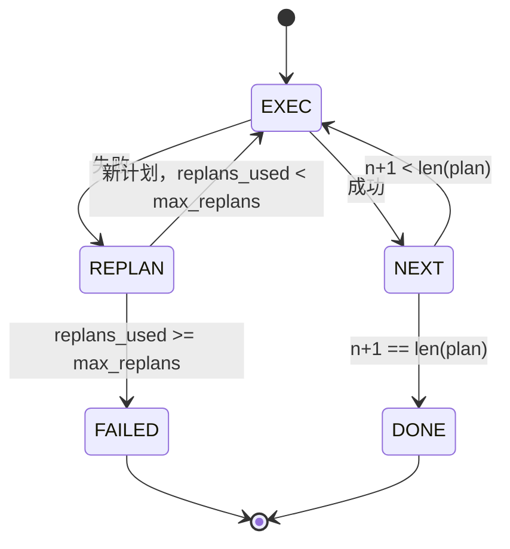

# 计划—执行控制流

> 无法经受失败的计划只是脚本；能够重新规划的脚本才是智能体。先构建重规划器。

**类型：** 构建
**语言：** Python
**前置课程：** 第 13 阶段课程 01–07、第 14 阶段课程 01
**用时：** 约 90 分钟

## 学习目标

- 将计划表示为有序的类型化步骤列表，让执行器能够判断进度和结果。
- 顺序执行步骤，并将受控的失败移交给规划器。
- 从当前游标重规划，把先前错误放入上下文，使下一份计划有依据。
- 每次修订发出计划差异，让下游追踪器或 UI 显示计划为何改变。
- 强制两个预算：硬步骤上限和硬重规划上限。

```figure
cg-plan-replan
```

## 计划并执行，而不是思维链

思维链智能体输出 token，让循环猜测工具调用在哪里结束；plan-and-execute 智能体先输出结构化计划，再确定性地执行每一步。计划是 harness 可以检查的数据，执行则是 harness 通过分发器运行这些数据。

这里有两个部分：产生计划的规划器和运行计划的执行器。真正有趣的地方在于执行器遇到失败时会发生什么。共有三种选择：

```text
1. Abort         (return failed, surface the error)
2. Skip          (mark step failed, continue with the rest)
3. Replan        (hand the error to the planner, get a new plan from the cursor)
```

正是重规划把脚本变成了智能体。

## Step 的形状

```text
Step
  id              : int           (monotonic within a plan revision)
  tool_name       : str
  args            : dict
  expected_outcome: str           (planner's stated success condition)
  result          : Any | None
  error           : str | None
```

`expected_outcome` 是规划器随步骤发出的短句，不由执行器强制执行。它有两个用途：重规划器会在修订计划时读取它，事件流也会发出它，让追踪器显示“这一步原本应完成什么”。

## 规划器的形状

```python
def planner(goal: str, history: list[Step], last_error: str | None) -> list[Step]:
    ...
```

这是一个纯函数。`goal` 是用户目标，`history` 是已经执行且填入结果或错误的步骤，`last_error` 在首次调用时为 `None`，之后每次调用都是最近一次失败消息。规划器返回从当前游标开始的下一份计划。

规划器不了解执行器，也不了解重试或超时。它只产生计划，仅此而已。

## 执行器

执行器是一个小型状态机。每一步都经过分发器。结果有三种：成功、可重规划的失败、致命失败。可重规划的失败会交还给规划器；致命失败（预算耗尽或达到重规划上限）则返回状态为 `FAILED` 的会话结果。



## 修订时的计划差异

失败后规划器返回新计划时，执行器会发出带有三个字段的 `plan.diff` 事件。

```text
removed: list of step ids that were in the old plan and are not in the new
added  : list of step ids in the new plan that were not in the old
revised: list of step ids whose tool_name or args changed
```

追踪器或 UI 可以把 removed 步骤渲染为删除线，把 added 步骤高亮。重点不在差异格式，而在于修订是一个可见事件，而不是静默重写。

## 两个硬预算

`max_steps` 限制整个会话（包括重规划）中的步骤执行总数，默认值为十二。一个五步的线性计划如果重规划两次、每次又增加三步，就会执行十六步，超过预算；执行器会拒绝重规划并返回 `FAILED`。

`max_replans` 限制首次计划之后规划器被调用的次数，默认值为五。这是更重要的限制：如果不设上限，规划器连续五次返回同一份损坏的计划，就会一直循环，直到步骤预算将其拦截。限制重规划次数能让失败更快发生，原因也更清楚。

## 本课的确定性规划器

本课不调用模型，而是依据 `last_error` 选择计划：

```text
last_error is None    -> emit a four-step plan
last_error matches X  -> emit a three-step plan that routes around X
last_error matches Y  -> emit a two-step plan that gives up gracefully
otherwise             -> return [] (signals nothing to replan)
```

这足以测试执行器的所有转换路径：成功、重规划一次、重规划两次、重规划耗尽和步骤预算耗尽。

## 结果形状

```text
SessionResult
  status      : "completed" | "failed"
  reason      : str     ("goal_met" | "step_budget" | "replan_budget" | "no_plan")
  history     : list[Step]
  revisions   : list[PlanDiff]
  events      : list[Event]
```

第二十课的 harness 循环可以直接读取这个结果。第二十三课的分发器负责执行每一步。第二十一课的注册表负责校验每一步的参数。第二十二课的传输层可以通过 JSON-RPC 把整个流程暴露给模型客户端。

## 如何阅读代码

`code/main.py` 定义 `PlanExecuteAgent`、`Step`、`PlanDiff`、`SessionResult` 和确定性规划器。执行器是一个返回 `SessionResult` 的单一 `run(goal)` 方法。计划差异通过比较步骤 ID 以及 `(tool_name, args)` 元组计算。

`code/tests/test_agent.py` 覆盖线性成功、中途失败后进行一次重规划、重规划耗尽并返回 `failed:replan_budget`、步骤预算耗尽，以及计划差异事件的格式。

## 进一步探索

把它接到真实模型后，你会需要两个扩展。第一是部分计划缓存：六步计划的前面三步成功、第四步失败时，不应重新运行前三步。执行器已经保存了 history，规划器只需读取它。第二是并行分支：当前执行器严格顺序运行；规划器可以发出独立分支（用 `gather_step` 代替 `next_step`），再通过分发器并发运行两个工具调用。

这两项都会增加真实复杂度，等线性执行器被测试固定后再添加会容易得多。本课就是要完成这一步。
