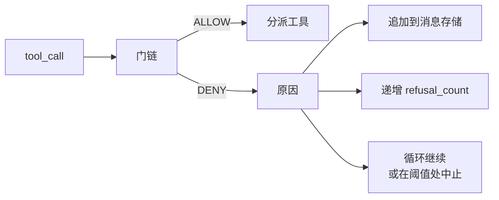
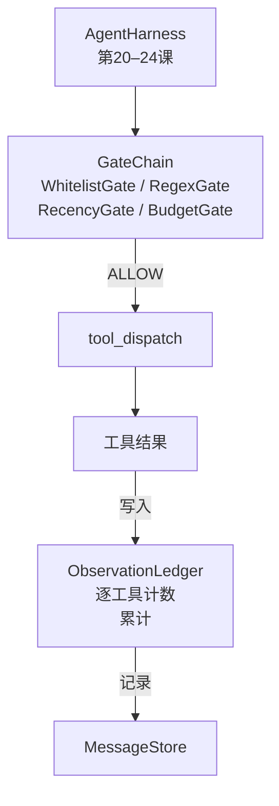

# 毕业项目课程 25：验证门与观测预算

> 没有验证层的智能体 harness，就像穿着风衣的愿望。本课构建确定性的门链，用来决定工具调用是否可以执行、智能体能看到多少输出，以及智能体读取过多内容时何时必须停止。整个链由若干小型命名门和一个观测账本组成，账本追踪模型看到的每一个 token。

**类型：** 构建
**语言：** Python（标准库）
**前置课程：** 第 19 阶段 · 20–24（轨道 A1：智能体循环、工具注册表、消息存储、提示构建器、模型路由器），第 14 阶段 · 33（作为约束的指令），第 14 阶段 · 36（范围契约），第 14 阶段 · 38（验证门）
**用时：** 约 90 分钟

## 学习目标

- 构建带有确定性 `evaluate(call)` 方法的 `VerificationGate` 协议。
- 将预算、时效性、白名单和正则门组合成具有短路语义的门链。
- 创建按工具和轮次记录每次观测的 `ObservationLedger`。
- 当累计观测预算将被超出时拒绝工具调用。
- 输出下游可接入观测系统的结构化 `GateDecision` 记录。

## 问题

当智能体 harness 允许模型自由调用工具时，真实使用的第一个小时内通常会出现三类 bug。

第一类是无界观测。对一个 20 万行的仓库执行 grep，可能把五十万个 token 的输出倒进下一轮。模型每千字节只能看到一个匹配，其余上下文全被浪费。token 账单很高，而智能体完成任务的能力反而下降。

第二类是过时的时效性。长任务积累五十次工具调用后，模型会把第三轮的第一次 `read_file` 当成实时状态重新阅读。第四十七轮的编辑没有出现，因为提示构建器先序列化了最早的观测。

第三类是权限蔓延。研究任务先调用 `web_search`，不知怎么又运行了 `shell`，因为模型编造了工具名而 harness 默认采用宽松策略。等有人查看 trace 时，`/tmp` 里已经有垃圾文件，curl 也已经请求了私有 API。

验证门是会说“不”的 harness 组件。它不是模型，也不是裁判，而是 `(call, history, ledger)` 的确定性函数，返回带理由的 ALLOW 或 DENY。理由会被记录并告知模型；循环随后继续或中止。

## 概念



只要对象具有 `evaluate(call, ctx) -> GateDecision` 方法，就可以成为一个门。门链是有序列表；第一次 deny 就会短路。顺序很重要：便宜的结构检查应先于昂贵的 token 计数。

本课提供四个门：

- `WhitelistGate`：允许的工具名是显式集合，集合外的一律拒绝。这是最便宜的门，首先运行。
- `RegexGate`：用正则匹配工具参数，可拒绝包含 `rm -rf` 的 shell 调用或指向内部 IP 的 HTTP 调用；它只依赖调用载荷。
- `RecencyGate`：模型只看到最近 N 个轮次的观测，较早观测会被遮蔽；若调用结果会扩展一个已经过时的观测窗口，门就拒绝它。
- `BudgetGate`：模型在整个会话中读取的累计 token 有上限。账本表示达到上限后，所有后续工具调用都会被拒绝。

观测账本负责记账。每次成功的工具调用都会写入一行：工具名、轮次、输出 token 数和累计数。账本回答两个问题：模型总共看到了多少，以及看到了工具 X 的多少。预算门读取第一个；你将在练习中编写的按工具预算门读取第二个。

```figure
cg-gate-chain
```

## 架构



harness 向门链发起询问。门链要么允许，要么拒绝。允许时工具运行、账本递增，结果追加到消息存储；拒绝时，模型收到包含拒绝信息的系统消息，循环决定重试还是中止。

## 你将构建什么

实现由一个 `main.py` 和测试组成。

1. `Observation` 和 `ToolCall` 数据类定义传输形状。
2. `ObservationLedger` 记录 `(turn, tool, tokens)` 行，并回答 `cumulative()` 与 `per_tool(name)`。
3. `GateDecision` 携带 `(allow, reason, gate_name)`。
4. `VerificationGate` 是协议，每个门实现 `evaluate(call, ctx)`。
5. `GateChain` 包装有序列表，返回第一个 deny；所有门通过时返回 allow。
6. 演示运行一个微型合成智能体循环，共三轮；第三轮触发预算门，并以非零拒绝计数报告干净的拒绝。

token 计数器刻意使用简单的 `len(text) // 4` 启发式。重点是门的连接，而不是分词器；生产环境应换成真正的分词器。

## 为什么门链顺序重要

拒绝比允许更便宜。`WhitelistGate` 是 O(1) 哈希查找；`RegexGate` 是 O(pattern * argv)；`RecencyGate` 读取消息存储的一小段；`BudgetGate` 读取整个账本。因此按成本升序排列，让被拒绝的调用在昂贵计算前短路。

还要按影响范围排序。白名单是最强的断言：这个工具不在契约中。正则门其次：这个参数不在契约中。时效性门再后：harness 仍然关心它，但调用在结构上合法。预算门最后，因为它按定义只会在其他条件都通过后触发。

## 它如何与轨道 A 的其余部分组合

前面的课程提供了循环、工具注册表、消息存储、提示构建器和模型路由器。本课增加模型与工具之间的这一层。课程 26 提供 dispatcher 在门链允许后交给工具的沙箱；课程 27 提供把拒绝计数作为质量信号记录的评测 harness；课程 28 把门决策接入 OpenTelemetry span；课程 29 将全部组件串成可工作的编码智能体。

## 运行

```bash
cd phases/19-capstone-projects/25-verification-gates-observation-budget
python3 code/main.py
python3 -m pytest code/tests/ -v
```

演示逐轮打印每个门的决策并以零退出。测试覆盖账本、每个独立门、门链短路，以及端到端的合成循环。
