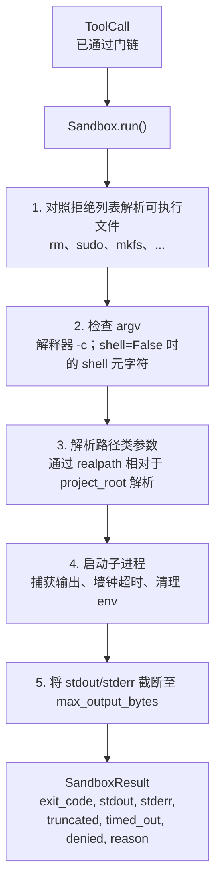
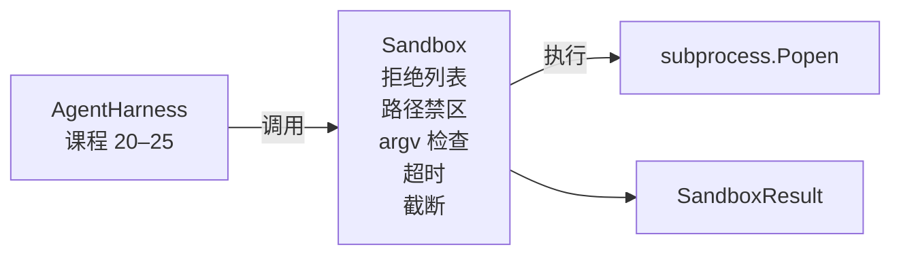

# 毕业课程 26：带拒绝列表和路径禁区的沙箱运行器

> 验证门决定工具调用是否应当运行，沙箱决定它运行后会发生什么。本课交付一个子进程运行器：拒绝危险的可执行文件、拒绝危险的 argv 形状、将每个文件路径限制在项目根目录内、截断过大的输出，并在墙钟超时时杀死失控进程。它是位于模型与操作系统之间的两层防护中的第二层。

**类型：** 构建
**语言：** Python（标准库）
**前置课程：** 第 19 阶段 · 25（验证门与观测预算），第 14 阶段 · 33（作为约束的指令），第 14 阶段 · 38（验证门）
**用时：** 约 90 分钟

## 学习目标

- 构建一个封装 subprocess.run、提供超时、捕获和截断功能的 Sandbox 类。
- 按名称对照拒绝列表拒绝命令，并按结构通过 argv 检查器拒绝命令。
- 拒绝任何解析后位于声明项目根目录之外的路径参数。
- shell 模式关闭时拒绝 shell 元字符。
- 返回结构化的 SandboxResult，使下游观测系统和评测 harness 可以接入。

## 问题

一个能够执行 shell 的编码智能体，一轮对话就可能安装后门、窃取密钥、搞坏开发者的笔记本，还可能花掉一大笔云费用。代价最低的防御是不提供 shell；第二低的防御则是让沙箱针对一份精确的模式列表说“不”。

智能体 trace 中反复出现三类失败。

第一类是危险的可执行文件。一个急于修复路径问题的模型可能会尝试 sudo、chmod -R 777、rm -rf、mkfs 或 dd。这些都不应出现在智能体运行中。拒绝列表通过名称和别名捕获它们。

第二类是 argv 花招。一个被告知不能使用 shell 的模型，可能会通过解释器传递攻击：python3 -c "import os; os.system('rm -rf /')"、bash -c '...'、node -e '...' 和 perl -e '...'。沙箱需要知道，任何带有类似 -c 标志的解释器运行，本质上都只是多绕了一步的 shell 调用。

第三类是路径逃逸。模型被要求读取 ./src/main.py，却改去读取 ../../etc/passwd。沙箱通过 os.path.realpath 解析每个路径参数，并断言它位于根目录前缀之下，从而把路径关进禁区。

沙箱不是操作系统意义上的安全边界。一个拥有代码执行能力且意志坚定的攻击者仍然可能逃逸。它是开发时的护栏：让常见的失败模式变得显眼，并阻止智能体因为笨拙而造成损害。

## 概念



沙箱有四条拒绝轴：名称、argv、路径和结构。每条都是调用的纯函数，在此之前不会启动子进程。只有所有轴都通过后，子进程才会启动。

SandboxResult 的退出码沿用常规约定：成功为 0，失败为非零；另有三个哨兵状态：拒绝为 -100，超时为 -101，截断时仍使用真实退出码但设置标志。下游课程读取这个结构化结果，而不是解析 stderr。

```figure
cg-path-jail
```

## 架构



拒绝列表是可执行文件 basename 组成的 frozenset。/bin/rm、/usr/bin/rm 等别名都会解析为同一个 basename。argv 检查器理解解释器的形状：只要 argv[0] 是解释器，且后续任一参数以 -c 或 -e 开头，就拒绝。调用没有明确请求 shell 时，;、|、&、>、<、反引号和 $() 等 shell 元字符也会导致拒绝。

路径禁区是最微妙的部分。沙箱构造时接收一个 project_root。任何看起来像路径的参数（包含 / 或匹配已有文件）都会先经过 os.path.realpath 规范化，然后与项目根目录的 realpath 比较。如果解析后的目标不在根目录下，就拒绝。通过检查 realpath，而不是字面路径，还能阻止项目根内指向外部位置的符号链接逃逸。

## 你将构建什么

实现由 main.py 和一个测试目录组成。

1. SandboxResult 数据类：exit_code、stdout、stderr、truncated、timed_out、denied、reason、duration_ms。
2. SandboxConfig 数据类：project_root、max_output_bytes、timeout_seconds、denylist、interpreter_block。
3. Sandbox 类：run(argv, *, shell=False, cwd=None)，返回 SandboxResult。
4. 内部拒绝辅助函数：_check_executable_denylist、_check_argv_interpreter、_check_shell_metachars、_check_path_jail。
5. 带清晰 truncated 标志和捕获流标记行的输出截断。
6. 文件末尾的演示：依次运行合法调用和对抗性调用，并展示每个调用的结果。

沙箱默认使用 shell=False 和 capture_output=True 调用 subprocess.run。墙钟超时通过 timeout 参数实现；发生 TimeoutExpired 时，沙箱杀死进程组并合成一个 SandboxResult。

## 为什么这不是真正的沙箱

本课的沙箱不使用 namespaces、cgroups、seccomp、gVisor、Firecracker，也不使用任何内核级隔离。子进程能做的事情，沙箱也能做。这里提供的是结构性保护：拒绝最常见的危险调用，让拒绝进入观测系统，而不是静默执行。

对于生产智能体，你还要在其上叠加非特权 Docker 容器或 microVM、删除 capabilities、以只读方式挂载项目根并让 scratch 目录可写、设置内存和 CPU 的 ulimit，并把环境清理成已知安全的白名单。课程 29 会做其中一部分。操作系统隔离不在本课范围内。

## 运行

```bash
cd phases/19-capstone-projects/26-sandbox-runner-denylist
python3 code/main.py
python3 -m pytest code/tests/ -v
```

演示创建临时目录，把一个干净文件放进去，然后运行一组调用。合法调用会成功；拒绝调用返回 denied=True 和原因；超时返回 timed_out=True；截断设置 truncated=True。演示打印结果的 JSON 表并以零状态退出。

## 它如何与轨道 A 的其余部分组合

课程 25 产出门链。课程 26 是 ALLOW 之后执行调用的执行器。课程 27 的评测 harness 将沙箱结果与每个任务预期的退出码比较。课程 28 围绕每次 Sandbox.run 调用发出 gen_ai.tool.execution span。课程 29 的端到端演示将真实编码智能体接入这两层防护。
