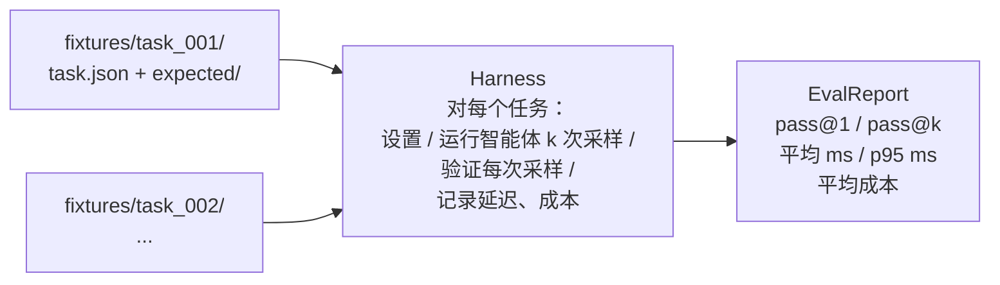
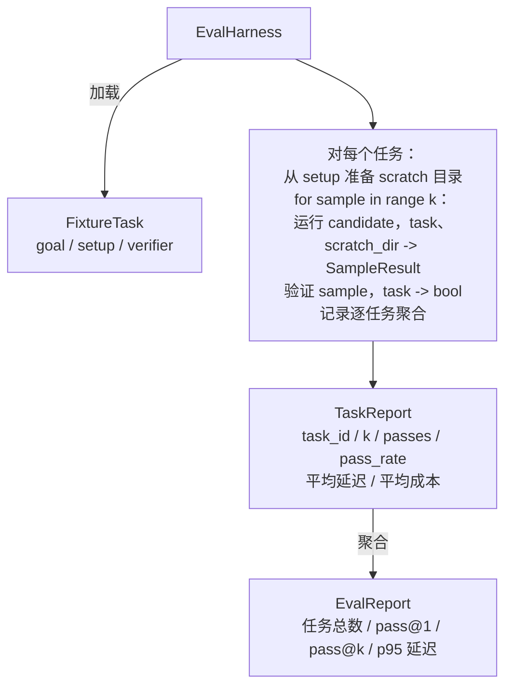

# 毕业课程 27：带 fixture 任务的评测 Harness

> 编码智能体的能力取决于用来衡量它的任务套件。本课构建一个评测 harness：接收一个 fixture 任务文件夹，让候选智能体逐个运行任务，用确定性验证器判定通过或失败，再把结果聚合为 pass@1、pass@k、平均延迟和平均成本。harness 是事实来源，让你能区分回归和重构。

**类型：** 构建
**语言：** Python（标准库）
**前置课程：** 第 19 阶段 · 25（验证门）、第 19 阶段 · 26（沙箱运行器）、第 14 阶段 · 30（评测驱动的智能体开发）、第 14 阶段 · 19（SWE-bench 与 GAIA 基准）
**用时：** 约 90 分钟

## 学习目标

- 将 fixture 任务定义为由目标、设置和验证器组成的三元组。
- 对每个任务的多次采样运行评分，并计算 pass@1 和 pass@k。
- 将延迟和成本聚合为均值与第 95 百分位指标。
- 把确定性验证器（文件差异、退出码、正则匹配）接入可复用函数。
- 输出结构化 JSON 报告，使回归跟踪脚本可以读取。

## 问题

没有评测 harness 的智能体基准通常会受到三种失败模式困扰。

第一种是未经验证的通过。智能体说自己修好了 bug，人类扫一眼 diff，套件就被标成绿色；三周后，回归测试再次暴露同一个 bug。智能体只是给出了看起来合理的推理，实际上什么也没有修好。

第二种是未被发现的回归。提示词模板的一次改动让智能体在显眼任务上提升 4%，却在不显眼的任务上下降 14%。没有金标准集和逐任务分数，回归就会进入主分支，直到客户抱怨时才出现。

第三种是逐任务漂移。评测周一使用 100 个任务，周五却只剩 95 个，因为有人重命名了五个 fixture。通过率看起来提高了 5%，其实并没有。

harness 是把这些失败转化为事实的程序。它每次都按可复现的顺序运行每个 fixture，并交给一个针对确定性检查返回 true 或 false 的验证器。

## 概念



FixtureTask 是一个小型 JSON 文件加上可选的 expected/ 目录。JSON 声明 id、goal（提供给智能体的提示词）、setup 块（放入 scratch 目录的文件）以及 verifier 块。verifier 块指定 harness 验证器注册表中的函数，并提供它的参数。

三种验证器形状覆盖了大多数有用任务。

第一种是 file_equals。智能体运行后，把指定文件与期望内容比较。它能捕获“以这种确切方式修复这个 bug”的任务。

第二种是 regex_match。把指定文件的内容与正则表达式匹配。它适合“函数必须存在并返回 X”这类存在多种可接受实现的任务。

第三种是 shell_exit_zero。harness 通过第 26 课的沙箱运行 shell 命令，只有命令退出码为零时任务才通过。它能捕获“测试必须通过”的任务。

harness 对每个任务运行 k 次。pass@k 的公式是 1 - (1 - p)^k，其中 p 是经验通过率；harness 还报告原始计数，帮助你发现方差。延迟是每次采样的墙钟时间。成本由智能体自行报告（词元数、美元，或二者），harness 将它在所有采样之间求和，并展示逐任务与聚合后的数字。

```figure
pass-at-k
```

## 架构



候选者是一个可调用对象：Callable[[FixtureTask, str], SampleResult]。harness 通过 tempfile.mkdtemp() 创建 scratch 目录，并以普通字符串传入其路径。harness 不关心候选者如何工作。候选者可以是确定性补丁应用器（适合 harness 自测）、真实 LLM 智能体或模糊测试器。契约就是 SampleResult。

## 你将构建什么

main.py 提供：

1. FixtureTask 数据类。
2. SampleResult 数据类：success_self_reported、latency_ms、cost_units、edits。
3. 带有 to_dict() 的 TaskReport 与 EvalReport 数据类。
4. 将验证器名称映射到函数的 VerifierRegistry。内置验证器为 file_equals、regex_match、shell_exit_zero。
5. EvalHarness 类：针对候选者运行一个任务目录，并返回 EvalReport。
6. tasks/ 中捆绑的五个 fixture 任务：
   - fizzbuzz 中的差一错误；
   - factorial 中缺少 return；
   - 错误消息中的拼写错误；
   - 空的函数体；
   - 链表遍历中的差一错误。
7. 确定性参考候选者 apply_known_fixes，harness 用它演示干净的 pass@1 = 1.0。
8. 打印 EvalReport JSON 并以零状态退出的演示。

fixture 任务以 tasks/ 中的 JSON 文件以及 tasks/<id>/buggy/ 和 tasks/<id>/expected/ 中成对的源文件捆绑。harness 将 buggy 复制到 scratch 目录，交给候选者，再与 expected 比较验证。

## 为什么是 pass@k，而不只是 pass@1

真实 LLM 智能体具有随机性。pass@1 为 0.6 看起来像失败；pass@5 为 0.95 则说明智能体大多数时候能给出正确答案，只是在早期采样中选错了。修复方式是采样与排序，而不总是增加训练。pass@k 会把这一点显现出来。

pass@k 必须与 pass@1 一起报告，因为 pass@k 会掩盖一个真实失败：如果模型二十次才得到一次正确答案，你仍然没有一个有用的智能体。harness 会同时展示两者。

## 它如何与轨道 A 的其余部分组合

课程 25 产出门链，课程 26 产出沙箱。对于 shell_exit_zero 验证器，harness 使用这个沙箱。课程 28 用 OTel trace 包裹每次 harness 运行。课程 29 针对捆绑 fixture 中的一个运行端到端演示，并断言参考候选者的 pass@1 = 1.0。

## 运行

```bash
cd phases/19-capstone-projects/27-eval-harness-fixture-tasks
python3 code/main.py
python3 -m pytest code/tests/ -v
```

演示以 JSON 打印 EvalReport，包括 pass@1、pass@5、平均延迟和逐任务明细。退出码为零。测试覆盖验证器函数、pass@k 数学、fixture 加载，以及使用捆绑参考候选者的 harness 端到端流程。
