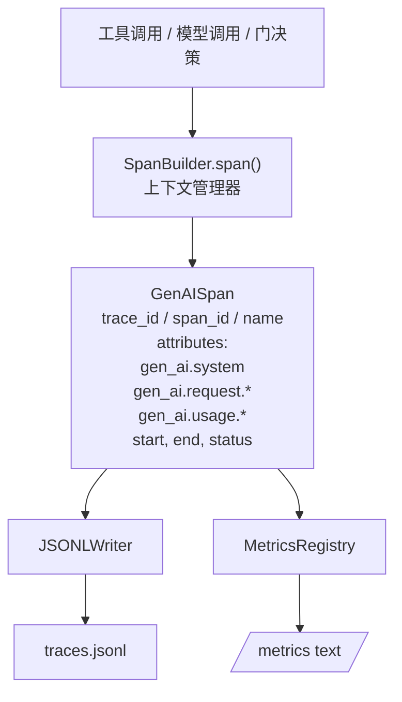
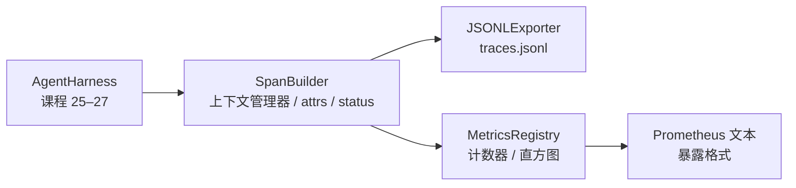

# 毕业课程 28：用 OTel GenAI Span 和 Prometheus 指标做观测

> 没有观测能力的智能体 harness 是会花钱的黑箱。本课手写一个符合 OpenTelemetry GenAI 语义约定的 span 构建器，将每个 span 写成一行 JSON-Lines，并以 Prometheus 文本格式暴露计数器和直方图。全部使用 Python 标准库，可离线运行。

**类型：** 构建
**语言：** Python（标准库）
**前置课程：** 第 19 阶段 · 25（验证门），第 19 阶段 · 26（沙箱），第 19 阶段 · 27（评测 harness），第 13 阶段 · 20（OpenTelemetry GenAI），第 14 阶段 · 23（OTel GenAI 约定）
**用时：** 约 90 分钟

## 学习目标

- 构建形状符合 OpenTelemetry GenAI 语义约定的 span 数据类。
- 实现 JSONL 导出器，每行写出一个自包含的 span。
- 构建带标签的计数器和直方图，并以 Prometheus 文本格式暴露。
- 用 span 上下文管理器包装任意 callable，记录时长、状态和异常。
- 验证导出的 span 可以经过 json.loads 往返，并符合规范形状。

## 问题

生产中的编码智能体每轮都会产生三类产物：一次模型调用、一次工具执行和一次验证门决策。没有结构化 telemetry，它们都没有用。

第一种失败模式是缺少 trace。周二发生了问题，但唯一记录是一份 500 行的聊天日志。日志中没有哪个工具运行过、花了多长时间、prompt 中有多少词元，或验证门是否拒绝了某个调用的记录。智能体作者只能猜。

第二种失败模式是无法解析的 trace。harness 写出了 span，却使用了自己的临时字段名。Grafana、Honeycomb、Jaeger 或本地 CLI 都无法读取它们。团队技术栈中已有的工具因为 span 不标准而全部浪费。

第三种失败模式是没有聚合的指标。你可以在 trace 中看到一次缓慢的工具调用，却无法回答“过去一小时 read_file 调用的 p95 延迟是多少”，因为你只有 trace，没有指标。

OpenTelemetry GenAI 语义约定正是为此存在：它定义了一小组标准属性，让不同 LLM 框架的 span 发射器共享。如果你的 harness 写入这些属性，所有兼容 OTel 的后端都能读取它们。

## 概念



harness 中的每项操作都会产生一个 span。span 有 trace id（整个智能体调用）、span id（当前这一项操作）、名称（例如 gen_ai.chat、gen_ai.tool.execution）、遵循 GenAI 约定的属性、起始和结束时间，以及状态。

GenAI 约定把以下属性键标准化：gen_ai.system（例如 anthropic、openai 这样的供应商）、gen_ai.request.model（模型 ID）、gen_ai.request.max_tokens、gen_ai.usage.input_tokens、gen_ai.usage.output_tokens、gen_ai.response.model、gen_ai.response.id、gen_ai.operation.name，以及工具专用的 gen_ai.tool.name 和 gen_ai.tool.call.id。

导出器写入 JSONL，每行一个 JSON 对象。这是下游工具可以流式处理、grep 和导入的最简单格式。一个真实 OTel 导出器会使用 OTLP gRPC；本课的 JSONL 导出器是离线等价物，能在任何开发者工作站上以零状态退出。

指标与 trace 并列存在。每次工具调用递增 tools_called_total{tool="read_file"}。直方图记录 tool_latency_ms{tool="read_file"} 的观测延迟。二者都序列化为 Prometheus 文本 exposition 格式，这是基于拉取的指标事实标准。

```figure
trace-spans
```

## 架构



span 构建器是一个小类，提供 span(name, attrs) 方法并返回上下文管理器。进入上下文时记录开始时间，退出时记录结束时间；如果期间抛出异常，就附加异常，并把已完成的 span 推给导出器。

指标注册表由两个字典组成。计数器的形状是 {(name, frozen_labels): int}。直方图保留原始样本列表，并在暴露时序列化为 Prometheus 直方图 bucket。

## 你将构建什么

main.py 提供：

1. GenAISpan 数据类：trace_id、span_id、parent_span_id、name、attributes、start_unix_nano、end_unix_nano、status、status_message、events。
2. SpanBuilder 类，提供带有 span(name, attrs, parent=None) 上下文管理器的方法。
3. JSONLExporter 类，export(span) 会追加一行。
4. Counter 和 Histogram 类，以及 MetricsRegistry。
5. prometheus_exposition(registry)，生成文本格式的输出。
6. wrap_tool_call(name) 装饰器，发出 span 并更新指标。
7. 演示：合成一次完整的智能体调用（在工具 span 外包裹 gen_ai.chat span），写入 traces.jsonl，打印 Prometheus exposition，并以零状态退出。

span ID 和 trace ID 是由 os.urandom 生成的 16 字节十六进制字符串，符合 OTel 的 W3C trace context。导出器不会抛出异常；IO 错误会暴露出来，但 harness 会继续运行。

直方图使用固定 bucket 集合（OTel 对毫秒延迟的默认值）：5、10、25、50、100、250、500、1000、2500、5000、10000 和 +Inf。样本以列表保存；exposition 按需计算每个 bucket 的计数。

## 为什么手写，而不是使用 opentelemetry-sdk

OTel Python SDK 是一个真实依赖。它也有数千行代码、OTLP 导出器的多进程开销，以及会吞噬课程预算的运行成本。手写版本教授 wire format；在生产环境中，把同样的属性接入真实 SDK，就能免费获得 OTLP 导出、批处理和资源检测。

这些约定是稳定的。本课发出的 wire format 到 2030 年仍会持续可解析，因为 OTel 不会破坏 GenAI 属性名，只会增加新的属性名。

## 它如何与轨道 A 的其余部分组合

课程 25 产出门链。课程 26 产出沙箱。课程 27 产出评测 harness。课程 28 让前三者都可观测。课程 29 为端到端演示的每一步包裹 span，并在末尾打印 Prometheus 文本。

## 运行

```bash
cd phases/19-capstone-projects/28-observability-otel-traces
python3 code/main.py
python3 -m pytest code/tests/ -v
```

演示会在课程工作目录中生成 traces.jsonl（结束时清理），随后打印三个 span 的样例，再打印计数器和直方图的 Prometheus exposition。测试验证 span 能往返序列化、规范的 GenAI 属性存在、计数器正确递增，以及直方图 exposition 包含预期的 bucket 计数。
