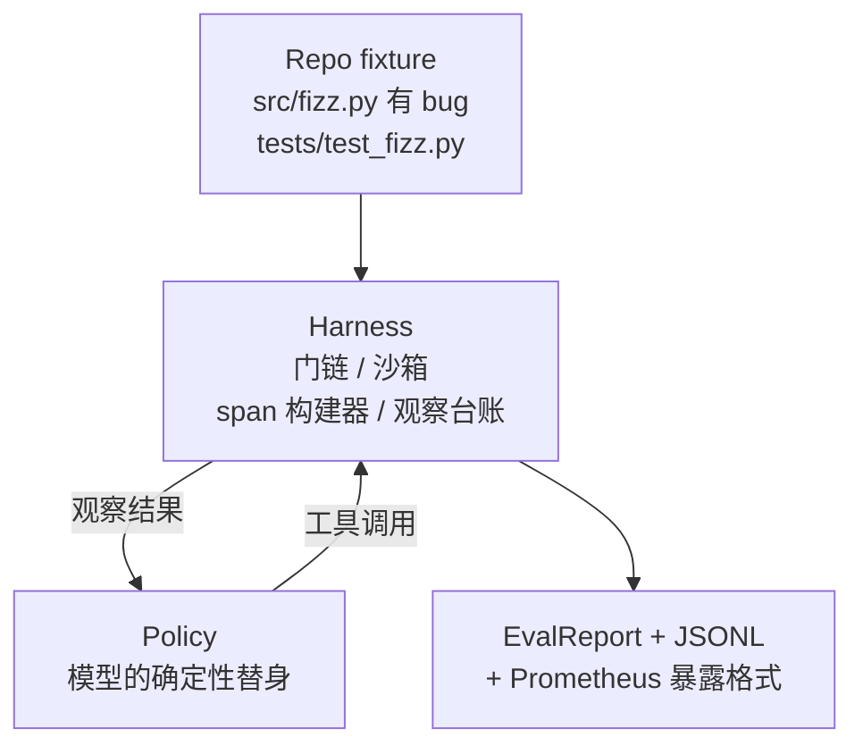
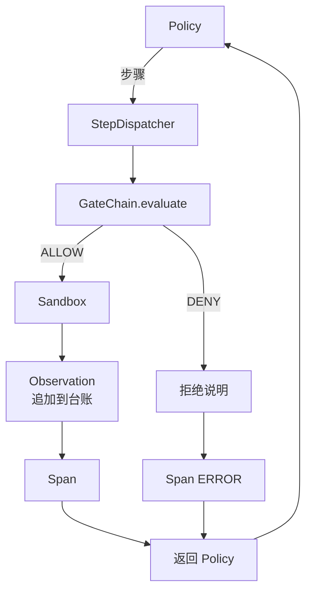

# 毕业课程 29：基于 harness 的端到端编码智能体

> 这是轨道 A 的成果。本课把门链、沙箱、评测 harness 和 OTel span 串成一个可工作的编码智能体，让它修复多文件 Python 项目中一个真实但小型的 fixture 级 bug。智能体是确定性策略而非 LLM；这种替换使课程可复现，也说明真正有趣的是 harness。契约保持不变：真实模型可以插入策略接缝。

**类型：** 构建
**语言：** Python（标准库）
**前置课程：** 第 19 阶段 · 25（验证门），第 19 阶段 · 26（沙箱），第 19 阶段 · 27（评测 harness），第 19 阶段 · 28（观测），第 14 阶段 · 38（验证门），第 14 阶段 · 41（真实仓库工作台），第 14 阶段 · 42（智能体工作台毕业项目）
**用时：** 约 90 分钟

## 学习目标

- 将门链、沙箱、评测 harness 和 span 构建器组合为单一智能体循环。
- 实现使用 read_file、run_tests 和 write_file 修复 fixture bug 的确定性策略。
- 在端到端运行中强制全局步骤预算和观测 token 预算。
- 为完整运行发出 OTel GenAI trace 和 Prometheus 指标。
- 验证智能体在少于 12 步内解决 fixture，合法工具零次触发门拒绝。

## 问题

多数智能体演示彼此孤立：单独的沙箱、评测 harness 或 span 发射器看起来都没问题，一旦组合，接缝就会暴露。

门链允许调用，但沙箱却因门链没有预见的原因拒绝。评测 harness 记录了通过，但 OTel span 却显示门拒绝了智能体声称使用的工具。Prometheus 计数器本应递增一次，却递增了两次。观测预算已经超出，智能体却继续运行，因为预算只在门链里记录，沙箱并不知道。

本课是整条轨道的集成测试。智能体必须依次完成四件事：读取项目、运行测试、从测试失败中识别 bug、写入修复、再次运行测试并停止。每项操作都经过门链，每次工具执行都经过沙箱，每一步都包在 span 中，评测 harness 最终为整个过程评分。

## 概念



智能体策略是一个状态机，共有五个状态。

SURVEY：智能体读取项目列表，下一状态为 RUN_TESTS。

RUN_TESTS：智能体运行测试命令。如果测试通过，状态机以成功停止；否则下一状态为 INSPECT。

INSPECT：智能体读取失败的源文件，下一状态为 FIX。

FIX：智能体写入修正后的文件，下一状态为 VERIFY。

VERIFY：智能体再次运行测试命令。如果测试通过，就以成功停止；否则以失败停止。

每个状态对应一次工具调用，每次调用都经过门链。如果工具调用被拒绝，智能体会在 trace 中报告拒绝并停止。

fixture 中的 bug 是 fizz.py 里的差一错误。确定性策略通过正则从测试失败信息中识别 bug，并输出修正后的文件。把策略替换成 LLM 不会改变 harness 契约。

```figure
cg-harness-weave
```

## 架构



本课自包含。每个前置课程的原语都以最小规模在 main.py 中重新实现（gate、sandbox、ledger、span），因此无需导入同级课程即可运行。名称与课程 25–28 完全一致，所以概念映射明确。

## 你将构建什么

main.py 提供：

1. 与课程 25–28 同名的最小 harness 原语：GateChain、Sandbox、ObservationLedger、SpanBuilder、MetricsRegistry。
2. CodingAgentPolicy 类：包含五种状态的状态机。
3. Repo 辅助类：用捆绑的有 bug fixture 准备 scratch 目录。
4. AgentRun 类：驱动策略，通过 harness 分发，并返回 AgentRunReport。
5. 一个捆绑的 fixture（fixture_repo/），包含 src/fizz.py、tests/test_fizz.py 和供评测 harness 使用的 expected/ 树。
6. 演示：端到端运行策略，打印逐步 trace，断言通过并打印指标。

捆绑 fixture 与课程 27 的任务结构相同：一个有 bug 的文件和一个测试文件。测试失败信息包含足够的信息，让确定性策略识别修复。真实 LLM 会做同样的工作，只是速度更慢、召回范围更广；它不会改变 harness 的预期。

## 为什么策略不是 LLM

真实 LLM 需要 API key、网络调用和无法验证的随机性。课程关注的是 harness；确定性策略让课程无需外部依赖即可在任何开发者电脑上运行，并让测试套件能够断言精确的步骤数。

本课的策略只是 LLM 智能体能力的严格子集。策略读取仓库、看到失败测试、定位行并输出修复。LLM 通过同一循环和同一 harness 契约完成这些工作；记账方式完全相同。

## 演示断言什么

演示在退出时断言五件事，测试套件也会以编程方式再次断言。

策略在少于 12 步内解决了 fixture。

观测预算从未超出。

合法工具零次触发门拒绝。（智能体从未凭空发明一个被拒绝的工具名称。）

traces.jsonl 中每一步都有对应的 span。

Prometheus exposition 包含 tools_called_total{tool="read_file"} 条目和 tool_latency_ms 直方图。

## 它如何与轨道 A 的其余部分组合

本课就是集成。课程 25 编写门链，课程 26 编写沙箱，课程 27 编写评测 harness，课程 28 编写观测，课程 29 证明它们作为一个系统协同工作。真实的智能体 harness 可以从这里扩展：将确定性策略换成模型，将捆绑 fixture 换成真实仓库任务，将 JSONL 导出器换成 OTLP。

## 运行

```bash
cd phases/19-capstone-projects/29-end-to-end-coding-task-demo
python3 code/main.py
python3 -m pytest code/tests/ -v
```

演示打印逐步 trace、最终评测报告和 Prometheus exposition，并以零状态退出。测试覆盖策略状态转换、合成工具调用的门拒绝、捆绑 fixture 的端到端运行，以及步骤预算不变量。
