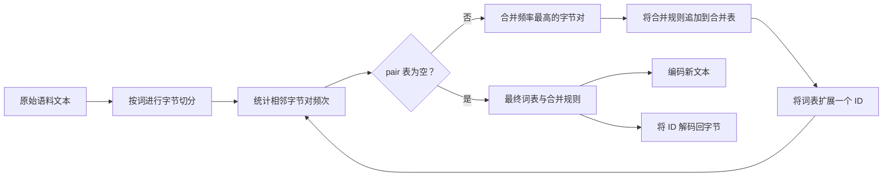
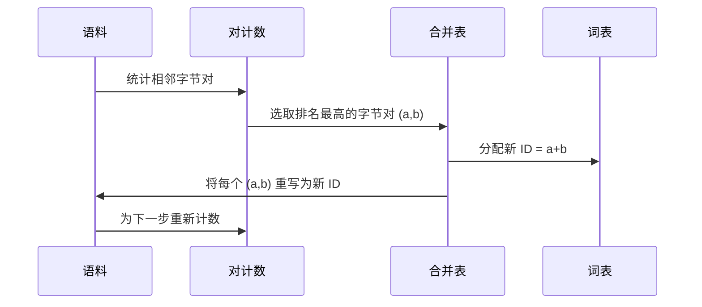

# 从零实现 BPE 分词器

> 输入字节，输出 ID，再把 ID 还原为相同的字节。构建每个现代文本模型都要从这里开始的分词器。

**类型：** 构建
**语言：** Python
**前置课程：** 第 04 阶段课程、第 07 阶段 Transformer 课程
**用时：** 约 90 分钟

## 学习目标

- 从原始文本语料训练 Byte-Pair Encoding 词表：反复合并出现频率最高的相邻符号对。
- 实现确定性的合并表，将新文本转换为子词 ID 流。
- 对任意 UTF-8 输入在 ID 与字节之间无损往返。
- 保留并保护特殊 token（`<|endoftext|>`、`<|pad|>`），使其在训练和解码中不被破坏。
- 理解为什么字节级字母表是通用分词器应有的最低基础。

```figure
cap-bpe-merge
```

## 基本框架

语言模型从来不直接看到文本，它看到的是整数。把字符串映射为整数列表、再映射回来，就是分词器。若这一层出错，训练过程中的每条 loss 曲线都在测量错误的对象。

通用文本模型中占主导地位的子词分词器家族是 Byte-Pair Encoding。思路很简单：从已知字母表开始，找出训练语料中出现次数最多的相邻符号对，把它合并为新符号，重复直到词表达到目标大小。编码新文本时，按相同顺序复用同一份合并列表。

本课实现字节级变体。字母表是 256 个原始字节，而不是 Unicode 码点。这样分词器无需退回未知 token，就能处理任何 UTF-8 输入。

## 流程



训练端和推理端共享合并表，这是两者之间的契约。若推理时改变合并顺序，得到的 ID 流就会不同。

## 字节字母表

前 256 个 ID 保留给 0x00 到 0xFF 的原始字节，因此任何输入字符串在合并前都能表示。字节区之后为特殊 token 保留一小段 ID。训练循环不会把这些 ID 当作合并目标，因为它们始终被排除在预分词流之外。

预分词器在训练前按空白和标点边界切分语料。否则 BPE 会学习跨词边界的合并，词表很快被完整常见短语填满。切分后，合并只发生在词内，结果更具泛化性。

## 训练循环

每个训练步骤做三件事：遍历语料中的每个词，按该词出现次数加权统计当前符号序列中相邻符号对的频率；选择频率最高的一对；把它的每次出现改写为一个新符号，并把合并记录下来。新符号的 ID 是词表中的下一个空闲位置。



每步成本与语料的符号序列总长度线性相关。序列会随着合并而缩短，因此即使百万词语料、目标一万个 ID，也能在合理时间内完成。

## 编码新文本

推理阶段不重新统计合并对，而是按学习到的顺序应用合并表。对新词，编码器从字节切分开始，扫描当前序列，寻找排名最低（最早学习且可用）的合并并执行，然后再次扫描，直到没有可用合并。

按排名处理是确定性编码并匹配训练行为的关键。较早学习的合并排名更高；若同一位置有两个合并可用，则优先较低排名者。

## 特殊 token

特殊 token 是字节流不可能自然产生的 ID，由我们手动保留。本课使用两个：

- `<|endoftext|>` 在预训练中分隔文档，告诉模型新文档开始，不要让前一文档的上下文泄漏过来。
- `<|pad|>` 把短序列补齐为矩形张量，训练时由 loss mask 隐藏。

编码器提供允许特殊 token 的开关。关闭时，这两个字符串会按组成它们的字节进行分词；开启时，字面字符串直接映射到保留 ID，不参与任何合并。

## 往返保证

编码后再解码必须精确返回输入字节。解码器按顺序拼接每个 ID 的字节展开；每个 ID 要么是原始字节，要么是此前已知 ID 的拼接，因此递归展开最终一定会落到原始字节，再还原为对应 UTF-8 字符串。

本课测试会在未见过的句子、含 Unicode emoji 的句子，以及包含字面 `<|endoftext|>` token 的句子上检查这一性质。

## 本课不做什么

本课不实现大型生产分词器那种正则驱动的预分词器，而使用小型的空白和标点切分。它足以在小语料上产生合理合并，并保持与后续课程的契约。下一课把分词器视为黑盒，在其上构建滑动窗口数据集。

本课不并行化符号对统计。几千词的 Python 循环远低于一秒；面对更大语料，可按词并行统计后再归并。

## 如何阅读代码

`main.py` 定义四个对象：`BPETokenizer` 保存词表、合并表和特殊 token 表；`train` 是训练循环；`encode` 是推理路径；`decode` 负责字节拼接。底部演示用内置语料训练小分词器，编码保留句子、再解码并打印结果。测试固定往返性质、特殊 token 保留和合并顺序。

运行演示，然后把目标词表大小从 300 改为 600，观察保留句子的编码长度下降；这条曲线就是 BPE 压缩曲线。
