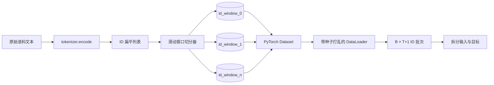
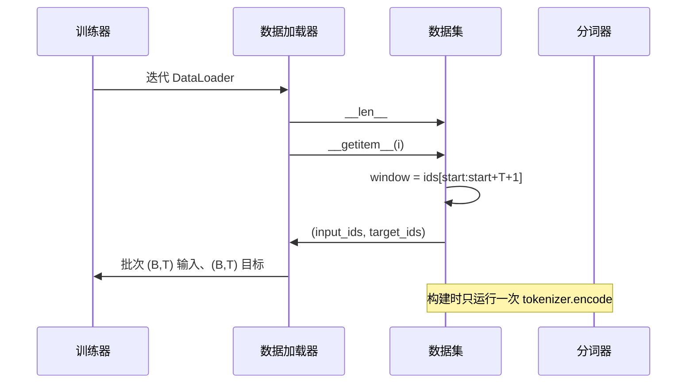

# 带滑动窗口的 token 化数据集

> 预训练运行把 token ID 转换为梯度。本课构建负责输入这些 ID 的传送带。

**类型：** 构建
**语言：** Python
**前置课程：** 第 04、07 阶段课程，本阶段第 30 课
**用时：** 约 90 分钟

## 学习目标

- 调用一次分词器，把原始语料转换为 token ID 流。
- 用可配置的重叠步长切分固定长度窗口。
- 构建返回下一 token 预测输入和目标张量的 PyTorch Dataset。
- 用每个 epoch 有确定性种子的随机打乱封装 DataLoader。
- 理解步长、冗余和有效数据集规模之间的权衡。

```figure
cap-sliding-window
```

## 基本框架

预训练每次读取一个 ID 批次并更新模型；批次形状由训练契约固定。因果语言模型使用形状 `(B, T)` 的输入和目标，目标是输入左移一位。数据管道要从可能数 GB 的原始文本确定性地产生这一契约。

本课构建这条管道。上一课的分词器把文本变成长的扁平 ID 列表，滑动窗口把列表切成训练样本，自定义 Dataset 将样本暴露为张量，DataLoader 负责批处理，并使用已知种子打乱它们。

## 形状契约

输入形状为 `(B, T)`，目标位置 `t` 是输入位置 `t+1`，所以每个样本需要 `T+1` 个原始 ID。窗口步长决定连续样本的重叠量。



末尾不足 `T+1` 个 ID 的窗口会被丢弃；补 `<|pad|>` 也可行，但会增加 loss mask 的复杂度，本课选择丢弃。

## 为什么使用滑动窗口

预训练语料是一条很长的 ID 流。如果模型只看不重叠的窗口，每个训练样本教给它的都是相同的那组 `T` 个边界。调整步长会移动这些边界，让模型看到更多样的“预测下一个词元”任务。

步长为 `T` 时窗口不重叠；步长为 `T // 2` 时重叠一半，有效数据集约翻倍；步长为 1 时重叠最大，数据量约增加 `T` 倍。代价是每个 epoch 计算更多，收益是看到更多边界。多数预训练运行使用等于上下文长度的步长，因为语料远大于单个 epoch 能处理的量。

## Dataset 类

PyTorch Dataset 需要 `__len__` 和 `__getitem__`。本课保存编码后的 ID 流和步长，按索引动态计算窗口起点，因此无论产生多少样本，内存都只需保存一份 ID 流。



`__getitem__` 内部完成错位，返回 `(input, target)`，其中 `input = window[:-1]`、`target = window[1:]`。两者都是 PyTorch long tensor，训练循环把它们当作真实目标。

## 确定性打乱

`shuffle=True` 的 DataLoader 会从 PyTorch 随机生成器读取索引。显式传入按 epoch 播种的 `torch.Generator`，即可在重启后得到相同顺序。这个性质对比较只改变一个超参数的两次运行很重要；没有种子时，两次运行会以不同顺序看到数据，loss 曲线的差异就不一定来自那个改动。

本课的种子契约很简单：`epoch_seed = base_seed + epoch_index`。构造数据加载器时传入 base seed，训练器在每个 epoch 开始时递增 epoch index。使用相同 base seed 重跑时，每个 epoch 的顺序都相同。

## 批采样器

PyTorch 默认采样器在不放回的情况下均匀随机选择索引，正适合预训练；在小数据集上微调时契约也相同。DataLoader 调用 `__getitem__` `B` 次并堆叠结果；样本长度由构造方式保证相同，因此不需要 padding。

为简单起见本课保持 `num_workers=0`。生产运行中，worker 会并行执行 `__getitem__` 调用。对本管道来说，工作主要只是切取内存 tensor，收益很小，但同一个 Dataset API 可以干净地支持 worker。

## 统计样本数

ID 流长度为 `N`、上下文长度为 `T`、步长为 `S` 时，样本数为 `max(0, 1 + (N - (T + 1)) // S)`。Dataset 将此计算暴露为静态方法。

## 本课不做什么

本课不从磁盘流式读取。语料会被完整编码并保存为一个 tensor；对几百万个 ID 来说，这远低于一百 MB，正适合本课。磁盘流式读取是可以插入的独立问题：只需替换存储方式，同时保持 Dataset 契约。

本课也不处理多个文档。语料被视为一条连续 ID 流；如果语料由多个文档构成，应在构建语料时插入 `<|endoftext|>` ID。模型会学习在这个边界附近进行预测。

## 如何阅读代码

`main.py` 定义两个类和一个辅助函数。`SlidingWindowDataset` 是 PyTorch Dataset，`make_dataloader` 返回配置好且带种子生成器的 DataLoader，`_encode_corpus_to_ids` 负责一次性调用分词器。演示会在进程内构造一个小型分词器，编码内置语料，建立数据集和加载器，打印一个 batch 并断言形状契约。`code/tests/test_dataset.py` 的测试固定窗口数量公式、错位一位性质、确定性打乱和步长权衡。

运行演示，再把上下文长度从 16 改为 32，观察每个 epoch 的样本数如何下降。
