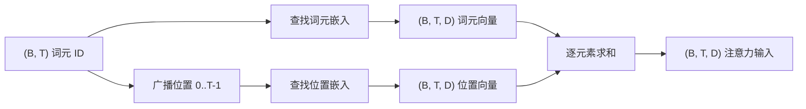
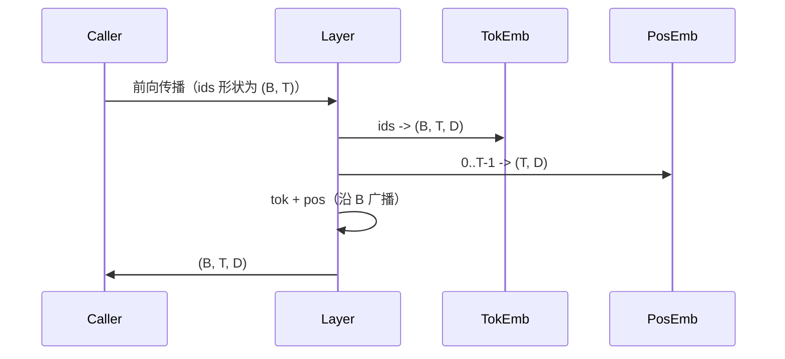

# token 与位置嵌入

> ID 是整数，模型需要向量。两个查找表位于两者之间，而位置表的选择会影响模型能学到什么。

**类型：** 构建
**语言：** Python
**前置课程：** 第 04、07 阶段课程，本阶段第 30、31 课
**用时：** 约 90 分钟

## 学习目标

- 构建把词表 ID 映射为稠密向量的 token 嵌入查找表。
- 构建按位置索引的可学习位置嵌入查找表。
- 构建无参数的固定正弦位置嵌入。
- 把 token 与位置嵌入组合为 Transformer block 的输入。
- 比较可学习与正弦嵌入在长度泛化和参数量上的差异。

```figure
cc-embedding-lookup
```

## 基本框架

模型第一次接触 token ID 时，会在 token 嵌入矩阵中查找一行。矩阵每个词表 ID 对应一行，每个模型维度对应一列；查到的向量会被网络其余部分当作该 ID 的含义。反向传播只更新本次前向真正访问的行。训练过程中，这些行组成的几何结构会逐渐学会用不同方向编码相似性。

ID 本身没有顺序，因此还需要第二个信号表示位置 1 与位置 17 不同。这个信号有两种主流选择：可学习位置嵌入（每个位置一行的第二张查找表）和固定正弦位置嵌入（没有参数的数学公式）。选择会带来后果。可学习表是参数，并受模型训练时使用的最大上下文长度限制；正弦表理论上不含参数，公式可延伸到任意位置，但本课的 `SinusoidalPositionalEmbedding` 会在 `max_context_length` 处预计算固定表，`forward` 超过该上限仍会报错。因此本课的两个模块都会强制最大上下文长度。即使表足够大、能够索引更长位置，模型在训练长度之外仍可能表现困难。

本课构建两种方案，并将它们与 token 嵌入组合成一个输入，供下一课的注意力模块使用。

## 形状契约

输入 token ID 形状为 `(B, T)`，输出为 `(B, T, D)`。组合采用逐元素相加而非拼接，使网络中的 `D` 保持不变。



## token 嵌入矩阵

token 嵌入是形状为 `(V, D)` 的参数张量，其中 `V` 是词表大小。PyTorch 用 `nn.Embedding(V, D)` 表示它。初始化时，元素通常从均值为零、标准差约为 0.02 的小高斯分布中抽取，这是 Transformer 规模模型的传统设置；比起具体初始化值，跨运行保持一致更重要。

前向传播只是一次索引操作：PyTorch 将形状为 `(B, T)` 的 int64 ID 通过收集矩阵行，映射为形状为 `(B, T, D)` 的浮点张量。反向传播只把梯度累积到前向访问过的行；本 batch 中从未出现的行在这一步收到的梯度为零。

还有一个细节。token 嵌入与模型末端的输出投影经常共享权重（weight tying）。发生这种情况时，每次反向传播都会通过输出端触及嵌入的每一行。本课把两者作为独立模块暴露，但在完整模型中同一矩阵可以承担这两个角色。

## 可学习位置嵌入

第二个 `nn.Embedding` 形状为 `(max_context_length, D)`，位置 ID 为 `0, 1, ..., T-1`，查得的 `(T, D)` 向量沿 batch 维广播。可学习表的缺点是：如果模型只训练到位置 `T-1`，就无法查询位置 `T`，因为那一行根本不存在。采用这种方案的生产 decoder-only 模型会把最大上下文长度写死在架构中，并拒绝处理更长输入。

## 正弦位置嵌入

正弦嵌入是从位置到向量的函数：

```python
angle = p / (10000 ** (2 * (i // 2) / D))
emb[p, 2k]     = sin(angle)
emb[p, 2k + 1] = cos(angle)
```

它没有参数。每个位置都有一个独特的向量；不同特征维度上的波长按几何级数变化，因此低维编码粗粒度位置，高维编码细粒度位置。

同时使用 sin 和 cos 带来的性质是：位置 `p + k` 的向量可以由位置 `p` 的向量作线性变换得到。这为注意力层学习相对位置偏移提供了便捷路径，模型无需额外参数就能表达“向前看五个词元”。

本课在构造时一次性计算完整的正弦表，并在前向时对它进行索引。

## 组合

流程依次是读取 ID、查 token 向量、加位置向量并返回总和；位置张量通过 `unsqueeze` 变为 `(1, T, D)` 后自动沿 batch 广播。



## 对比分析

本课在相同输入上运行两个变体，并打印两个诊断。第一个是参数量：可学习变体在 token 嵌入之外增加 `max_context_length * D` 个参数，正弦变体增加零个参数。第二个是相邻位置嵌入之间的余弦相似度：正弦变体因为函数连续，呈现平滑且可预测的衰减；可学习变体在初始化时各行独立抽取，因而相似度近似随机。训练之后，可学习变体通常会形成相似的平滑结构，但那是从数据中发现的，而不是公式直接提供的。

## 本课不做什么

本课不构建 rotary positional encoding（RoPE）或 AliBi。它们是生产 Transformer 的现代选择，并且都遵循这里的形状契约：对形状为 `(B, T, D)` 的向量施加与位置有关的变换；区别是它们作用在输入嵌入处之后的注意力投影步骤。下一课构建注意力模块，其中一个可选扩展就是把 rotary 折叠进 query-key 投影。

本课也不训练嵌入。训练需要损失，损失需要模型输出，模型输出又需要注意力和 LM 头；下一课及其后续课程会提供这些部分。

## 如何阅读代码

`main.py` 定义三个模块。`TokenEmbedding` 封装 `nn.Embedding(V, D)`，`LearnedPositionalEmbedding` 封装 `nn.Embedding(L, D)`，`SinusoidalPositionalEmbedding` 预计算表并将它暴露为 buffer。`EmbeddingComposer` 把 token 嵌入和位置嵌入组合起来。演示打印形状、参数量和相邻位置相似度诊断；`code/tests/test_embeddings.py` 的测试固定形状、广播行为、参数量和正弦公式。

运行演示，再把模型维度 `D` 从 64 改为 32，观察正弦波长带如何变化。
