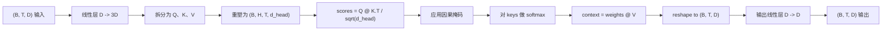
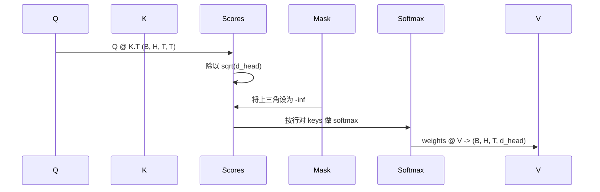

# 多头自注意力

> 一次线性投影、三个视图、H 个并行头、一个 mask：构建模型实际使用的注意力模块。

**类型：** 构建
**语言：** Python
**前置课程：** 第 04、07 阶段课程，本阶段第 30–32 课
**用时：** 约 90 分钟

## 学习目标

- 用一个线性层完成批量 Query/Key/Value 投影并拆分为 H 个头。
- 计算带正确归一化和 dtype 处理的缩放点积注意力。
- 应用因果 mask，阻止位置关注未来位置。
- 查看固定输入的逐头注意力权重并理解每个头关注的内容。
- 在玩具任务上训练小型注意力模块，观察头逐渐专门化。

```figure
cap-multihead-attention
```

## 基本框架

注意力让一个 token 的表示从同序列其他 token 获取信息。自注意力中 query、key 和 value 都来自同一输入；多头注意力把投影拆成 H 个并行的注意力问题，拼接结果后再投影回去。

高效实现用一个从 `D` 投影到 `3 * D` 的线性层，再把结果切成三个视图，并重塑为 H 个大小为 `D // H` 的头。矩阵乘、softmax 和加权和都以批量张量操作完成，因此这些头可以在加速器上并行运行。

本课构建这个模块，并加入因果 mask，使同一份代码可以作为 decoder-only 语言模型的注意力层。下一课会把模块堆叠为完整 Transformer，再下一课会训练它。

## 形状契约

输入和输出都是 `(B, T, D)`，mask 为 `(T, T)` 或可广播形状；内部张量为 `(B, H, T, d_head)`，且必须满足 `D % H == 0`。



QKV 投影和输出投影是模块唯一的参数；mask、softmax、矩阵乘和重塑都无参数。

## QKV 拆分与头重塑

朴素实现会使用三个独立线性层，分别生成 Q、K、V。高效实现使用一个输出 `3 * D` 特征的层，再拆分结果。两者在数学上等价，因为三个使用 `(D, D)` 权重的矩阵乘，正好等于把三个矩阵沿输出方向堆叠成一个 `(3D, D)` 权重后做的一次矩阵乘。

高效版本更快，是因为加速器只需启动一次矩阵乘而不是三次；它也更容易初始化，因为三个子矩阵位于同一参数张量中，可以一起初始化。

拆分后 Q、K、V 都是 `(B, T, D)`。为了变成 H 个并行的注意力问题，先重塑为 `(B, T, H, d_head)`，再转置为 `(B, H, T, d_head)`。现在 head 维紧邻 batch 维，PyTorch 可以把每个头的注意力视为跨 `B * H` 个独立实例的批量操作。

`d_head` 放在最后，是为了让分数矩阵乘 `Q @ K.transpose(-2, -1)` 沿该维度收缩。结果是每个头形状为 `(B, H, T, T)` 的注意力分数。

## 缩放

softmax 前将分数除以 `sqrt(d_head)`。否则 `d_head` 变大时点积也会变大，softmax 会进入几乎把全部质量放在一个位置、其余位置概率极小的区域。此时梯度很小，学习会停滞。除以 `sqrt(d_head)` 能让不同头大小下的分数方差大致保持稳定。

## 因果 mask

预测下一个 token 时 decoder 只能使用过去信息。mask 强制执行这一点：softmax 前把 `(T, T)` 分数矩阵对角线以上的每一项替换为负无穷，softmax 后这些位置的权重就会变为零。

mask 在构造时注册为 buffer，因此会与模型位于同一设备，也不会进入梯度图。它覆盖该模块可能接收的最大上下文长度；前向时只切出左上角的 `(T, T)` 区域。



## 输出投影与权重查看

逐头上下文 `(B, H, T, d_head)` 先转回 `(B, T, H, d_head)`，再重塑为 `(B, T, D)`，最后经过 `(D, D)` 输出投影，以便混合各头。如果没有输出投影，各个头只能通过后续层重新组合，模块会受到人为限制。

`return_weights=True` 时，前向还返回形状 `(B, H, T, T)` 的逐头注意力权重。演示会打印一个短输入中某个头的热图，让你看到因果三角形和每个位置的关注焦点。

## 训练演示

main.py 底部的演示把注意力模块接到一个小型 LM head，并在重复任务上训练整个系统。每一行输入都是一个在上下文中重复的随机 ID；目标是左移后的输入，因此模型必须学会“下一个 token 与前一个相同”。损失是交叉熵。使用 H=4、D=32、T=12 和大小为 64 的词表时，loss 会从随机水平（约为 `log(64) ~ 4.16`）下降到在 CPU 上三个 epoch 后远低于 `1.0`。

演示的目的不是训练一个有用的模型，而是确认梯度能流经模块的每个部分，并且在答案明显的任务上，注意力头确实能学到东西。

## 输出投影

输出投影让模型混合各个头；若没有它，各头只能在后续层中重新组合。

## 注意力权重查看

不同头通常会学习不同模式：关注前一个 token、序列开头，或近似均匀地分配注意力。查看权重是解释这些模式的入口。

训练目标是验证梯度流和头的专门化，而不是获得可用模型；测试同时检查因果性、softmax 和梯度。

## 本课不做什么

本课不加入前馈块。真实模型的 Transformer 层还包含注意力之后的两层 MLP，以及围绕每个子层的残差连接和 LayerNorm；下一课会加入这些组件。

本课不实现 rotary 或 AliBi 位置编码。二者都可以在同一模块的 QKV 投影步骤中应用，但属于独立的教学单元。这里构建的模块只需在矩阵乘前变换 Q 和 K，就能兼容任一种方案。

本课也不实现推理用的 KV cache。跨前向传播缓存 key 和 value，是加速自回归解码的优化；它会改变 K、V 张量的形状契约，但不会改变 Q 的形状，属于推理课程。

## 如何阅读代码

`main.py` 定义 `MultiHeadSelfAttention`。该类持有两个线性层和一个注册的 mask buffer。前向依次执行投影、重塑、计算分数、mask、softmax、加权、重塑和输出投影。演示底部构造一个由 token 与位置嵌入、注意力和 LM head 组成的小模型，在复制任务上训练三个 epoch，并打印 loss 曲线和逐头注意力热图。`code/tests/test_attention.py` 的测试固定形状契约、因果性、softmax 性质、拆头性质和梯度流。

运行演示，再把 `n_heads` 从 4 改为 8（保持 `d_model=32`，所以 `d_head=4`），观察热图变化。
