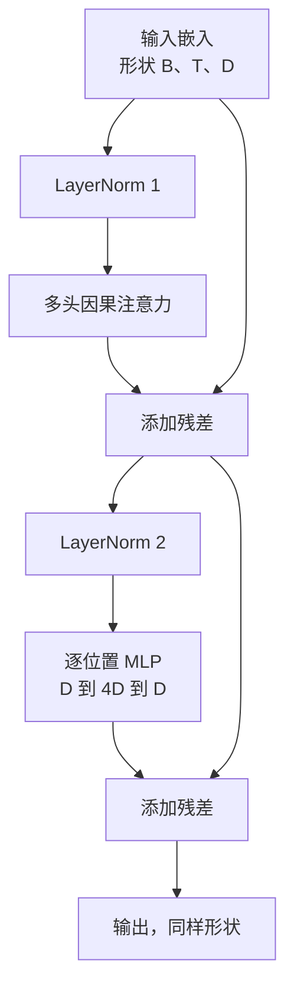
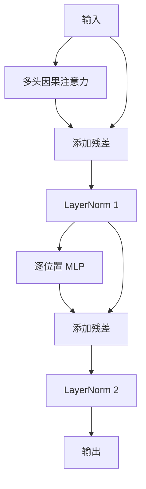

# 从零实现 Transformer Block

> 一个 block 是现代 decoder LLM 的基本单元：LayerNorm、多头注意力、残差、MLP、残差。本课并排构建 pre-LN 和 post-LN，并比较它们在 12 层堆叠中的训练表现。

**类型：** 构建
**语言：** Python
**前置课程：** 第 19 阶段第 30–33 课
**用时：** 约 90 分钟

## 学习目标

- 用 LayerNorm、多头因果注意力、残差连接和逐位置 MLP 构建 Transformer block。
- 放置两种配置的 LayerNorm（pre-LN 与 post-LN），解释为何一种无需 warmup 也能稳定训练。
- 在多头注意力内部实现因果 mask，使 token `i` 无法看到 `j > i`。
- 在 12 层堆叠上追踪两种变体的梯度流并解读结果。
- 在下一课组装 1.24 亿参数 GPT 时复用该 block。

## 问题

Transformer 就是重复堆叠一个 block。一次错误重复十二次，模型可能首 epoch 发散，或始终需要 warmup。常见错误是注意力看到未来，以及 LayerNorm 放在无法抑制深层残差信号的位置。block 恰好有两条残差路径和两个归一化位置；选对位置后，剩下只是按部就班地连接。

## 概念

每个 decoder-only Transformer block 都是一个函数：接收形状为（batch、sequence、embedding）的张量，返回相同形状的张量。内部由两个子层完成主要工作。首张图展示 pre-LN：LayerNorm 位于残差分支内部、子层之前，残差连接把未归一化信号继续向前传递。post-LN 则把 LayerNorm 移到残差相加之后；它与 pre-LN 的形状相同，但训练行为不同。post-LN 中沿残差路径反向传播的梯度必须经过 LayerNorm，在 12 层深度、学习率 3e-4 时会快速缩小，因而需要 warmup；pre-LN 保留未归一化残差路径，梯度可以干净地传播到嵌入层，这也是 GPT-2 及之后的模型采用它的原因。

decoder-only Transformer block 接受 `(batch, sequence, embedding)`，返回相同形状。pre-LN 把 LayerNorm 放在残差分支、子层之前，残差携带未归一化信号；post-LN 把 LayerNorm 放在残差相加之后。形状相同，但训练行为不同：post-LN 的深层梯度会经过 LayerNorm，学习率 `3e-4` 时可能快速缩小；pre-LN 保留未归一化残差路径，梯度更容易传播，也是 GPT-2 之后常用的配置。



### 因果多头注意力

注意力把输入投影为 Q、K、V，并从 `(B, T, D)` 重塑为 `(B, H, T, D/H)`。每头计算 `softmax(Q K^T / sqrt(d_k))`，将上三角置为负无穷，再乘 V；拼回 `(B, T, D)` 后再次投影。mask 是因果性的唯一保证，遗漏它会让模型作弊。



### MLP

逐位置 MLP 对每个 token 独立应用两层网络：隐藏宽度为 embedding 宽度的四倍，激活为 GELU，第二个线性层后接 dropout。token 间的信息混合全部发生在注意力中。

### 残差连接的两个作用

残差让跨深度的梯度路径变成加法形式，也让每个 block 学习对当前表示的增量而非完整替换，因此更容易扩展。

```figure
cc-transformer-block
```

## 构建

其中，LayerNorm 带可学习的 scale、shift 和带偏置的 eps，并逐 token 向量应用；MultiHeadAttention 保存 num_heads、head_dim = d_model // num_heads、融合 QKV 投影、注册的因果 mask、注意力 dropout 和残差 dropout；FeedForward 由两个线性层、GELU 和 dropout 组成。演示用相同输入构建两个 6 层堆叠，并并排打印输出形状和一次反向传播后的嵌入梯度范数。pre-LN 梯度比 post-LN 大一个数量级，是它无需 warmup 即可训练的实证信号。

`code/main.py` 实现 `LayerNorm`、带 fused QKV 和因果 mask 的 `MultiHeadAttention`、含 GELU 的 `FeedForward`，以及通过 `pre_ln` 切换两种变体的 `TransformerBlock`。演示构建 6 层 pre-LN 和 post-LN 堆叠，打印输出形状及一次反向传播后的 embedding 梯度范数。

运行：

```bash
python3 code/main.py
```

## 依赖

- `torch`：张量计算、自动微分和 `nn.Module`。
- 不使用 `transformers` 或预训练权重，block 完全由基础原语实现。

## 生产实现模式

三个独立线性层需要三次 kernel 启动和三次矩阵乘；一个宽度 3 × d_model 的线性层可以在一次启动中完成同样的工作，再沿最后一轴切分。融合路径在各种加速器上更快，也符合 GPT-2、LLaMA 和 Mistral 参考实现的做法。mask 只依赖最大上下文长度，构造时分配一次、前向时切活动窗口，可以避免长上下文下每次调用的分配器开销。前一个 dropout 位置是 attention dropout，后一个是 residual dropout；直接对残差做 dropout 会破坏深层梯度依赖的加法恒等路径，早期实现曾因此得到脆弱的训练。

**融合 QKV 投影。** 一个宽度 `3 * d_model` 的线性层替代三个独立层，沿最后一维切分，减少 kernel 启动和矩阵乘。

**注册因果 mask buffer。** 构造时按最大上下文长度分配，用 `register_buffer` 保存，前向只切活动窗口，避免每次分配。

**在两个位置使用 dropout，而不是三个。** dropout 放在注意力 softmax 后和 MLP 第二个线性层后；不要直接 dropout 残差，否则会破坏帮助深层梯度传播的加法恒等路径。

## 使用

- 本课 block 可直接接入第 35 课 GPT 组装。
- pre-LN 是现代开放权重 LLM 的常见配置，post-LN 是原始 2017 注意力论文采用的配置。
- 把 GELU 换成 SiLU 可得到 LLaMA 系列激活，把 LayerNorm 换成 RMSNorm 可得到其归一化形式；骨架不变。

## 练习

1. 给每个线性层增加 `bias=False`，测量 12 层、768 维模型节省的参数量。
2. 用手写 RMSNorm 替换 `nn.LayerNorm`，验证输出形状不变。
3. 增加返回第一个头 `(B, T, T)` 注意力权重的开关，绘制上三角确认 softmax 后为零。
4. 将 `(2, 16, 384)`、`H=6` 的张量送入两种变体，在相同初始化且 dropout 为零时断言输出不同。

## 关键术语

| 术语 | 常见说法 | 实际含义 |
|------|----------|----------|
| Pre-LN | “Pre norm” | LayerNorm 在残差分支、每个子层之前；残差携带未归一化信号 |
| Post-LN | “Post norm” | 残差相加之后的 LayerNorm；原始论文采用且需要 warmup |
| Causal mask | “Triangle mask” | 将注意力 logits 上三角置为负无穷，使 token i 无法读取 j>i |
| Fused QKV | “Combined projection” | 一个宽度 3D 的线性层替代三个宽度 D 的线性层 |
| Residual stream | “Skip connection” | 穿过每个 block 的未归一化张量，每个 block 向其添加更新 |

## 延伸阅读

- 第 7 阶段第 02 课：从零实现自注意力。
- 第 7 阶段第 05 课：完整 Transformer。
- 第 10 阶段第 04 课：预训练 mini GPT。
- 第 19 阶段第 35 课：将这些 block 堆叠为 GPT 模型。
