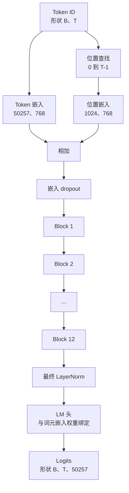
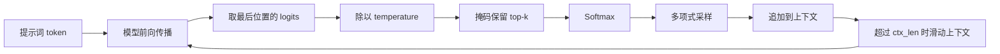

# GPT 模型组装

> 十二个模块、一个词元嵌入、一个学习到的位置嵌入、一个最终 LayerNorm，以及一个权重绑定的语言模型头——这就是完整的 1.24 亿参数 GPT 模型。本课将这些部件组装成可运行的类，统计参数量以确认模型符合参考的 124M 形状，并使用多项式采样、温度和 top-k 生成文本。

**类型：** 构建
**语言：** Python
**前置课程：** 第 19 阶段课程 30–34
**用时：** 约 90 分钟

## 学习目标

- 将课程 34 的 Transformer 模块组装为完整 GPT 模型：词元嵌入、位置嵌入、N 个模块、最终 LayerNorm 和语言模型头。
- 复现 1.24 亿参数配置：词表 50257、上下文 1024、嵌入维度 768、12 个注意力头、12 层。
- 将语言模型头的权重与词元嵌入绑定，并说明为何在这一规模下可节省约 3800 万个参数。
- 使用多项式采样、温度缩放和 top-k 截断，从提示词生成文本，并用滑动窗口保持上下文长度。
- 将参数量和前向计算成本与 124M 目标进行比较。

## 问题

Transformer 模块本身什么也做不了。你需要把词元 ID 变成向量，加入位置信息，送入模块堆栈，再投影回词表 logits。四步中漏掉任何一步，模型都会无法前向、位置漂移或无法生成文本。

模型形状同样重要。参考 GPT-2 small 按上述配置正好有 1.24 亿个参数。词表 50257 乘以嵌入维度 768 是词元表；位置表是 1024 乘以 768；12 个模块各约 700 万个参数，共约 8400 万。最终头通过权重绑定复用词元表。把这些部分相加即可得到 1.24 亿。参数量不匹配通常意味着连接出了问题。

## 概念



词元 ID 变成词元向量，位置 ID 变成位置向量；两者相加后送入模块堆栈。最终 LayerNorm 是位于模块外部、在各种现代变体中都保留下来的部件。LM 头复用词元嵌入矩阵，这就是权重绑定。

### 权重绑定

词元嵌入形状为 `(vocab, d_model)`，语言模型头需要把 `d_model` 投影回 `vocab`，二者互为转置。绑定意味着使用同一个参数张量两次。50257 × 768 约为 3800 万个参数；不绑定要付出两份，绑定只需一份，而且嵌入与输出头会获得更一致的梯度信号。

### 位置嵌入是学习得到的，而不是正弦嵌入

GPT-2 使用学习到的位置嵌入。位置表形状为 `(1024, 768)`；每次前向查找位置 0 到 T-1，并加到词元嵌入上。它是最简单的位置方案，124M 参考模型使用的正是它。

### 生成：温度、top-k、多项式采样

生成是自回归过程。每一步模型都会返回每个位置上的完整词表 logits；只取最后一个位置，除以温度，可选地将 top-k 之外的 logits 设为负无穷，再 softmax 得到概率并采样一个词元。



三个旋钮对应三种行为：温度接近零时趋向贪心；温度为 1 时保持模型的自然分布；top-k 为 1 时是贪心，top-k 为 40 时过滤长尾。组合方式很重要，下一课会把生成作为定性评估信号。

```figure
cc-gpt-assembly
```

## 动手构建

实现具体包括以下部分：

1. GPTConfig 数据类，默认使用 124M 配置：vocab_size=50257、context_length=1024、d_model=768、num_heads=12、num_layers=12、mlp_expansion=4、dropout=0.1、use_bias=True、weight_tying=True。
2. GPTModel：词元嵌入、位置嵌入、嵌入 dropout、12 个 TransformerBlock、最终 LayerNorm，以及在开关开启时与词元嵌入绑定的 lm_head。
3. count_parameters 辅助函数：返回去重后的参数量，因此会正确处理权重绑定。
4. generate 函数：实现温度、top-k、多项式采样和滑动窗口上下文。
5. 一个演示：构建模型，将参数量与 124M 参考值并排打印，并从固定提示词生成短序列，展示完整流水线。

`code/main.py` 实现配置类 `GPTConfig`、模型类 `GPTModel`、唯一参数计数辅助函数、支持温度/top-k/多项式采样/滑动窗口的 `generate`，以及构建模型、打印参数量并生成短序列的演示。运行：

```bash
python3 code/main.py
```

输出包括与 124M 参考值并列的参数量、随机提示词生成的词元 ID，以及确认 LM 头和词元嵌入共享存储的消息。脚本还会用小配置完成一次快速端到端运行；124M 配置只统计参数量并执行一次前向。

## 技术栈

- `torch`：张量运算、自动微分和模块连接。
- `code/main.py`：在本地重新实现课程 34 的模块模式。

## 生产环境中的模式

这些做法决定了模型是“能运行”还是“能交付”。注意力输出投影和 MLP 第二个线性层直接进入残差相加；如果沿用其他线性的标准差，残差流会随深度增长，并把最终 LayerNorm 推入不稳定区域，因此应将这两个投影的标准差按 1 / sqrt(2 * num_layers) 缩放。位置 ID 也只应在 __init__ 中按最大上下文长度分配一次，每次前向切出前 T 项。最后，lm_head.weight = token_embedding.weight 才是参数层面的绑定；复制会让两个参数各自更新，头部逐渐偏离嵌入，权重绑定也就失去意义。

**将残差投影初始化得更小。** 注意力输出投影和 MLP 第二个线性层直接参与残差相加；将其标准差缩放为 `1 / sqrt(2 * num_layers)`，可让 12 层中的残差流保持合理范围。

**缓存位置 ID 张量。** 不要每次前向都重新分配 `torch.arange(T)`；在 `__init__` 中按最大上下文长度分配，调用时切片。

**在参数层面绑定权重。** `lm_head.weight = token_embedding.weight` 才会共享张量；复制只会创建两个参数，使绑定失效。

## 使用它

- 本课模型与下一课训练的模型形状相同。
- 用 RoPE 替换学习到的位置嵌入即可得到 LLaMA 家族的关键变化。
- 用 SiLU 和 RMSNorm 替换 GELU 和 LayerNorm 可继续接近 LLaMA。
- 生成函数适用于任意 logits 来源，也可复用于课程 37 加载的 GPT-2 权重。

## 练习

1. 解除 LM 头与词元嵌入的绑定并重新统计参数量，验证增量为 50257 × 768 = 3800 万。
2. 用构造时计算的正弦表替换学习到的位置嵌入，确认参数量减少 786432。
3. 增加 `greedy=True` 选项，跳过采样并选择 argmax，确认多次运行序列一致。
4. 增加 `repetition_penalty`，在 softmax 前缩放提示词或历史中词元的 logit，观察大于 1 的值如何减少重复。
5. 在 `top_k` 旁加入 `top_p`（核采样），检查保留词元的概率和超过 `top_p`。

## 关键术语

| 术语 | 常见说法 | 实际含义 |
|------|----------|----------|
| Weight tying | “绑定嵌入” | LM 头与词元嵌入共享同一参数张量 |
| Position embedding | “学习到的位置” | 加到词元向量上的 `(context length, d_model)` 参数表 |
| Sliding window context | “上下文上限” | 超过上下文长度时丢弃最早词元 |
| Top-k sampling | “K 截断” | 只保留值最高的 K 个 logits |
| Temperature | “采样温度” | softmax 前用 T 除 logits；T<1 变尖锐，T>1 变平坦 |

## 延伸阅读

- 第 19 阶段课程 34：本课堆叠的模块。
- 第 19 阶段课程 36：用交叉熵训练该模型的循环。
- 第 19 阶段课程 37：向该架构加载预训练 GPT-2 权重。
- 第 7 阶段课程 07：GPT 因果语言建模的数学。
- 第 10 阶段课程 04：同一架构上的 mini GPT 预训练流程。
