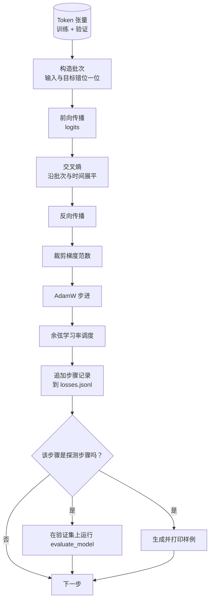

# 训练循环与评估

> 不进行测量的循环就是会说谎的循环。本课构建驱动 GPT 模型的训练循环：拆分权重衰减的 AdamW、预热加余弦学习率、批次损失辅助函数、留出集评估、定性生成探针，以及可供后续绘图的 JSONL 损失日志。

**类型：** 构建
**语言：** Python
**前置课程：** 第 19 阶段课程 30–35
**用时：** 约 90 分钟

## 学习目标

- 构建输入与目标正确错位一位的交叉熵训练循环。
- 让 AdamW 只对权重张量施加权重衰减，不衰减 LayerNorm 和 bias。
- 实现线性预热与余弦衰减，并读取随时间变化的学习率。
- 使用 `evaluate_model` 在留出划分上取得可比较的评估损失。
- 每 K 步用 `generate_and_print_sample` 发现损失曲线尚未显示的发散。
- 将每步损失持久化到 JSONL，便于重载、绘图和交付。

## 问题

只打印损失的训练脚本会有三种失败。它无法判断损失下降是否出于正确原因：模型可能只是过拟合训练集，从未学会泛化；它无法判断发散是否开始：损失可能只尖峰一次后恢复，也可能尖峰一次后直接崩溃；它也无法告诉你模型学会了什么，因为损失是一个标量，而生成样例是一段文字。除非循环进行测量，这三种失败都会被隐藏。

本课的循环用三种方式测量：每一步记录训练 batch 的损失；每 K 步记录留出 batch 的损失；每 K 步从固定提示词生成一段续写。训练日志写成 JSONL，让这个产物成为训练循环的证词。

只打印损失的训练脚本无法判断模型是否真正学习、发散是否开始，也无法知道模型学会了什么。训练批次损失、留出批次损失和固定提示词续写应一起记录；JSONL 日志就是这次训练的证据。

## 概念



### 损失对齐

输入 `[t0,t1,t2,t3]` 的目标必须是 `[t1,t2,t3,t4]`，交叉熵在 `(batch * seq, vocab)` 与 `(batch * seq,)` 的展平形状上计算。不做错位就会训练模型预测自身。

### AdamW 衰减拆分

权重衰减用于矩阵权重，不用于归一化缩放和 bias；对 LayerNorm 缩放施加衰减会把它推向零并破坏归一化。

### 预热加余弦调度

预热让学习率从零升到目标，余弦衰减则在剩余步骤中降回接近零；两者组合能减少训练开始和结束阶段的不稳定。

### 留出集评估

`evaluate_model` 在验证划分上运行固定数量的批次，不计算梯度、不使用 dropout，返回平均损失，从而可以可靠比较不同运行。

### 定性采样作为早期信号

损失下降但生成结果全是同一个词元，说明模型仍然损坏；固定提示词的短续写能发现标量损失遗漏的模式。

```figure
cap-training-loop
```

## 动手构建

实现包含以下部件：make_batches(token_ids, batch_size, context_length) 把长 token tensor 切成输入—目标对；calc_loss_batch(model, inputs, targets) 完成前向、展平并返回标量交叉熵；evaluate_model(model, val_loader, max_batches) 不计算梯度地遍历固定数量验证 batch 并返回平均损失；generate_and_print_sample(model, prompt, max_new_tokens) 在固定提示词上调用第 35 课生成函数并打印结果；build_param_groups(model, weight_decay) 生成 AdamW 的两组参数；cosine_with_warmup(step, warmup_steps, total_steps, max_lr, min_lr) 返回某一步的学习率；train(...) 运行循环、持久化 outputs/losses.jsonl，并每 eval_every 步打印评估损失和样例。演示会在合成数据上用少量步骤训练小模型，在 CPU 上远低于一分钟完成。

`code/main.py` 实现批次切片、损失计算、评估、采样、AdamW 两组参数、预热余弦学习率和训练函数，并将 `outputs/losses.jsonl` 写入磁盘。运行：

```bash
python3 code/main.py
```

## 技术栈

- `torch`：自动微分、优化器和模块。
- `main.py`：本地重新实现课程 35 的 `GPTModel`。

## 生产环境中的模式

异常 batch 可能来自异常数据、学习率尖峰或数值边界情况，并产生足以抹掉数小时训练的巨大梯度；因此在 backward 后、step 前使用梯度范数裁剪，默认上限 1.0。逐步 loss 记录写成 JSONL 后，即使崩溃也留下可读、可 grep、可绘图的产物，还能从最后一步恢复；pickle 状态则绑定生成文件时的精确模块布局，跨重构很脆弱。验证 token 也应在脚本开始时切成固定 batch，而不是每次临时抽取，否则不同运行的评估损失同时反映批次随机性。

**梯度范数裁剪不可省略。** 在 `backward` 后、`step` 前使用 `torch.nn.utils.clip_grad_norm_(params, max_norm=1.0)`，避免异常批次摧毁训练。

**使用可恢复的 JSONL 日志。** 每步保存 `{"step": int, "train_loss": float, "lr": float}`，崩溃后仍可读取、绘图或从最后一步恢复。

**评估批次来自固定切片。** 脚本开始时一次性切出验证批次，保证不同运行比较的是模型而不是批次随机性。

## 使用它

- 该循环可直接训练真实数据上的 124M 模型。
- JSONL 日志将训练运行变成可检查的证据。
- 定性采样是标量损失无法替代的兜底检查。

## 练习

1. 测试权重衰减分组，确认缩放和 bias 不衰减。
2. 用小文本文件替代随机词元，验证生成样本包含文件中的字符。
3. 为余弦调度加入 `max_lr` 的 10% 学习率下限并重新绘图。
4. 每 `eval_every` 步保存检查点并支持恢复模型和优化器状态。
5. 记录每步吞吐量，确认其保持稳定区间。

## 关键术语

| 术语 | 常见说法 | 实际含义 |
|------|----------|----------|
| Loss alignment | “错位一位” | 位置 0..T-1 的输入预测位置 1..T 的目标 |
| Decay split | “两组” | 矩阵张量衰减，缩放或 bias 张量不衰减 |
| Warmup | “升温” | 学习率从零升至目标 |
| Eval batches | “留出批次” | 每次探针使用相同的验证张量切片 |
| Qualitative probe | “打印样本” | 用固定提示词的短生成捕获损失隐藏的故障 |

## 延伸阅读

- 第 19 阶段课程 35：本循环驱动的模型。
- 第 19 阶段课程 37：加载相同模型的预训练权重。
- 第 10 阶段课程 04：真实数据上的 mini GPT 预训练。
- 第 10 阶段课程 10：交叉熵之外的评估面。
