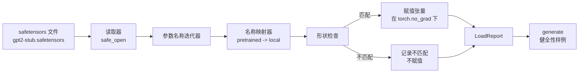

# 加载预训练权重

> 从头训练一个 1.24 亿参数的模型是一项预算决策；加载公开检查点则是日常操作。本课将 safetensors 文件中的 GPT-2 风格权重加载到第 35 课的精确架构中，逐步展示参数名映射，并通过生成一段续写来确认加载确实生效。不联网、不使用第三方加载器，也没有不透明的魔法。

**类型：** 构建
**语言：** Python
**前置课程：** 第 19 阶段课程 30–36
**用时：** 约 90 分钟

## 学习目标

- 使用 `safetensors` Python 库读取 safetensors 文件，并检查张量名称和形状。
- 将每个预训练参数名映射到第 35 课 GPT 模型中的一个参数。
- 处理公开 GPT-2 权重与本轨道模型之间的两套命名约定：前者使用 `wte/wpe/h.N.attn.c_attn/c_proj` 和 `mlp.c_fc/c_proj`，后者使用 `tok_embed/pos_embed/blocks.N.attn.qkv/out_proj` 和 `mlp.fc1/fc2`。
- 在发生任何权重赋值之前，用清晰的错误信息检测并拒绝形状不匹配。
- 用加载后的权重生成一小段续写，确认词元来自加载后的分布，而不是随机初始化的分布。

## 问题

公开发布的权重并不是为你的架构打包的。它们携带原始实现使用的名称。预训练文件中有一个形状为 `(2304, 768)` 的 `transformer.h.0.attn.c_attn.weight`；你的模型期望的是形状同样为 `(2304, 768)` 的 `blocks.0.attn.qkv.weight`（只是布局约定不同），或者你的模型使用存储转置矩阵的 `nn.Linear`。同一个参数因此同时具有三种略有不同的身份：名称、形状和字节布局；加载器必须协调这三者。

盲目复制的加载器会把正确的张量放到错误的位置，最终模型只会生成乱码。如果加载器在形状不同时拒绝复制，却什么也不记录，你就只能猜是哪一个张量没有落到位。本课的加载器是显式的：记录每次赋值，检查每个形状，并用 `LoadReport` 汇总命中、缺失和形状不匹配，便于读懂发生了什么。

## 概念



名称映射器就是一个从字符串到字符串的函数。形状检查就是一个 `if`。赋值发生在 `torch.no_grad()` 内，因此自动微分不会跟踪加载过程。报告保存每个名称的处理结果。

### GPT-2 命名约定

公开的 GPT-2 权重使用如下名称：

| 预训练名称 | 形状 | 含义 |
|-----------------|-------|---------|
| `wte.weight` | (50257, 768) | 词元嵌入 |
| `wpe.weight` | (1024, 768) | 位置嵌入 |
| `h.N.ln_1.weight` | (768,) | 第 N 个模块的 LayerNorm 1 缩放 |
| `h.N.ln_1.bias` | (768,) | 第 N 个模块的 LayerNorm 1 平移 |
| `h.N.attn.c_attn.weight` | (768, 2304) | 融合的 QKV 线性层权重 |
| `h.N.attn.c_attn.bias` | (2304,) | 融合的 QKV 线性层偏置 |
| `h.N.attn.c_proj.weight` | (768, 768) | 注意力输出投影 |
| `h.N.attn.c_proj.bias` | (768,) | 注意力输出投影偏置 |
| `h.N.ln_2.weight` | (768,) | 第 N 个模块的 LayerNorm 2 缩放 |
| `h.N.ln_2.bias` | (768,) | 第 N 个模块的 LayerNorm 2 平移 |
| `h.N.mlp.c_fc.weight` | (768, 3072) | MLP fc1 权重 |
| `h.N.mlp.c_fc.bias` | (3072,) | MLP fc1 偏置 |
| `h.N.mlp.c_proj.weight` | (3072, 768) | MLP fc2 权重 |
| `h.N.mlp.c_proj.bias` | (768,) | MLP fc2 偏置 |
| `ln_f.weight` | (768,) | 最终 LayerNorm 缩放 |
| `ln_f.bias` | (768,) | 最终 LayerNorm 平移 |

这里有两个需要提前规划的意外之处。`c_attn`、`c_proj` 和 `c_fc` 这些线性层的矩阵存储方式，与 `nn.Linear.weight` 所需的方式互为转置。加载器会在赋值时执行转置。文件中完全没有 LM 头；模型依靠与 `wte` 的权重绑定，因此在 `wte` 到位后通过别名设置该头。

### 本地命名约定

本轨道中的模型使用更具描述性的名称：

| 本地名称 | 含义 |
|---------|---------|
| `tok_embed.weight` | 词元嵌入 |
| `pos_embed.weight` | 位置嵌入 |
| `blocks.N.ln1.scale` | 第 N 个模块的 LayerNorm 1 缩放 |
| `blocks.N.ln1.shift` | LayerNorm 1 平移 |
| `blocks.N.attn.qkv.weight` | 融合的 QKV |
| `blocks.N.attn.qkv.bias` | 融合的 QKV 偏置 |
| `blocks.N.attn.out_proj.weight` | 注意力输出投影 |
| `blocks.N.attn.out_proj.bias` | 输出投影偏置 |
| `blocks.N.ln2.scale` | LayerNorm 2 缩放 |
| `blocks.N.ln2.shift` | LayerNorm 2 平移 |
| `blocks.N.mlp.fc1.weight` | MLP fc1 |
| `blocks.N.mlp.fc1.bias` | MLP fc1 偏置 |
| `blocks.N.mlp.fc2.weight` | MLP fc2 |
| `blocks.N.mlp.fc2.bias` | MLP fc2 偏置 |
| `final_ln.scale` | 最终 LayerNorm 缩放 |
| `final_ln.shift` | 最终 LayerNorm 平移 |

映射是一个固定函数。本课将它作为字典提供给加载器，加载器再对其进行迭代。

### stub fixture

真实的 GPT-2 权重有 0.5 GB。演示不会下载它们，而是在首次运行时生成一个小型 safetensors fixture，使用精确的 GPT-2 命名约定，以及适用于 12 层、`d_model` 为 192（而不是 768）的模型的形状。这个 fixture 具有覆盖加载器每条代码路径所需的完整结构。把 fixture 换成真实文件后，加载器无需修改即可工作。

```figure
cc-weight-remap
```

## 动手构建

`code/main.py` 实现：

- 第 35 课 `GPTModel` 的一个小型副本，使本课自包含。
- `make_pretrained_to_local(num_layers)`，展开逐层条目。
- `load_safetensors(model, path)`，遍历名称、进行映射和形状检查、转置 Conv1d 风格的权重，并在 `torch.no_grad()` 下赋值；返回一个 `LoadReport`。
- `make_stub_safetensors(path, cfg)`，用精确的预训练命名约定生成 fixture 文件。
- 一个演示程序：首次运行时创建 `outputs/gpt2-stub.safetensors`，构造新模型，记录随机初始化时的一段续写，加载 stub 后再记录一段续写，打印两者并验证它们不同（说明加载确实改变了模型）。

运行：

```bash
python3 code/main.py
```

输出包括 fixture 路径、逐名称加载日志、`LoadReport` 摘要、加载前的续写、加载后的续写，以及 fixture 中故意注入的单个错误张量所触发的形状不匹配信息，因此失败路径也会得到演示。

## 技术栈

- `safetensors`：磁盘格式和流式读取器。
- `torch`：模型和赋值运算。
- 不使用 `transformers`、`huggingface_hub`，也不发起网络调用。

## 生产环境中的实践模式

有三种模式能让加载器经得起处理非自制权重的考验。

**在任何赋值前验证完整文件。** 打开文件，列出每个张量的名称、dtype 和形状，执行完整映射与形状检查，只有成功后才开始赋值。半加载模型是最容易产生静默失败的装置。

**记录每次赋值的源名称和目标名称。** 出现问题时，日志会告诉你哪个张量落到了哪里；否则你只能去读十六进制转储。本课中的 `LoadReport` 数据类跟踪 `loaded`、`missing`、`unexpected` 和 `shape_mismatch` 列表，并在末尾打印摘要。

**LM 头是权重绑定别名，而不是单独的副本。** 加载 `tok_embed` 后设置 `model.lm_head.weight = model.tok_embed.weight` 是规范做法。把嵌入矩阵复制到一个新的 `lm_head.weight` 参数中会破坏绑定，并悄悄使参数量翻倍。

## 使用它

- 对任何采用预训练命名约定的 safetensors 文件，加载器都能工作。真实的 GPT-2 small、medium、large 和 xl 文件无需改代码；只有模型配置不同。
- 更新名称映射后，同一模式也能扩展到 LLaMA、Mistral 和 Qwen 权重。形状检查与报告保持不变。
- 加载后进行健全性生成是一道快速门槛：如果加载后的样本看起来和加载前一样，说明加载没有改变模型，也就是说映射可能静默漏掉了所有张量。

## 练习

1. 为加载器增加 `dtype` 参数，在赋值时把每个张量转换为目标 dtype（`bfloat16`、`float16` 或 `float32`）。确认 `float32` 模型可以降为 `bfloat16` 并仍然生成文本。
2. 增加 `expected_layers` 参数，拒绝 `h.N` 索引与模型 `num_layers` 不一致的检查点。
3. 把加载器接入第 35 课的生成函数，并排生成两份样本：一份来自随机初始化，一份来自加载后的 fixture。
4. 增加导出路径：使用预训练命名约定把当前模型状态写入新的 safetensors 文件。往返加载，并确认报告中没有形状不匹配。
5. 扩展 `NAME_MAP` 以处理 LLaMA 命名约定（无偏置、RMSNorm、融合的 qkv 布局），然后在你生成的 stub LLaMA fixture 上重新运行加载器。

## 关键术语

| 术语 | 常见说法 | 实际含义 |
|------|-------|--------|
| Name map | “键重映射” | 从预训练张量名称到本地参数名称的函数，通常是一个字面量字典，再通过循环展开每个层索引 |
| Shape mismatch | “形状错误” | 预训练张量在映射后的名称下存在，但维度与本地参数不一致；加载器拒绝赋值并记录这一对名称 |
| Transpose-on-load | “Conv1d 布局” | 公开的 GPT-2 将注意力和 MLP 投影以 `nn.Linear` 所需布局的转置形式存储；加载器在加载时转置 |
| Weight tying alias | “共享 LM 头” | 设置 `model.lm_head.weight = model.tok_embed.weight`，让头与嵌入共享存储；因为这一点，文件中没有单独的头 |
| Load report | “覆盖摘要” | 跟踪 `loaded`、`missing`、`unexpected` 和 `shape_mismatch` 列表的小型数据类；打印它就能判断加载是否成功 |

## 延伸阅读

- 第 19 阶段课程 35：接收这些权重的架构。
- 第 19 阶段课程 36：生成同形状检查点的训练循环。
- 第 10 阶段课程 11（量化）：内存紧张时如何处理加载后的权重。
- 第 10 阶段课程 13（构建完整 LLM pipeline）：加载与推理的完整生命周期。
