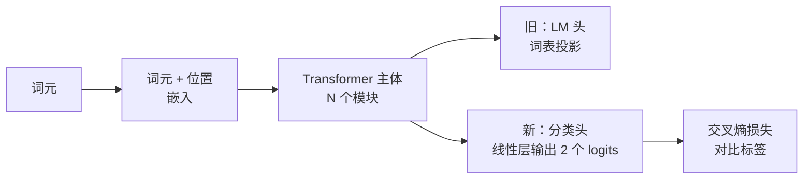
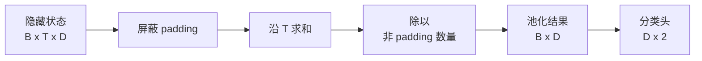
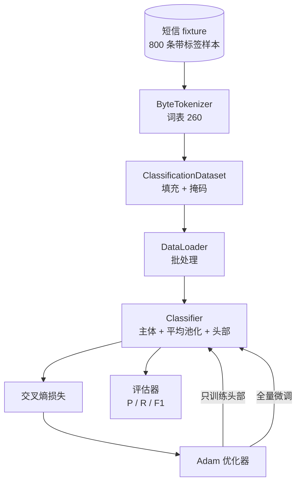

# 毕业课程 38：通过替换头部进行分类器微调

> 这是 Track B 的第一节毕业课程。预训练语言模型是一堆自注意力模块，末端接着一个词元预测头。当你想区分垃圾短信和正常短信时，头部不合适，但主体大多仍然有用。本课会拆掉原来的头，在池化后的表示上接一个二分类线性层，并用两种方式训练分类器：只训练最后一层，以及进行全量微调。评估在留出划分上计算 precision、recall 和 F1。你将了解每种策略带来什么、代价又是什么。

**类型：** 构建
**语言：** Python（torch、numpy）
**前置课程：** 第 19 阶段课程 30–37（NLP LLM 轨道：分词器、嵌入表、注意力模块、Transformer 主体、预训练循环、检查点、生成和困惑度）
**用时：** 约 90 分钟

## 学习目标

- 在不重新初始化主体的情况下，用分类头替换语言模型头。
- 实现两种训练模式：冻结主体（只训练头部）和全量微调，并让它们共享一个训练循环。
- 构建理解分词器的数据管道，完成填充、屏蔽 padding 和注意力输出池化。
- 从原始 logits 计算 precision、recall、F1 和混淆矩阵。
- 思考参数量、训练时间和上限空间之间的权衡。

## 问题

你已经在通用语料上预训练了一个小型 Transformer。输出头把最后的隐藏状态投影到一个包含 1000 个词元的词表。现在你手里有 800 条标为 spam 或 ham 的短信，想要一个二分类器。这里有三种选择。

错误的选择是用 800 个样本从头训练一个全新的分类器。预训练模型的主体已经编码了有用的结构：词的身份、位置和简单的共现关系。丢掉它，就浪费了构建这些能力所消耗的计算。

两种正确的选择是：替换头部并冻结主体，或者替换头部并让主体继续训练。只训练头部速度快，几乎不额外占用内存，在数据这么少时也很少过拟合。全量微调更慢，在小数据上可能过拟合，但当下游领域偏离预训练语料时，能达到更高的准确率。

本课会同时构建两种方式，让你在同一个 fixture 上进行比较。

## 概念



模型是一个函数 `f_theta(tokens) -> hidden_states`。头部是一个函数 `g_phi(hidden) -> logits`。替换头部意味着保留 `theta`，替换 `g_phi`。主体的参数才是昂贵部分；头部只是一个线性层。

有两组可训练参数需要关注：

- `theta`（主体）：每个注意力模块有数万项权重。
- `phi`（头部）：`hidden_dim * num_classes` 个权重，再加一个偏置。

在只训练头部的模式中，你对 `phi` 计算梯度，同时让 `theta` 的梯度归零。PyTorch 允许通过对主体参数设置 `requires_grad=False` 来实现。这样优化器只能看到头部，主体保持冻结。

在全量微调中，允许梯度流经整个堆栈。主体权重会漂移以适应分类目标。风险是小数据上的灾难性遗忘：主体的预训练能力可能被过拟合噪声冲刷掉。

## 池化问题

分类器需要每个序列一个向量，而不是每个词元一个向量。常见选择有三种：

- **Mean pool（平均池化）：** 沿序列求平均，并使用 attention mask 加权。
- **CLS pool（CLS 池化）：** 在序列开头添加特殊词元，只使用该词元的输出。BERT 就采用这种方式。
- **Last-token pool（末词元池化）：** 使用最后一个非 padding 词元。这是 GPT 类分类器采用的方式。

本课使用带显式 attention-mask 权重的平均池化。它最简单，在不同序列长度之间能提供稳定信号，也不要求预训练一个 CLS 词元。



## 数据

`code/main.py` 会确定性地生成 800 条短信，其中 spam 和 ham 各 400 条。生成器使用固定种子，选择模板并替换槽位内容，生成长度在 5 到 25 个词元之间的消息。真实数据集会包含这个 fixture 没有的噪声；fixture 的目的在于保证可复现。

数据按 80/20 划分：640 条训练、160 条测试。划分采用分层方式，因此测试集仍保持 50/50 的类别平衡。已知平衡比例的留出集能让 precision 和 recall 成为可信的数字。

## 指标

二分类中把类别 1（spam）作为正类。各计数定义如下：

- `TP`：预测为 spam，实际也是 spam。
- `FP`：预测为 spam，实际是 ham。
- `FN`：预测为 ham，实际是 spam。
- `TN`：预测为 ham，实际也是 ham。

三个主要指标是：

- `precision = TP / (TP + FP)`：被标记为 spam 的消息中，实际为 spam 的比例是多少？
- `recall = TP / (TP + FN)`：实际为 spam 的消息中，模型标记出了多少？
- `F1 = 2 * P * R / (P + R)`：二者的调和平均。

混淆矩阵会把四个计数打印成一个 2×2 网格。演示程序会针对两种训练模式都把它写到标准输出。

```figure
cap-classifier-head-swap
```

## 架构



主体是一个刻意做得很小的 Transformer：词表 260，隐藏维度 64，4 个头，2 个模块，最大序列长度 32。它足够小，可以在 CPU 上九十秒内把两种模式都训练到收敛。课程不会先加载预训练权重；相反，`pretrain_quick` 辅助函数会在同一 fixture 的文本上做五轮语言模型训练，为主体提供一个非平凡的起点。这样课程仍然自包含。

## 你将构建什么

实现由一个 `main.py` 和一个测试模块（`code/tests/test_main.py`）组成。

1. `ByteTokenizer`：把字节映射为 ID，并保留一个 pad ID。
2. `Block`：包含多头注意力和前馈层的 Transformer 模块，采用 pre-norm。
3. `LMBody`：词元与位置嵌入，加上模块堆栈；返回隐藏状态。
4. `MeanPool`：沿序列轴执行带掩码权重的平均。
5. `Classifier`：主体、池化层和线性头部。两种模式使用同一个主体实例。
6. `freeze_body` 和 `unfreeze_body`：切换主体参数的 `requires_grad`。
7. `train_classifier`：一个共享循环。它接收模型和优化器，而优化器应根据当前可训练的参数组进行配置。
8. `evaluate`：运行测试集，并返回 `Metrics(precision, recall, f1, confusion)`。
9. `run_demo`：短暂预训练主体，然后依次训练并评估只训练头部和全量微调，打印两份报告并以零状态退出。

## 为什么比较很重要

只训练头部的模式通常训练更快，也更能平稳地应对欠拟合。在这个 fixture 上，只训练头部二十轮后，通常可以看到 precision 接近 0.9、recall 接近 0.85。全量微调大约耗时三倍，结果可能上下相差几个百分点，具体取决于随机种子。

本课不替你选出赢家，而是教你读懂数字和成本。在 800 个样本和一个很小的主体上，只训练头部是合理选择；在 80,000 个样本和更大的主体上，全量微调才开始值得。你从本课带走的契约是 API：同一个 `train_classifier` 函数处理两种模式，切换只需要调用一次函数。

## 延伸目标

- 增加第三种模式，只解冻最后一个模块。这有时称为部分微调，成本低于全量微调，学习能力又强于只训练头部。
- 增加学习率调度器。对头部使用余弦调度、对主体使用更小的恒定学习率，是常见的生产配置。
- 把平均池化换成可学习的注意力池化：使用一个可学习查询的小型注意力层。在更长的序列上，它常常优于平均池化。

实现提供了这些扩展所需的钩子，测试则固定了契约。至于数字能提升多少，留给你继续探索。
