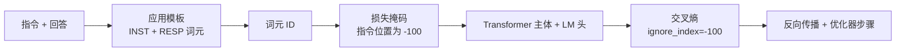
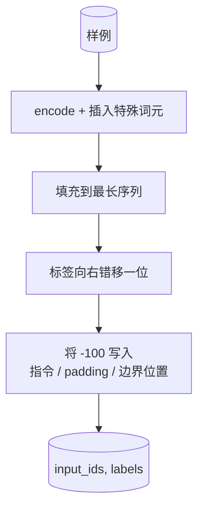
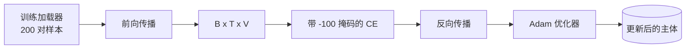

# 毕业课程 39：通过监督微调进行指令调优

> 预训练基础模型可以续写序列，却不会遵循指令。监督微调是修复这一点的最小改动：给模型输入由指令和期望回答组成的成对样本，训练主体预测回答词元。关键在于，损失只应统计回答，而不应统计指令。本课构建一个 Alpaca 风格的 SFT 循环，使用自定义 collate 函数以 `ignore_index=-100` 屏蔽指令词元，在 200 对指令—回答样本上训练，并用留出集上的精确匹配进行评估。

**类型：** 构建
**语言：** Python（torch、numpy）
**前置课程：** 第 19 阶段课程 30–37（NLP LLM 轨道：分词器、嵌入表、注意力模块、Transformer 主体、预训练循环、检查点、生成和困惑度）
**用时：** 约 90 分钟

## 学习目标

- 用明确的边界词元把成对的指令—回答数据格式化为单个因果序列。
- 构建一个屏蔽指令词元的 collate 函数，使交叉熵只统计回答词元。
- 在 SFT 目标下训练一个小型 Transformer 主体，并观察评估指标的变化。
- 实现尊重回答起始边界的贪心生成和温度采样生成。
- 在生成的补全上计算留出集精确匹配。

## 问题

在下一个词元预测上训练的基础模型并不知道什么是指令。给它字符串 `"What is the capital of France?"`，它可能继续写这个问题，也可能凭空编造一个新句子。模型掌握了语言，却没有掌握格式契约。

SFT 契约是一个字符串模板。每个训练样本都会变成包含三个区域的单个序列：

```text
<INST> What is the capital of France? <RESP> The capital of France is Paris.
```

边界词元是在训练时预留的特殊词元。模型会学到 `<RESP>` 之后的内容就是回答，而被评分的正是回答。基础模型的下一个词元目标仍然适用；只是现在训练语料中的每个样本都具有这种形状。

但这里有一个陷阱。如果把整个序列直接交给普通交叉熵损失，就等于也在训练模型预测指令词元。指令是已经给出的输入，你希望这些位置的梯度为零。修复方法就是掩码。

## 概念



`ignore_index` 是 `torch.nn.functional.cross_entropy` 的一个特性。任何等于 `ignore_index` 的目标位置都会贡献零损失和零梯度。PyTorch 的约定值是 `-100`。collate 函数为每个样本构建两个张量：`input_ids`（完整序列）以及 `labels`（`input_ids` 的副本，其中指令位置被改写为 `-100`）。

模型在前向传播时会看到完整序列，注意力可以关注指令；损失却只统计回答词元。这正是我们想要的效果：以指令为条件，预测回答。

## 数据

`main.py` 会确定性地生成 200 对指令—回答样本，覆盖六种任务：

- 单轮事实问答（X 的首都是哪里）
- 算术
- 列表提取
- 单句摘要
- 代码（打印、排序）
- 定义

每个任务都有模板化的指令和确定性的回答。这种设计有意保持简单。精确匹配很严格，本课使用一个唯一正确答案是特定字符串的 fixture。真实 SFT 数据集需要模糊指标；但原则完全相同。

数据划分为 160 条训练、40 条测试。测试集覆盖全部六种任务，因此可以报告逐类别的精确匹配。

## 分词与填充

分词器采用字节级编码，并保留三个特殊 ID：

- `INST_ID = 256`：标记指令区域的开始。
- `RESP_ID = 257`：标记指令与回答之间的边界。
- `PAD_ID = 258`：用于可变长度 batch 的填充。

序列形状为 `[INST] inst_bytes [RESP] resp_bytes [PAD]*`。collate 函数会：

1. 对每个样本进行分词。
2. 把每个样本填充到该 batch 中的最长序列。
3. 构建 `labels = input_ids` 向右错移一位（因果 LM 目标），并将以下位置设为 `-100`：
   - 指令区域；
   - padding 区域；
   - `RESP_ID` 边界本身（不训练模型去预测边界词元，而是训练它预测边界之后的内容）。



错移是标准的因果技巧：`input_ids` 的位置 `i` 预测位置 `i+1`，所以 `labels[i] = input_ids[i+1]`（输入丢掉最后一个位置，目标丢掉第一个位置）。掩码是在错移之后应用的，这样才能落在正确的位置。

## 训练



循环是标准的 PyTorch SFT 训练循环。使用 Adam，学习率约为 3e-4 到 1e-3，在这个 fixture 上训练 10–20 个 epoch，不使用调度器。模型很小（隐藏维度 96、2 个模块、最大长度 64），在 CPU 上两分钟内就能训练到收敛。

每五个 epoch，循环会在留出集上运行一次很小的评估，并打印精确匹配。观察精确匹配从第一个 epoch 的 0.0 上升到第十五个 epoch 左右的 0.85，是本课最有价值的部分：你可以看到模型同时学会格式和答案。

## 生成

评估时，模型接收指令前缀 `[INST] inst_bytes [RESP]`，生成词元直到满足以下条件之一：

- 序列达到 `max_len`；
- 模型产生特殊的停止启发式：连续生成两个句末字节（`.`、`!` 或 `?`）。

课程提供贪心解码以及可选的温度采样器。精确匹配使用贪心解码，因为温度会让指标具有随机性。真实系统通常先采样，再进行模糊评判；这条流水线会在第 41 课介绍。

## 精确匹配评估

精确匹配是最严格的文本指标。预测的回答字符串会先规范化（转小写、去除首尾空白、折叠连续空格），再与同样规范化的参考回答比较。每个样本的指标值只能是 1 或 0，聚合结果就是均值。

真实的 SFT 流程会用词元级 F1（第 41 课）和评审模型补充精确匹配。精确匹配仍然有用，因为它没有歧义：如果它显示 0.7，就表示测试指令中恰好有 70% 生成了逐字符等于金标准的回答。

```figure
cc-sft-loss-mask
```

## 你将构建什么

实现由一个 `main.py` 和测试组成。

1. `InstructionTokenizer`：带预留特殊词元的字节级编码器。既可以编码指令前缀，也可以编码完整的指令—回答对。
2. `make_dataset`：使用固定种子，在六种任务类型上生成 200 对样本。
3. `SFTDataset`：为每个样本返回 `(input_ids, labels)`，并提前准备好掩码。
4. `sft_collate`：动态填充，构建 batch 张量，并在指令和 padding 位置设置 `-100`。
5. `TinyGPT`：Transformer 主体，以及绑定或不绑定的 LM 头。
6. `train_sft`：带逐 epoch 评估钩子的 SFT 循环。
7. `generate`：从前缀开始进行因果解码，支持贪心或采样，并使用停止启发式。
8. `exact_match`：规范化字符串并比较，返回 `[0, 1]` 中的浮点数。
9. `run_demo`：构建数据，训练 20 个 epoch，执行评估，打印逐类别明细，并以零状态退出。

## 为什么 mask 很重要

没有掩码，损失会把指令当作目标。模型学到的是预测指令。这是另一种目标，并会以两种方式产生更差的模型。第一，模型容量被浪费在重建用户总会提供的输入上。第二，在大多数 batch 中，指令词元比回答词元多，因此回答部分的损失在梯度总和中占比更小；优化器在你真正关心的部分上的有效学习率也低于预期。掩码不是润色，而是目标函数本身。

## 延伸目标

- 增加学习率预热，再接余弦衰减。SFT 对学习率比预训练更敏感。
- 记录逐词元损失并绘制训练曲线。注意早期 epoch 由模板词元（`<RESP>`、常见前缀）主导，而后期 epoch 则由真正的回答词元主导。
- 将 BLEU-1 或 chrF 加入评估。精确匹配会低估那些用同一答案进行改写的模型。
- 增加一个多轮对话模板，并在包含追问的 fixture 上训练。

实现提供了格式契约、掩码和循环。从基础模型到指令遵循模型的目标变化，就藏在一个 collate 函数里。
