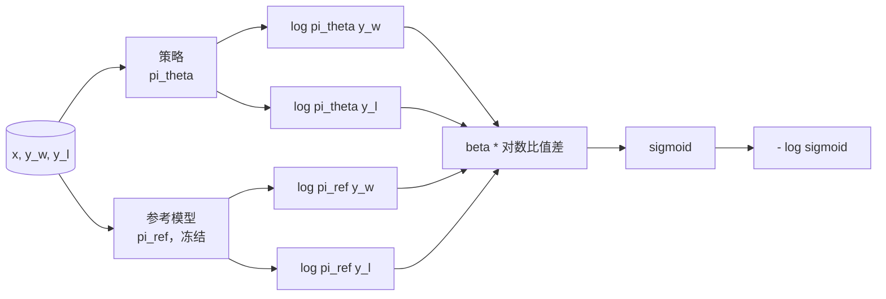
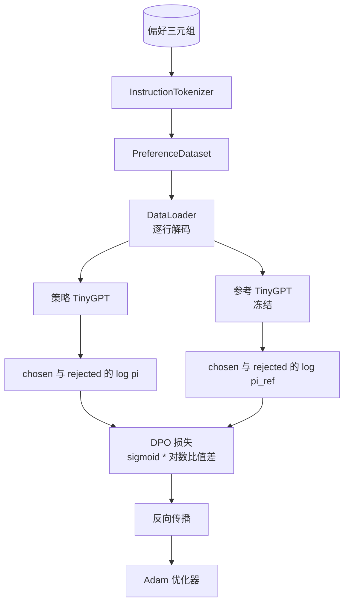

# 第 40 课：从零实现直接偏好优化

> 奖励模型和 PPO 是经典 RLHF 技术栈。DPO 把这套栈压缩成一个监督学习损失，直接根据偏好对拟合策略。本课从奖励差异恒等式推导 DPO 损失，交付一个可运行的参考模型与策略模型，计算逐词元对数概率，并在由 chosen 与 rejected 补全组成的偏好 fixture 上训练一个小型 Transformer。测试会固定损失数学和梯度方向，确保实现与论文一致。

**类型：** 构建
**语言：** Python（torch、numpy）
**前置课程：** 第 19 阶段课程 30–37（NLP/LLM 轨道：分词器、嵌入表、注意力块、Transformer 主体、预训练循环、检查点、生成、困惑度）
**用时：** 约 90 分钟

## 学习目标

- 将 DPO 损失推导为缩放后的对数比值差的 sigmoid，并把它与隐式奖励联系起来。
- 构建参考模型与策略模型的成对结构，其中参考模型冻结、策略模型可训练。
- 在两个模型下计算序列级对数概率，并屏蔽 prompt 词元。
- 用 `(prompt, chosen, rejected)` 三元组训练策略，观察 chosen 相对于 rejected 的对数概率上升。
- 用损失数学、梯度符号和参考模型不变性测试固定实现行为。

## 问题

你已经有一个 SFT 模型。它能够遵循指令，但输出质量不稳定：有些补全清晰，有些冗长或错误。你还有一小组偏好对：对同一个 prompt，人类把一个补全标为 chosen，把另一个标为 rejected。

经典的 RLHF 解法是两阶段流水线。先根据偏好训练奖励模型，再用 PPO 针对奖励优化策略。它可以工作，但代价很高：PPO 期间需要在内存中保留两个模型，需要用 KL 控制让策略靠近参考模型；奖励模型脆弱时还会出现 reward hacking。

DPO 用一个监督学习损失替代这两个阶段。奖励模型不再显式存在；策略直接在偏好对上训练，并通过显式 KL 惩罚朝 SFT 参考模型靠拢。在 Bradley–Terry 偏好模型下，它得到相同的最优解，却需要少得多的代码。

## 概念

从 Bradley–Terry 模型开始。给定 prompt `x`，以及两个补全 `y_w`（chosen）和 `y_l`（rejected），人类偏好 `y_w` 的概率为：

```text
P(y_w > y_l | x) = sigmoid( r(x, y_w) - r(x, y_l) )
```

其中 `r` 是某个潜在奖励函数。RLHF 首先从偏好中拟合 `r`，然后通过 KL 锚点最大化策略 `pi` 的奖励：

```text
max_pi   E_{x, y~pi} [ r(x, y) ] - beta * KL(pi || pi_ref)
```

DPO 推导注意到，在这个目标下，最优策略 `pi*` 可以用 `r` 写成闭式形式：

```text
pi*(y | x) = (1/Z(x)) * pi_ref(y | x) * exp( r(x, y) / beta )
```

将它重新整理为 `r`：

```text
r(x, y) = beta * ( log pi*(y | x) - log pi_ref(y | x) ) + beta * log Z(x)
```

`log Z(x)` 对 `y_w` 和 `y_l` 相同（它依赖 `x` 而不依赖 `y`），所以计算偏好差异时会抵消：

```text
r(x, y_w) - r(x, y_l) = beta * ( log pi_theta(y_w|x) - log pi_ref(y_w|x)
                                - log pi_theta(y_l|x) + log pi_ref(y_l|x) )
```

把这个结果代入 Bradley–Terry 的 sigmoid，并对偏好对取负对数似然：

```text
L_DPO(theta) = - E_{(x, y_w, y_l)} [
  log sigmoid( beta * ( log pi_theta(y_w|x) - log pi_ref(y_w|x)
                       - log pi_theta(y_l|x) + log pi_ref(y_l|x) ) )
]
```

这就是损失：每个样本由四个对数概率计算一个标量，再对它应用 sigmoid。不需要单独的奖励模型，也不需要 PPO。损失中没有单独的 KL 项；KL 约束已经编码在闭式推导里。



## 梯度的符号

在真正训练前，可以做一个有用的 sanity check。对 `log pi_theta(y_w | x)` 求梯度：

```text
d L_DPO / d log pi_theta(y_w | x) = - beta * (1 - sigmoid(z))
```

其中 `z` 是 sigmoid 的输入。它对所有 `z` 都为负，意味着提高策略对 chosen 补全的对数概率会降低损失。对 `log pi_theta(y_l | x)` 的梯度则对称地为正：提高 rejected 补全的对数概率会增加损失。训练会把 chosen 往上推、把 rejected 往下推。参考模型被冻结，不会移动。

## 数据

本课提供十二个偏好三元组，每个都是 `(prompt, chosen, rejected)`。chosen 补全短而精确；rejected 补全冗长、离题或错误。这些配对覆盖第 39 课的相同任务族（首都、算术、列表），因此从 SFT 基座开始的策略有一个合理的起点。

fixture 有意保持很小。生产中的 DPO 会使用数万条偏好对；本课关注的是让损失数学和训练循环在小数据上端到端运行，并直观看到 chosen 与 rejected 的对数概率差距扩大。

## 参考模型不变性

DPO 实现必须谨慎处理参考模型。参考模型是原地冻结的 SFT 模型，必须满足三个性质：

- 参考模型参数永远不接收梯度。
- 不同 epoch 之间，参考模型的对数概率不会改变。
- 策略从与参考模型相同的权重开始。（最优 `theta` 是参考模型加上学习到的更新；将策略初始化为参考模型的副本是定义明确的起点。）

实现通过以下方式强制这些性质：

- 在前向传播期间用 `torch.no_grad()` 包裹参考模型。
- 将每个参考参数的 `requires_grad` 设为 `False`。
- 构建参考模型后，通过 `policy.load_state_dict(reference.state_dict())` 构造策略副本。

```figure
cap-dpo-preference
```

## 架构



模型与第 39 课使用的 TinyGPT 相同（仅解码器、因果、字节分词器）。参考模型与策略模型共享架构；训练期间策略权重会偏离参考模型，而参考模型保持固定。

## 你将构建什么

实现由一个 `main.py` 和测试组成。

1. `InstructionTokenizer`：带有 `INST` 和 `RESP` 特殊词元的字节分词器，形状与第 39 课相同。
2. `TinyGPT`：仅解码器 Transformer，形状与第 39 课相同，因此即使跳过第 39 课，本课也能独立运行。
3. `make_preferences`：返回十二个 `(prompt, chosen, rejected)` 三元组。
4. `sequence_log_prob`：给定模型、prompt 前缀和补全，返回补全部分下一词元对数概率之和（不计 prompt 位置）。
5. `dpo_loss`：接收四个对数概率和 `beta`，返回逐样本损失张量以及用于记录的隐式奖励差。
6. `train_dpo`：逐 epoch 计算策略与参考模型下的 chosen/rejected 对数概率，应用损失并执行 Adam 更新。
7. `evaluate_margins`：在任意时刻返回策略下 chosen–rejected 对数概率差的均值。
8. `run_demo`：从小型预热预训练构建参考模型和策略，复制权重，训练三十步，打印每步损失与差值，并在成功时以零退出。

## DPO 为什么有效

在 Bradley–Terry 偏好模型下，DPO 在数学上等价于 RLHF，区别只在奖励的参数化方式。隐式奖励 `r(x, y) = beta * (log pi(y|x) - log pi_ref(y|x))` 可以从偏好中识别，但只确定到一个关于 `x` 的函数；这个函数在差异中会抵消。策略的闭式形式让你可以跳过显式奖励模型。KL 约束以结构方式执行：`pi` 偏离 `pi_ref` 时，对数比值会变大，sigmoid 逐渐饱和，策略走得太远时梯度就会减弱。参考模型就是安全网。

## 拓展目标

- 给对数概率和加入长度归一化：除以补全长度。长度偏差是 DPO 的已知失败模式，模型会偏好更短的补全，因为它们的绝对对数概率更大。
- 加入 IPO 变体：将 sigmoid + log 替换为 `(z - 1)^2`，比较它在 fixture 上的收敛情况。
- 增加标签平滑参数，在硬性的 chosen–rejected 标签与均匀的 0.5 之间插值。
- 用更小、更便宜的模型替代参考模型，形成知识蒸馏风格的实现。

实现交付了损失、参考模型不变性和训练循环；数学才是本课的核心，代码则让数学变得具体。
