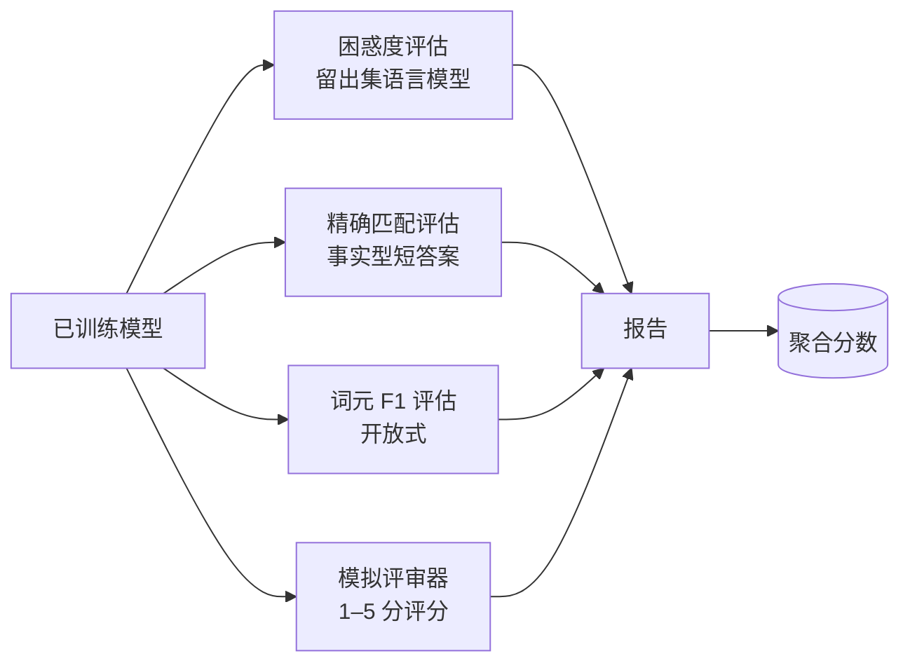
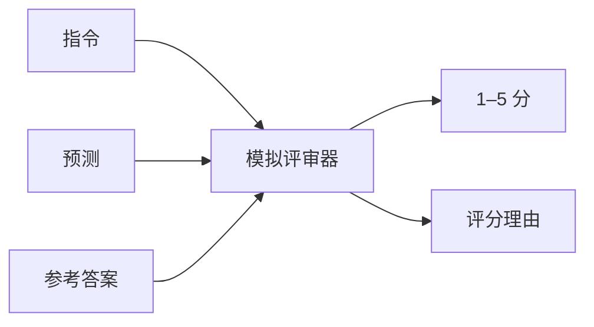
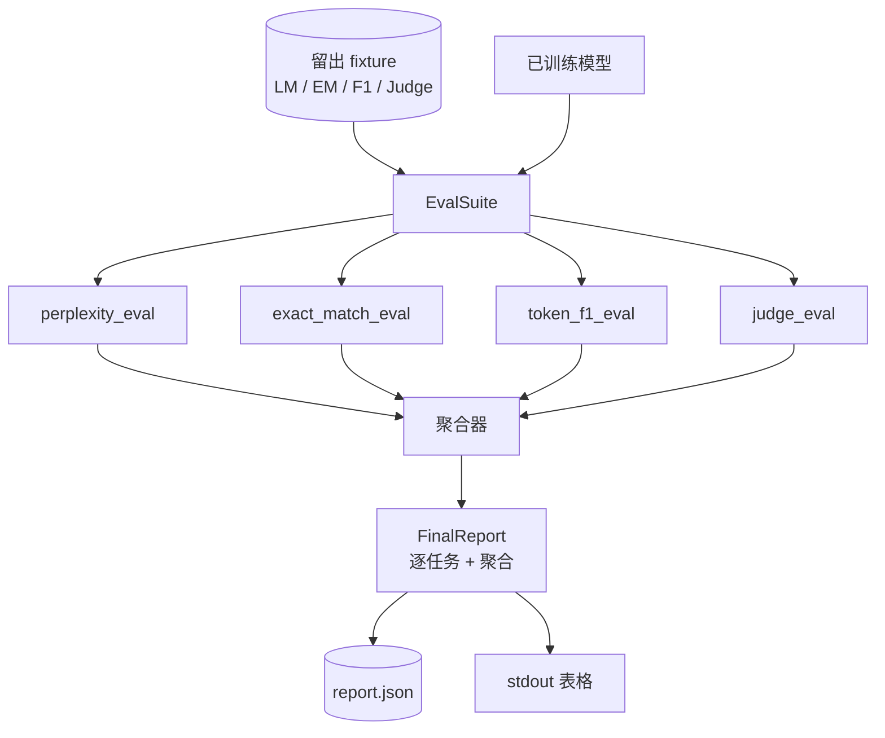

# 第 41 课：完整评测流水线

> 训练是可以用损失曲线监控的部分；评测则是必须由你设计的部分。本课构建统一的评测流水线：接收任意训练好的语言模型，对它运行四种异构评测，把结果聚合成逐任务报告，并提供本地模拟的 LLM-as-judge，使整个循环无需联网即可运行。四种评测覆盖每个可交付模型都需要关注的维度：语言建模（困惑度）、短答案正确性（精确匹配）、开放式相似度（词元 F1）和定性评分（评审器）。

**类型：** 构建
**语言：** Python（torch、numpy）
**前置课程：** 第 19 阶段课程 30–37（NLP/LLM 轨道：分词器、嵌入表、注意力块、Transformer 主体、预训练循环、检查点、生成、困惑度）
**用时：** 约 90 分钟

## 学习目标

- 在小型 Transformer 上，用掩码词元计数计算留出集困惑度。
- 对事实型短答案 prompt 运行精确匹配评测。
- 通过规范化，在预测字符串与参考字符串之间计算词元级 F1。
- 构建离线运行的本地模拟 LLM-as-judge，以 1–5 分评价模型输出。
- 将四种评测聚合成一个带逐任务明细的加权报告。

## 问题

单个指标无法描述一个语言模型。困惑度说明模型对语言分布的拟合程度，却无法说明它是否能回答问题。精确匹配说明模型是否生成了金标准字符串，却会惩罚正确的改写。词元 F1 能容忍改写，却可能被错误内容中的词汇重叠欺骗。LLM-as-judge 可以捕捉定性维度，但成本高且具有随机性。

你真正需要的流水线应同时包含四者。每项评测覆盖其他评测遗漏的维度，并在为该指标设计的不同留出数据子集上运行。最终报告把逐任务数字并排展示，并给出聚合结果，让评审者一眼看出模型做出了哪些取舍。

本课将在一个文件中端到端构建这条流水线。

## 概念



每项评测都是从 `(model, dataset)` 到 `EvalResult` 的函数。结果携带指标值、便于检查的逐样本细节，以及用于聚合的名称。流水线用一个配置把这些评测组合起来，配置会声明运行哪些评测以及各自权重。

## 正确计算困惑度

困惑度是 `exp(每词元平均负对数似然)`。实现中有两个陷阱：

- 平均值必须针对真实词元位置，而不是 `batch * sequence`；padding 词元必须从分母排除，否则困惑度会看起来比真实情况更好。
- 模型预测下一个词元，所以位置 `i` 的 logits 预测位置 `i+1` 的词元。这里的差一错误很隐蔽：损失仍然可以训练，但指标会失去意义。

评测对每个 batch 计算非 padding 位置上的 `-log p(token)` 总和以及词元数，最后再相除。相比对每个 batch 的困惑度取平均，这种方法数值上更安全，也不会让短序列权重过低，并且符合教材中的定义。

## 规范化后的精确匹配

在比较前，harness 会对预测和参考答案执行相同的规范化：

- 转成小写。
- 去除首尾空白。
- 将内部连续空白折叠为一个空格。
- 如果两边只差结尾标点，则去除结尾的句号、感叹号或问号。

规范化让精确匹配在实践中更有用。模型回答 `"Paris"` 是对的，回答 `"Paris."` 也算对，回答 `"  paris  "` 同样算对；但规范化之后仍必须是同一个字符串。

## 正确计算词元 F1

词元 F1 是在词元袋上计算的精确率与召回率的调和平均。步骤如下：

1. 规范化预测和参考答案（规则与精确匹配相同）。
2. 将两者分别拆成词元列表（按空白分词）。
3. 统计多重集合交集。
4. 精确率 = `intersection_count / len(pred_tokens)`；召回率 = `intersection_count / len(ref_tokens)`；F1 = 调和平均。

如果预测和参考答案都为空，F1 为 1（空命题匹配）；如果只有一方为空，F1 为 0。这个模式与 SQuAD 的评测参考实现一致，并能在改写之间产生稳定数字。

## 本地模拟 LLM 评审

真实评审器是一个藏在 API 后面的前沿模型。本课要求评审器离线运行，因此使用确定性模拟评审器：它接收指令、模型预测和参考答案，返回 `{1, 2, 3, 4, 5}` 中的分数以及一行理由。评分规则明确如下：

- 规范化后的预测等于规范化后的参考答案时得 5 分。
- 预测与参考答案的词元 F1 至少为 0.8 时得 4 分。
- 词元 F1 在 `[0.5, 0.8)` 时得 3 分。
- 词元 F1 在 `[0.2, 0.5)` 时得 2 分。
- 其他情况得 1 分。

这不是真正的评审器，但接口是正确的。之后只需替换一个函数，就可以接入真实模型；流水线本身不必知道评审器的内部实现。



## 聚合

聚合结果是规范化评测分数的加权平均。每项评测都在 `[0, 1]` 中报告自己的数值：

- 困惑度：规范化为 `1 / (1 + log(perplexity))`。困惑度为 1 时映射到 1，无穷大时映射到 0。
- 精确匹配：本来就在 `[0, 1]` 中。
- 词元 F1：本来就在 `[0, 1]` 中。
- 评审器：除以 5。

权重可以配置。默认组合是：困惑度 0.2、精确匹配 0.3、词元 F1 0.3、评审器 0.2。权重选择属于产品决策；本课暴露这个旋钮，供你进行实验。

```figure
cg-eval-quadrant
```

## 架构



`EvalSuite` 是一个薄编排器。每项独立评测都是接收 `(model, tokenizer, dataset, config)` 并返回 `EvalResult` 的自由函数。`Aggregator` 收集结果并生成最终报告。演示打印表格，并写入一份下游 CI 可以读取的 JSON 副本。

## 你将构建什么

实现由一个 `main.py` 和测试组成。

1. `TinyGPT`：第 38–40 课使用的相同仅解码器架构，使本课可以独立运行。
2. `InstructionTokenizer`：带 `INST` / `RESP` / `PAD` 特殊词元的字节分词器。
3. 四个 fixture：语言模型语料、精确匹配集合、F1 集合和评审集合，每个包含 20 个确定性样例。
4. `perplexity_eval`：返回带困惑度值和逐词元损失直方图的 `EvalResult`。
5. `exact_match_eval`：返回平均精确匹配分数和逐样本记录。
6. `token_f1_eval`：返回平均词元 F1 和逐样本记录。
7. `mock_judge` 与 `judge_eval`：逐样本分数和理由，以及集合上的平均分。
8. `Aggregator.normalise`：逐评测规范化规则。
9. `Aggregator.aggregate`：加权平均和组装后的报告。
10. `run_demo`：短暂训练小模型，运行四项评测，打印报告表格并写入 JSON；成功时以零退出。

## 阅读报告

报告有三层。最上层是聚合分数，下面是四个逐评测数字，再下面是用于诊断的逐样本明细。CI 失败时通常先看聚合分数；追查回归的评审者则需要逐样本明细，以确认模型在哪些输入上出错。

JSON 转储使用稳定键，因此 CI 仪表板可以跨版本绘制趋势线。格式化表格面向训练结束后盯着终端的人。

## 拓展目标

- 增加校准评测：模型的 softmax 概率是否与准确率一致？按置信度将预测分桶，并报告每桶的经验准确率。
- 增加鲁棒性评测：给每个样例标注扰动（拼写错误、改写、干扰项），报告每种扰动造成的指标下降。
- 将模拟评审器替换为通过 HTTP 调用的真实模型。函数签名不变。
- 增加逐任务权重学习：不再使用固定权重，而是拟合模型之间目标偏好顺序对应的权重。

本实现交付四项评测、聚合器和报告。真正的评测流水线会在此基础上叠加更多维度，但模式保持不变：每项评测一个函数、一个聚合器和一份报告。
