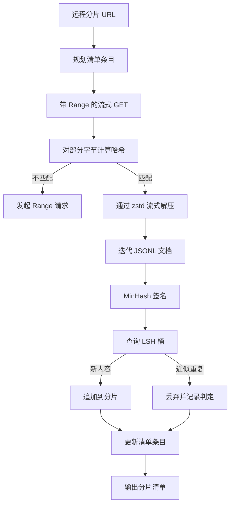

# 大规模语料下载器

> 训练语言模型早在第一次前向传播之前就开始了。语料必须落盘、解压、去重并且可寻址；在网络于 4% 处断开之前，就应该把断点续传方案设计好。本课构建一个流式下载器：拉取压缩分片，使用 Zstandard 即时解压，通过 MinHash 加局部敏感哈希为近似重复内容生成指纹，并写出其余流水线可以信任的分片清单。

**类型：** 构建
**语言：** Python
**前置课程：** 第 19 阶段课程 30–37
**用时：** 约 90 分钟

## 学习目标

- 用 `urllib` 流式读取远程分片，并用 `zstandard` 解压，不把整个文件缓存在内存中。
- 针对已验证的字节偏移发出 HTTP `Range` 请求，恢复部分下载。
- 为每篇文档构建 MinHash 签名，并用 LSH 分桶，使近似重复文档发生碰撞。
- 输出包含内容哈希、字节大小、文档数和去重判定的分片清单。

## 问题

第一次在 200 GB 语料上训练时，网络在 41% 处断开，脚本以 `urllib` 异常退出；第二次在 78% 处断开；到了 99%，你已经把循环重写了三遍。从第一分钟就必须设计的两个失败场景，是部分下载恢复和重复文档移除。二者都有公认解法，却经常被跳过，因为流水线往往从一行逐渐变复杂的 `requests.get` 调用开始。

断点续传是 HTTP 问题。服务器必须遵守 `Range`，客户端必须把已验证偏移量记录到磁盘，且这个偏移量必须在进程死亡后仍然存在。如果偏移量和文件哪怕相差一个字节，恢复下载就会写入垃圾数据，语料也会被损坏；这种损坏通常要到分词时才暴露。

去重是签名问题。精确哈希去重会漏掉近似重复：同一篇 Wikipedia 文章带着三种不同的页脚出现，同一个代码文件带着不同的许可证头出现，同一篇博客的每个链接都多了一个跟踪参数。MinHash 加 LSH 可以用次线性成本捕捉它们。代价是每篇文档一个签名、每个签名一次分桶查询。

## 概念



### 使用 `urllib` 流式读取

标准库的 `urllib.request.urlopen` 返回一个类文件对象。将它包在 `zstandard.ZstdDecompressor().stream_reader` 中，字节就会从网络流经解压器进入文档迭代器，而不会把压缩分片或解压后的分片整体实体化到内存中。内存成本只有行缓冲区、当前文档的 MinHash 签名和 LSH 索引。

### 使用 `Range` 恢复

下载器为每个分片写两个文件：分片文件本身和一个 `.partial.json` 检查点。检查点记录 `verified_bytes`、`expected_size`、`sha256_prefix`（对前 `verified_bytes` 个字节计算）以及源 URL。启动时，下载器读取检查点，对磁盘上的字节重新计算 `sha256_prefix`，只有哈希匹配才恢复。如果哈希错误，就丢弃部分文件并从字节零重新下载。因为检查的是已验证字节而不是盲目信任偏移，所以不会发生静默损坏。

### MinHash 加 LSH

MinHash 在固定空间中估计两个集合的 Jaccard 相似度。对一篇文档来说，这个集合是其文本的 shingles（重叠 n-gram）。签名由 `k` 个最小哈希值组成，每个值对应一个独立哈希函数。Jaccard 相似度为 `s` 的两篇文档，在签名任一单独分量上相同的概率是 `s`。

然后，LSH 把 `k` 个分量分成 `b` 个 band，每个 band 有 `r` 行，其中 `k = b * r`。两篇文档至少在一个 band 中碰撞的概率是 `1 - (1 - s^r)^b`，它会在你用 `(b, r)` 调节的 `s` 值附近形成陡峭阈值。典型语料去重使用 `s = 0.8`；LSH 研究文献用 `k = 128`、`b = 32`、`r = 4` 达到这个阈值。

### 将分片清单作为契约

下载器唯一持久化的输出就是清单。清单按分片保存 URL、解压后的字节数、文档数、去重后的唯一文档数，以及最终分片文件的 sha256。下游分词读取清单，而不是读取目录列表。如果分片缺失或 sha256 错误，清单会告诉下一阶段拒绝启动。清单是“数据已下载”和“数据已下载且可验证”之间的决定性边界。

```figure
cap-corpus-downloader
```

## 构建

`code/main.py` 实现：

- `ShardPlanner`：读取分片 URL 列表，生成规划中的清单条目。
- `StreamingDownloader`：用可选的 `Range` 打开 `urllib` 流，写入临时文件，在每个分块后更新 `.partial.json` 检查点，并在恢复时验证 sha256 前缀。
- `ZstdDocIterator`：将类文件流包在 `zstandard.ZstdDecompressor` 中，每行产出一篇文档。
- `MinHasher`：用固定的哈希种子族为字符串生成包含 `k` 个分量的签名。
- `LSHIndex`：按 band 将签名分桶，并报告碰撞。
- `Dedup`：组合 hasher 与索引，为每篇文档标记 `keep` 或 `near_duplicate`，并记录发生匹配的分片 ID。
- `ManifestWriter`：收集逐分片统计并写入 `manifest.json`。

文件底部的演示会在磁盘上构建一个小型合成语料，用 `zstandard` 压缩，通过 `file://` URL 下载，执行去重，并打印清单。

运行：

```bash
python3 code/main.py
```

脚本以零退出，并打印清单摘要。

## 生产实践

四种模式可以把本课扩展到真实语料。

**写入前先做检查点。** `.partial.json` 必须在字节追加到分片之前完成 `fsync`。否则断电会颠倒顺序：分片字节已经落盘，检查点却没有记录它们；下一次恢复时就会以为已验证字节更少，重复的后缀字节会损坏文件。先写检查点，再写分片。这与预写日志的纪律相同。

**分片化 LSH 索引。** 在 200 GB 规模上，整个语料共用一个 LSH 索引放不进 RAM。按第一个 band 哈希对 LSH 索引分区，把分区存到磁盘，只查询新签名将要落入的分区。代价是每篇文档多一次磁盘读取；收益是 LSH 索引不再构成硬性的内存上限。

**使用墓碑，不要删除。** 被丢弃的重复项应在清单中记录 `near_duplicate` 判定，以及与之碰撞的文档分片 ID。删除它们会丢失重复项与保留项之间的联系；使用墓碑可以保留审计轨迹，也让下游阶段能够重新考虑阈值。

**清单中记录逐分片 sha256，并额外记录清单 sha256。** 清单自身也要有内容哈希。下游阶段在信任逐分片条目之前先验证清单哈希。否则清单就是静默攻击面：能够编辑单个文件的攻击者就能破坏整个流水线。

## 使用

生产模式：

- **每次 CI 运行都恢复。** CI runner 是临时的。下载器必须假设每次运行都是新磁盘，并从缓存或远端恢复。`--cache-dir` 是一等参数。
- **在分词前去重。** 分词很昂贵。对同一篇文档运行两次，就是为同一条 loss 曲线支付两次成本。去重应位于分词上游，而不是下游。
- **把清单作为合并门。** 训练运行从固定提交读取清单 sha256。新数据集版本需要新的清单提交。代码与数据之间的联系是 git，而不是口口相传。

## 交付

在真实项目中，`outputs/skill-corpus-downloader.md` 会说明哪些 URL 供下载器使用、检查点目录如何布局、去重使用的 shingle 宽度和 `(k, b, r)` 三元组，以及清单在版本控制中的位置。本课交付的是引擎。

## 练习

1. 增加 `--shingle-width` 参数，测量宽度为 3、5、9 时去重判定如何变化，并为所选默认值辩护。
2. 通过嗅探 magic bytes，在 zstd 旁边增加 gzip 支持。下载器不应要求调用方指定编码格式。
3. 增加 `--resume-only` 模式：找不到检查点时拒绝启动新的下载。在 CI 中，这能避免一次运行意外重新拉取 200 GB。
4. 将 LSH 索引移到 shelf 或 sqlite 文件中，测量它与内存版本的吞吐量差异。
5. 启动时增加清单 sha256 检查。如果磁盘上的清单与 `manifest.lock` 中的清单哈希不一致，下载器应默认拒绝运行。

## 关键术语

| 术语 | 常见说法 | 实际含义 |
|------|-----------------|------------------------|
| Shard | “一个文件” | 语料的自包含切片，拥有自己的 sha256，是恢复和去重的操作单位 |
| MinHash signature | “指纹” | 集合的 `k` 分量草图，每个分量都是一个独立哈希在该集合上的最小值 |
| LSH band | “桶” | 由 `r` 个签名分量组成的组，作为碰撞检测的单个桶键 |
| Verified bytes | “恢复偏移量” | 磁盘上 sha256 前缀与检查点匹配的字节；唯一安全的恢复起点 |
| Manifest | “索引” | 下载器产物的唯一持久记录，包括内容哈希 |

## 延伸阅读

- [RFC 7233](https://datatracker.ietf.org/doc/html/rfc7233) - HTTP Range 请求与断点续传协议
- [Zstandard format specification](https://datatracker.ietf.org/doc/html/rfc8478) - 使流式解压安全的帧格式
- [MinHash](https://en.wikipedia.org/wiki/MinHash) - 本课使用的签名族
- [Locality-sensitive hashing](https://en.wikipedia.org/wiki/Locality-sensitive_hashing) - 去重阈值背后的分 band 方案
- 第 19 阶段 · 43 - 下载器供给的 HDF5 词元语料
- 第 19 阶段 · 44 - 在语料上训练的余弦调度
- 第 19 阶段 · 45 - 消费该调度的 AMP 循环
