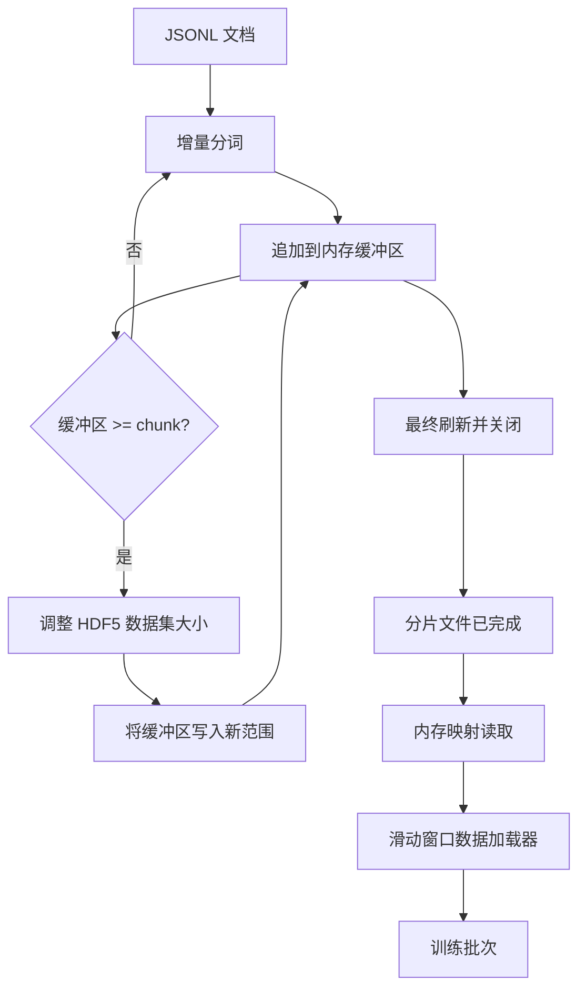

# 第 43 课：HDF5 分词语料库

> 下载的语料必须落在训练器能够以接近线路速度流式读取的布局中。磁盘上的 JSONL 无法承受 16 个数据加载器 worker；可调整大小、分块的整数 HDF5 数据集可以。本课把流式分词写入可调整大小的 HDF5 数据集，跨多个文件分片写入，在训练时通过内存映射读取，并实现按滑动窗口生成固定长度序列且遵循正确打包规则的数据加载器。

**类型：** 构建
**语言：** Python
**前置课程：** 第 19 阶段课程 30–37
**用时：** 约 90 分钟

## 学习目标

- 将文档流式写入可调整大小的 HDF5 整数数据集，并使用确定性的分块策略。
- 将写入分片到多个 HDF5 文件，使故障影响范围受限，同时支持并行处理。
- 通过 HDF5 基于页缓存的分块布局读回词元，让数据加载器只在组装批次时复制到批次缓冲区。
- 实现滑动窗口数据加载器，输出固定长度的训练序列，并明确规定打包方式。

## 问题

现代语言模型训练会在数十个 worker 间以每秒数十万样本的速度读取词元。JSONL 在第一次冷缓存缺页时就会失效：JSON 解析器很慢，文档边界无法寻址，而要定位“样本 4,217,884”必须扫描整个文件。即使是压缩效果很好的 Parquet 也不合适，因为训练器不要列，而是要一个能够以 `O(1)` 随机访问的扁平词元流。

HDF5 之所以适合，是因为它提供了分块、可调整大小、只含整数的数据集；读取时这些分块对页缓存友好。训练器请求 `tokens[3,200,000 : 3,200,8192]`，HDF5 就会从页缓存中取出请求的 hyperslab，复制到新分配的 NumPy 数组。代价是每个 worker 需要一个打开的文件句柄，以及一个按 chunk 大小计算的页缓存占用；与解析 JSONL 的成本相比，这点开销可以忽略。

构建难点在于让写入端真正可靠。可调整大小的数据集很容易被误用：每篇文档写一次，HDF5 文件会碎片化到无法使用；一次扩展写入全部文档，进程死亡就会丢掉整个分片。正确的纪律是先缓冲再扩展，并让缓冲区大小与 chunk 大小匹配；同时把写入分片到多个文件，使崩溃最多损失一个分片。

## 概念



### 正确使用可调整大小的 HDF5

词元数据集以 `maxshape=(None,)` 创建，并使用固定的 `chunks=(chunk_size,)`。写入时，将词元缓冲在长度为 `chunk_size` 的 NumPy 数组中。缓冲区填满后，数据集恰好扩展 `chunk_size`，再把缓冲区写入新范围。分片结束时，将残余缓冲写入最后一个不完整范围。除了最后一次写入外，每次写入都连续并与 chunk 对齐；最后一次可能不对齐，因此读取器要按分片 HDF5 属性中记录的 `token_count` 截断。

### 分片写入

单个 HDF5 文件就是一个单点故障。流水线并行写入分片：第 19 阶段第 42 课产生的每个输入分片，都会对应一个 HDF5 输出分片。`shards.json` 索引按分片记录文件路径、词元数、文档数以及对词元计算的 sha256。训练器读取 `shards.json` 来计算全局偏移量并校验语料。

### 内存映射读取

在训练时，每个 worker 以 `swmr=True` 模式打开自己负责的 HDF5 文件，并请求 `tokens[start:stop]`。HDF5 的 chunk 布局意味着，一旦 chunk 变热，这就是一次基于页缓存的读取。worker 从不将整个文件实体化：切片只复制到数据加载器的批次缓冲区，数据加载器在批次处理时再把它复制到固定页内存的训练张量。热路径每次跨越 chunk 时进行一次系统调用，其余都是 RAM 访问。

### 滑动窗口数据加载器

数据加载器是唯一知道训练序列长度的阶段。它从全局词元流中随机选择起始索引，读取 `window_size + 1` 个词元，并返回 `(input, target) = (tokens[:-1], tokens[1:])`。不强制文档边界：窗口可能跨越两个文档，中间带有显式 `boundary_token_id`，让模型学会使用分隔符。这是标准的打包规则；初学者也常常忘记它，结果语料中 8% 是训练边界词元，92% 是自然文本。

```figure
cc-hdf5-corpus
```

## 构建

`code/main.py` 实现：

- `Tokenizer`：一个足以支撑演示的、按字节工作的确定性分词器。接口是 `encode(text) -> list[int]`，并提供 `vocab_size`。
- `HDF5ShardWriter`：打开可调整大小的整数数据集，将词元缓冲到 chunk 大小，以固定步长调整大小并写入；关闭时将 `token_count` 和 `sha256` 记录为 HDF5 属性。
- `ShardedTokenizationPipeline`：遍历输入文档，将它们路由到对应的 writer，并输出 `shards.json` 索引。
- `MmapTokenStore`：打开分片文件进行内存映射读取，计算全局偏移量，并暴露统一的 `get_slice(start, stop)` API。
- `SlidingWindowDataloader`：从全局流中随机选择窗口，生成 `(input_ids, target_ids)` NumPy 数组。

文件底部的演示会构建一个很小的内存语料，将其分词到两个分片中，通过内存映射打开它们，用数据加载器运行 10 个批次，并打印每个批次的形状和校验和。

运行：

```bash
python3 code/main.py
```

脚本以零退出码结束，并打印每个批次的校验和。

## 生产实践

四种模式可以把本课扩展到真实训练运行。

**让 chunk 大小等于典型读取量。** 训练器会为每个样本读取 `window_size + 1` 个词元。将 HDF5 chunk 设置为 `window_size` 的倍数，读取就能与页缓存对齐。chunk 不匹配会让吞吐量减半，因为每个样本都要触碰两个 chunk。

**把词元数存入属性，而不是从数据集形状推断。** 数据集末尾的切片可能只填了一部分，因为 chunk 大小不一定整除文档边界。将真实的 `token_count` 作为数据集的 HDF5 属性存储，并让读取器按这个值截断。否则读取器会走过末尾，读到零填充的词元，模型就会学着预测零。

**分片 sha256 与并行校验。** 每个分片都对词元字节计算自己的 sha256。训练开始前，训练器可以并行校验所有分片。错误的 sha256 会让运行及早失败，而不是在训练 16 小时后的第 3 个 epoch 才暴露。

**两端使用 `swmr=True`，写入器使用 `libver="latest"`。** Single-Writer-Multiple-Reader 模式要求写入器以 `libver="latest"` 打开，预先创建所有数据集，然后设置 `file.swmr_mode = True`。之后每次调整大小后，写入器都必须调用 `dataset.flush()`，这样以 `swmr=True` 打开的读取 worker 才能看到一致的数据。跳过 `libver="latest"`，或者在结构变更后才启用 SWMR，是出现“file is locked”错误的常见原因。

## 使用

生产模式：

- **每个源分片对应一个 HDF5。** 下载器（第 19 阶段第 42 课）为每个 URL 输出一个分片；分词（本课）为每个源分片输出一个 HDF5。1:1 的映射让恢复和部分失败处理都很简单。
- **边界词元 id。** 边界词元属于分词器词表，也是数据加载器唯一会注入的词元。若模型应忽略边界词元，训练损失会屏蔽它；否则模型会学会把它作为序列分隔符使用。
- **以 `shards.json` 为事实来源。** 添加新分片意味着写入 HDF5、计算其 sha256，并追加一条记录。训练器在启动时读取一次该文件，此后不再触碰目录列表。

## 交付

在真实项目中，`outputs/skill-hdf5-tokenized-corpus.md` 会说明哪个分词器为流水线供给数据、什么 chunk 大小与训练器的窗口匹配、`shards.json` 在版本控制中的位置，以及数据加载器 worker 如何在文件间分片。本课交付的是引擎。

## 练习

1. 为 HDF5 writer 增加 `--compression gzip` 参数，并在演示语料上测量吞吐成本。为所选默认值辩护。
2. 为滑动窗口数据加载器加入确定性 seed，验证相同 seed 的两次运行会产生完全相同的批次。
3. 增加 `--validate` 模式，读取每个分片，重新计算其词元的 sha256，并与 `shards.json` 比较。CI 应在训练开始前运行该模式。
4. 比较 chunk 大小分别等于窗口大小的一倍、二分之一和两倍时的数据加载器吞吐量。报告页缓存的影响。
5. 增加 `--max-document-tokens` 参数，在写入时截断过长文档。针对“在读取时再决定”这一方案，为取舍进行辩护。

## 关键术语

| 术语 | 常见说法 | 实际含义 |
|------|-----------------|------------------------|
| Resizable dataset | "Append-only" | 一个 `maxshape=(None,)` 的 HDF5 数据集，通过以 chunk 大小为步长调用 `resize` 增长 |
| Chunked layout | "How HDF5 stores it" | 磁盘上的固定大小页面，内核可以对其进行内存映射，数据加载器可以连续读取 |
| `swmr` mode | "Read-while-write" | Single-Writer-Multiple-Reader 模式，让数据加载器 worker 安全共享文件 |
| Shard index | "shards.json" | 包含所有词元分片、偏移量和内容哈希的持久索引 |
| Sliding window | "Training sample" | 全局词元流中的固定长度切片，训练器将它与错位一位的 target 配对 |

## 延伸阅读

- [HDF5 分块文档](https://support.hdfgroup.org/documentation/hdf5/latest/hdf5_chunking.html) - 本课使用的分块、可调整大小数据集布局
- [h5py 用户指南](https://docs.h5py.org/en/stable/) - HDF5 的 Python 绑定
- [NumPy 内存映射](https://numpy.org/doc/stable/reference/generated/numpy.memmap.html) - h5py 暴露的读取端原语
- 第 19 阶段 · 42 - 本课进行分词的下载器输出
- 第 19 阶段 · 44 - 消费该数据加载器的余弦调度器
- 第 19 阶段 · 45 - 包装训练步骤的 AMP 循环
