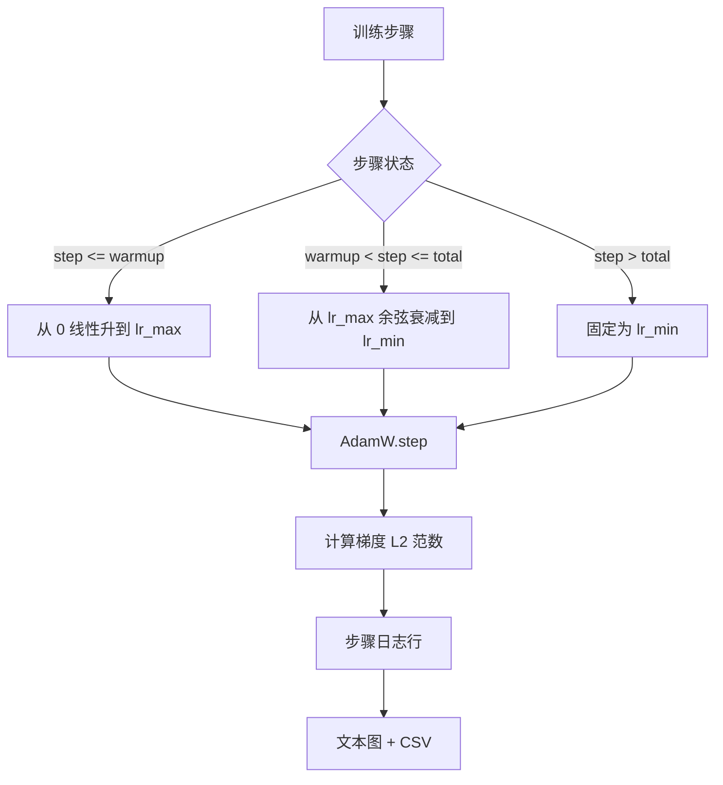

# 第 44 课：带线性预热的余弦学习率

> 学习率调度是损失函数之后第二重要的决定。带余弦衰减和线性预热的 AdamW 已成为语言模型训练的现代默认方案：它让模型在脆弱的前一千次更新中使用较小的有效步长，升到配置的峰值，再平滑地衰减回接近零。本课构建该调度器，绘制训练步上的曲线，把梯度范数记录在调度旁边，并验证调度器遵守预热、峰值和衰减边界。

**类型：** 构建
**语言：** Python
**前置课程：** 第 19 阶段课程 30–37
**用时：** 约 90 分钟

## 学习目标

- 将 AdamW 优化器接入带线性预热的余弦学习率调度。
- 在任意步骤精确计算调度值，使不同运行之间不因浮点漂移而产生差异。
- 将梯度 L2 范数与学习率并排记录，让训练健康状况可观测。
- 将调度渲染成便于人眼读取的文本图，以及任何工具都能消费的 CSV。

## 问题

训练开始的一千次更新最为剧烈。模型权重仍接近初始化状态，优化器的二阶矩运行估计还没有稳定，梯度范数又大又嘈杂。如果学习率在这些更新期间就处于峰值，模型要么直接发散，要么落入永远无法逃离的损失平台。两个广为人知的修复方案是梯度裁剪（第 19 阶段第 45 课的主题），以及从较小学习率开始逐步升高的学习率调度。

带预热的余弦调度有三个区域。从第 0 步到 `warmup_steps`，学习率从零线性缩放到配置的峰值 `lr_max`。从 `warmup_steps` 到 `total_steps`，学习率沿余弦曲线的上半段从 `lr_max` 衰减到 `lr_min`。超过 `total_steps` 后，学习率固定在 `lr_min`，这样错误配置导致训练器超出范围时，也不会静默地离开调度。

构建难点在于调度器很容易出现差一错误。这个错误会在训练开始 6 小时后才表现为：模型开始过拟合的时刻，学习率高了或低了 1%。如果不在边界上穷举测试，很难发现它。

## 概念



### 预热公式

对于属于 `[0, warmup_steps]` 且 `warmup_steps > 0` 的 `step`，学习率为 `lr_max * step / warmup_steps`。退化的 `warmup_steps = 0` 情况被视为“不进行预热”：调度在第 0 步直接从 `lr_max` 开始，并立即进入余弦衰减。有些测试 harness 会传入 `warmup_steps = 0`，以确认调度仍然能产生可用曲线。

### 余弦公式

对于属于 `(warmup_steps, total_steps]` 的 `step`，学习率为 `lr_min + 0.5 * (lr_max - lr_min) * (1 + cos(pi * progress))`，其中 `progress = (step - warmup_steps) / max(1, total_steps - warmup_steps)`。在 `step = warmup_steps` 时，余弦计算为 `cos(0) = 1`，得到 `lr_max`，与预热端点完全一致。在 `step = total_steps` 时，余弦计算为 `cos(pi) = -1`，得到 `lr_min`，与衰减端点完全一致。

两个端点处的连续性并非偶然。这正是调度被实现为关于 `step` 的单个函数，而不是把三个不同函数粘在一起的原因。拼接式调度第一次修改 `lr_max` 时，就会丢掉一个边界。

### 总步数之后的下限

对于 `step > total_steps`，学习率保持在 `lr_min`。契约是明确的：调度不会报错，也不会外推；它会固定在下限，并让训练器记录一条警告。需要延长训练的训练器应修改调度的 `total_steps`，而不是修改循环。

### 与学习率一起记录梯度范数

调度只是训练健康状况的一半，梯度范数是另一半。训练循环会逐步记录二者。发散的训练会先出现梯度范数尖峰，之后损失才会变化；调得好的预热会让范数随学习率线性升高；过于激进的峰值则会表现为预热结束后范数仍然很高。磁盘上的数据集为 `step, lr, grad_l2_norm, loss`。CSV 是唯一的持久记录。

```figure
cap-cosine-warmup
```

## 构建

`code/main.py` 实现：

- `CosineWithWarmup`：关于已配置调度的无状态函数 `lr(step) -> float`。
- `TrainState`：将模型、`AdamW` 优化器和调度封装为单个步骤函数。
- `TrainState.step`：执行一次前向传播、一次反向传播，记录梯度 L2 范数，并将 `lr(step)` 应用到优化器。
- `plot_schedule_ascii`：将调度渲染成人眼可读取的文本图。
- `write_schedule_csv`：逐步输出包含学习率的行。

文件底部的演示会构建一个很小的 `nn.Linear` 模型，在固定输入批次上训练 20 步，并打印每步的学习率、梯度范数和损失。调度也会渲染为文本图，用于视觉 sanity check。

运行：

```bash
python3 code/main.py
```

脚本以零退出码结束，并打印逐步训练日志和调度图。

## 生产实践

四种模式可以把调度提升为生产级产物。

**调度放在配置中，而不是代码里。** 训练器从提交到 git 的 YAML 或 JSON 配置中读取 `warmup_steps`、`total_steps`、`lr_max`、`lr_min`。因为配置具有内容地址，调度是可复现的；因为配置属于 PR diff 的一部分，调度也是可审计的。

**步数计数器单调递增，并与 epoch 解耦。** 当数据集被分片或数据加载器重启时，一些框架会混淆 step 和 epoch。调度读取训练器检查点中的 `global_step`，而不是本地计数器。恢复运行时，持久化的步数轴会让训练继续处于正确的调度位置。

**将调度图放入运行目录。** 每次训练运行都要把 `outputs/lr_schedule.png`（本课中是文本图）写入自己的运行目录。浏览该目录的评审者无需重新运行，就能检查调度是否合理。这会在 PR 阶段捕获错误配置调度这一类 bug。

**日志行 schema 固定。** 按 `step, lr, grad_l2_norm, loss` 的顺序记录。下游 notebook 或仪表板会读取这个 schema；不提升版本就重命名列，会让所有既有仪表板失效。

## 使用

生产模式：

- **先扫描峰值，再扫描其他参数。** `lr_max` 是最敏感的旋钮。先在小模型上扫描；最优 `lr_max` 随模型规模的变化很弱，因此小模型扫描结果是很强的先验。
- **预热是总步数的比例，而不是绝对数量。** 一个 2 亿步的运行如果预热 2,000 步，几乎会立即到达峰值；一个 20,000 步的运行用相同数量预热，就会把总步数的 10% 用在预热上。将预热配置为比例（典型值：1–3%），让调度随训练时长缩放。
- **`lr_min` 有意设置为非零。** 约为 `lr_max` 10% 的下限会让优化器在漫长的尾段继续学习。`lr_min = 0` 的调度会产生一条看起来很漂亮的训练曲线，却得到一个实际上还没有完成训练的模型。

## 交付

在真实项目中，`outputs/skill-cosine-warmup.md` 会说明哪个配置承载调度、从训练器的哪一步读取全局计数器，以及哪次 `lr_max` 扫描产生了部署值。本课交付的是引擎。

## 练习

1. 增加逆平方根版本的调度，并在 200 步的玩具训练上进行比较。哪条曲线产生更低的最终损失？
2. 增加 `--restart` 参数，在 `total_steps / 2` 处加入第二次预热。为 warm restart 在玩具运行上是改善还是损害效果进行辩护。
3. 增加单元测试，验证调度是连续的：对于 `[0, total_steps]` 中的每一步，差值 `|lr(step+1) - lr(step)|` 都被 `lr_max / warmup_steps` 约束。
4. 将调度接入 `torch.optim.lr_scheduler.LambdaLR`，使其能与框架代码组合。本课使用普通步骤函数；这个包装器改变了什么？
5. 增加 `--plot-png` 参数，通过 `matplotlib` 写出真实图表。为 CI 运行选择本课文本图还是 PNG 作为默认值，并进行辩护。

## 关键术语

| 术语 | 常见说法 | 实际含义 |
|------|-----------------|------------------------|
| Warmup | "Slow start" | 在最初的 `warmup_steps` 次更新中，从零线性升到 `lr_max` |
| Cosine decay | "Smooth drop" | 在剩余步数中从 `lr_max` 到 `lr_min` 的上半段余弦曲线 |
| Floor | "After training" | 超过 `total_steps` 后，调度固定使用的 `lr_min` 值 |
| Gradient norm | "L2 of grads" | 拼接梯度向量的欧氏范数，每一步都会记录 |
| Global step | "Schedule axis" | 跨重启保留并驱动调度的单调步数计数器 |

## 延伸阅读

- [Loshchilov 与 Hutter，SGDR：带热重启的随机梯度下降（arXiv 1608.03983）](https://arxiv.org/abs/1608.03983) - 余弦调度的参考论文
- [Loshchilov 与 Hutter，解耦权重衰减正则化（arXiv 1711.05101）](https://arxiv.org/abs/1711.05101) - AdamW 的参考论文
- [PyTorch torch.optim.lr_scheduler](https://docs.pytorch.org/docs/stable/optim.html#how-to-adjust-learning-rate) - 步骤函数如何与框架调度器组合
- 第 19 阶段 · 42 - 本调度消费其语料的下载器
- 第 19 阶段 · 43 - 与本调度共同演化的数据加载器
- 第 19 阶段 · 45 - 训练循环的下一层：梯度裁剪与 AMP
