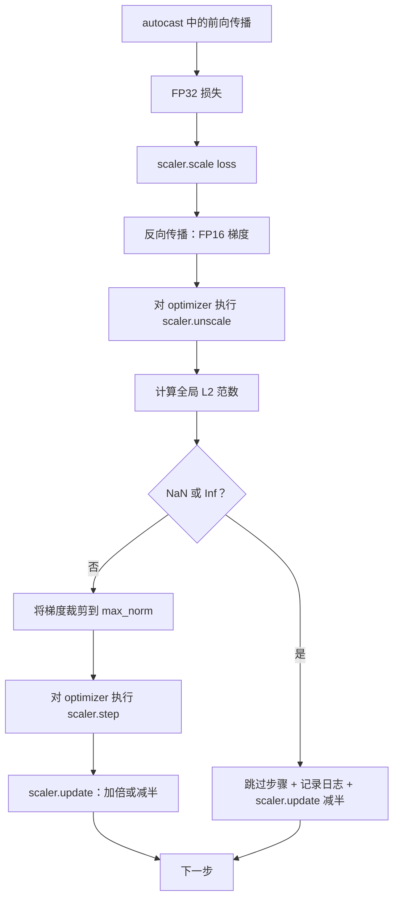

# 梯度裁剪与混合精度

> 上一课的优化器和调度器假设梯度正常，但实际通常并非如此。一个异常批次就可能让梯度范数放大三个数量级；混合精度还会在损失侧引入 FP16 溢出。本课构建生产训练不可缺少的两条安全带：将全局 L2 范数裁剪到配置阈值，以及使用 autocast 与 GradScaler 检测 NaN/Inf、干净地跳过更新并记录缩放因子。

**类型：** 构建
**语言：** Python
**前置课程：** Phase 19 第 30–37 课
**用时：** 约 90 分钟

## 学习目标

- 计算所有参数梯度的全局 L2 范数，超过阈值时原地裁剪。
- 用 autocast 和 GradScaler 包装训练步骤，使 FP16 前向与反向能够应对溢出。
- 检测损失或梯度中的 NaN/Inf，跳过优化器更新并记录原因。
- 每一步报告 GradScaler 的缩放因子，让连续跳步立即可见。

## 问题

混合精度通常把吞吐提高 2–3 倍，因为前向和大部分反向使用 FP16；代价是 FP16 的指数范围很窄。溢出的梯度会成为 Inf，继续传播为 NaN，并在下一次优化器更新时把所有权重变成 NaN。GradScaler 会在反向前放大损失，在优化器更新前用同一因子反向缩放梯度；若反缩放时发现 Inf 或 NaN，就跳过该步并把因子减半；连续 N 步正常时则加倍，最终找到 FP16 范围允许的最高值。

正确连接两条安全带的顺序是：先缩放损失并 backward，再对优化器执行 unscale，然后裁剪梯度，执行 scaler.step，最后执行 scaler.update。若在 unscale 前裁剪，阈值作用于缩放后的梯度，循环会悄悄失效。

昨天还正常的训练在第 8,217 步突然损失曲线竖直上升。原因是一个批次的梯度范数达到 4,200，是此前峰值的 20 倍。不裁剪时，优化器会执行一次更新，抹掉模型前一小时学到的内容；全局 L2 范数裁剪为 1.0 后，同一批次只贡献单位范数的更新，损失保持趋势，训练得以继续。

混合精度通过用 FP16 计算前向和大部分反向，将吞吐提高 2–3 倍，但 FP16 的指数范围很窄。溢出的梯度会变成 Inf，并传播为 NaN，下一次优化器更新会把所有权重变成 NaN。PyTorch 的 GradScaler 在反向前放大损失，在更新前反向缩放梯度；发现 Inf/NaN 时跳过更新并将因子减半，连续正常若干步则加倍。

真正的构建难点是正确连接两者。必须先 `unscale_` 再裁剪，否则阈值作用于缩放后的梯度。正确顺序是：`scaler.scale(loss).backward()`、`scaler.unscale_(optimizer)`、`clip_grad_norm_`、`scaler.step(optimizer)`、`scaler.update()`。

## 概念



### 全局 L2 范数

全局 L2 范数是拼接后梯度向量的欧氏范数，而不是逐参数范数。PyTorch 用 `torch.nn.utils.clip_grad_norm_(parameters, max_norm)` 实现；函数返回裁剪前范数，因此可以同时记录自然范数和裁剪后数值。

### autocast 与 GradScaler

CPU autocast 是因为 CI 在 CPU 上运行；把 device_type 从 cpu 改为 cuda 后，同一模式可原样迁移到 CUDA。CPU 上的 GradScaler 是一个占位实现，因为 CPU autocast 默认使用 BF16，不需要损失缩放；课程仍保留调用位置，以便与 GPU 循环保持一致。

`torch.amp.autocast(device_type)` 是有选择地以 FP16 执行适用操作的上下文管理器；`torch.amp.GradScaler(device_type)` 在反向前缩放损失，并在更新前反向缩放梯度。两者应配套使用。本课在 CI 中使用 CPU autocast；迁移到 CUDA 时只需把 `device_type="cpu"` 改为 `device_type="cuda"`。

### NaN 与 Inf 检测

检测分两处进行：反向前用 `torch.isfinite` 检查损失；`scaler.unscale_(optimizer)` 后用 `has_non_finite_grad(...)` 扫描梯度。两处共同覆盖前向和反向失败。

### 缩放因子诊断

健康运行中的缩放因子通常以 2 的幂增长，直到接近 2^17 或 2^18；异常运行中它会在高低值之间振荡，说明梯度有时在范围内、有时溢出。若不记录该内部状态，这个诊断信号不可见。

每一步读取 `scaler.get_scale()`，与学习率和梯度范数一起记录。健康训练中因子以 2 的幂增长并接近 `2^17` 或 `2^18`；异常训练中因子在高低值间振荡，说明梯度有时在范围内、有时溢出。

```figure
grad-clip-monitor
```

## 构建

AmpTrainState.step 会完整执行裁剪、缩放和遇到 NaN 时跳过的流水线；StepLog 与 SkipLog 保存每步结构化结果。演示训练一个小型线性模型 20 步，并在第 5 步向梯度注入 Inf，确保至少触发一次 SKIP 路径。

`code/main.py` 实现 `clip_global_l2_norm`、`has_non_finite_grad`、封装模型/AdamW/GradScaler/autocast 的 `AmpTrainState`，以及结构化的 `StepLog`、`SkipLog`。演示训练小型 `nn.Linear` 20 步，并在第 5 步注入 Inf 以触发跳过路径。

运行：

```bash
python3 code/main.py
```

脚本以零退出码结束，逐步打印标记为 `STEP` 或 `SKIP` 的日志，且至少有一行 `SKIP`。

## 生产模式

滚动 1,000 步的跳步率应成为告警信号：少量跳步健康，但每个 epoch 数百次跳步说明模型处在 FP16 无法承载的区域，生产系统可在超过 5% 时触发告警。裁剪阈值应与第 44 课调度器位于同一 YAML 或 JSON 配置中；默认 max_norm=1.0，但更大阈值容纳困难 batch、更小阈值则带来更嘈杂的损失曲线。规范 CSV 的列还应包含 step、lr、grad_l2_pre_clip、grad_l2_post_clip、loss、skipped、skip_reason 和 scaler_scale，使一次审查同时看到调度、梯度、缩放因子和跳步原因。无论正常更新还是跳步，都必须执行 scaler.update：正常步可能加倍因子，跳步减半并重置计数器。

四个模式可将循环提升为生产训练步骤。

**把跳步计数器当作告警。** 少量跳步正常；每个 epoch 数百次跳步则说明 FP16 无法承载当前状态。本课跟踪 1,000 步滚动跳步率，生产中可在超过 5% 时告警。

**裁剪阈值放入配置。** `max_norm = 1.0` 是语言模型训练的现代默认值。应先在小模型上扫描；阈值越大越能容纳困难批次，越小则上界更紧但损失曲线更嘈杂。它应与第 44 课调度器放在同一 YAML 或 JSON 配置中。

**范数日志与调度器写入同一 CSV。** 列为 `step, lr, grad_l2_pre_clip, grad_l2_post_clip, loss, skipped, skip_reason, scaler_scale`，这样每行同时呈现调度、梯度、缩放因子和跳步结果。

**即使跳步也执行 `scaler.update()`。** 正常步可能加倍因子，跳步会减半并重置计数器；忘记跳步路径上的 `update()` 就会导致缩放因子永不变化。

## 使用

- **autocast 设备须与优化器设备一致。** GPU 使用 `torch.amp.autocast(device_type="cuda")`，CPU 使用 `torch.amp.autocast(device_type="cpu")`。
- **反向前检查损失。** `torch.isfinite(loss).all()` 成本很低，却能避免一次无效训练步。
- **`zero_grad` 使用 `set_to_none=True`。** 让无关参数组跳过计算，提升吞吐并减少错误面。

## 交付

真实项目中的 `outputs/skill-clip-amp.md` 会说明裁剪阈值、autocast 设备、逐步 CSV 位置和生产跳步告警阈值。本课交付的是训练引擎。

## 练习

1. 用真实损失尖峰（将一个批次的目标乘以 1e8）替代 Inf 注入，验证跳步路径。
2. 添加 `--bf16` 模式，确认同一演示中的跳步率降为零。
3. 添加单元测试，验证不发生裁剪时包装器返回正确的裁剪前后范数。
4. 添加滚动窗口跳步率，并在连续 100 步超过阈值时使 CLI 失败。
5. 写出规范 CSV，并确认每行刷新后 Ctrl-C 不会丢失文件内容。

## 关键术语

| 术语 | 常见说法 | 实际含义 |
|------|---------|---------|
| Global L2 norm | “裁剪目标” | 所有可训练参数梯度拼接向量的欧氏范数 |
| autocast | “混合精度” | `with` 块内对适用操作选择性使用 FP16 或 BF16 |
| GradScaler | “损失缩放器” | 反向前放大损失、更新前反向缩放梯度的辅助工具 |
| Skip | “坏步骤” | 因损失或梯度非有限而拒绝的优化器更新；因子会减半 |
| Scaling factor | “缩放器状态” | GradScaler 当前乘数；连续正常时加倍，跳步时减半 |

## 延伸阅读

- [Micikevicius et al., Mixed Precision Training (arXiv 1710.03740)](https://arxiv.org/abs/1710.03740) - 最初的损失缩放方案
- [Pascanu, Mikolov, Bengio, On the difficulty of training recurrent neural networks (arXiv 1211.5063)](https://arxiv.org/abs/1211.5063) - 梯度裁剪参考论文
- [PyTorch torch.amp.GradScaler](https://docs.pytorch.org/docs/stable/amp.html) - 本课封装的缩放器 API
- [PyTorch torch.nn.utils.clip_grad_norm_](https://docs.pytorch.org/docs/stable/generated/torch.nn.utils.clip_grad_norm_.html) - 本课使用的裁剪原语
- Phase 19 · 42 - 为循环提供语料的下载器
- Phase 19 · 43 - 循环消费的数据加载器
- Phase 19 · 44 - 本循环组合使用的调度器
